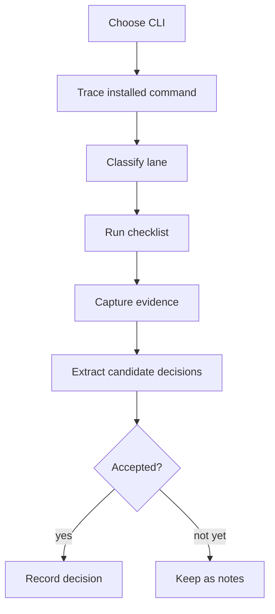

# Agent CLI Evaluation Rubric

Use this rubric to evaluate external agent CLI tools and decide what patterns to adopt.

## Purpose

- Compare real tools with the same lens.
- Separate public CLI UX from hidden machine seams.
- Preserve observations before turning them into decisions.
- Extract reusable decisions only after evidence supports them.

## Evaluation Flow



## Classify The Tool

- **Human CLI**: optimized for interactive humans; scripts can use exit codes and plain text.
- **Script-friendly CLI**: stable flags, predictable stdout, useful exit codes, limited structured output.
- **Agent-native CLI**: agents can discover, run, parse, recover, and explain without hidden context.
- **Facade-backed CLI**: command contract, help, parsing, runtime envelopes, and tests share a reusable facade.
- **Hidden-protocol CLI**: human public surface with internal or hidden machine seams.

Record the classification separately for:

- Public command surface.
- Hidden or internal machine seams.
- Installed wrapper chain.
- Source architecture.

## Evidence To Capture

- Installed command path and version.
- Invocation chain from executable to runtime.
- Matching readable source paths or repository links.
- Public help output and command tree.
- Machine-readable outputs, if any.
- Hidden or undocumented protocol commands.
- Failure examples for missing input, missing dependency, and runtime error.
- Install, cache, registry, or discovery commands.
- Folder structure around CLI, runtime, protocol, generated contracts, and tests.

## Checklist

### 1. Wrapper

- Does the executable wrapper stay thin?
- Does it only locate the runtime, forward argv, preserve exit code, and inject minimal metadata?
- Does it avoid duplicating parser or command behavior across languages?
- Does it expose the real runtime source path or make it easy to find?
- Does wrapper failure explain missing runtime, dependency, or install damage?

Evidence:

- `which <cmd>`
- wrapper source
- package entrypoint
- env vars set by wrapper
- exit-code preservation test

### 2. Command Contract

- Is the command surface backed by a stable contract or catalog?
- Is help generated from the same command metadata the parser accepts?
- Can agents inspect commands, args, flags, output modes, side effects, and examples without scraping prose?
- Are command handlers separated from parser glue?
- Are human output and machine output produced from the same runtime result?
- Does unknown-command handling distinguish typo, missing capability, and unavailable dependency?
- Does agent-facing help avoid drift from parser behavior and machine output?

Evidence:

- CLI entry file
- command registry
- command metadata
- help output
- parser tests
- missing-command behavior

### 3. Protocol Seams

- Are machine seams explicit, documented, and stable?
- Are protocol commands public enough for agents to discover?
- Does the tool support JSON over stdout, stdio protocol, WebSocket, socket, or schema output?
- Are protocol schemas generated or validated?
- Can agents use the protocol without scraping human text?
- Are internal seams hidden only for good product reasons?

Evidence:

- `--json`
- `schema`, `api`, `protocol`, `driver`, `server`, or `print-*` commands
- generated files
- protocol validators
- transport source

### 4. Discovery And Registry

- Can agents inspect installed state?
- Can agents inspect capability state?
- Can agents inspect cache state and owners?
- Can agents preview planned mutations with dry-run output?
- Does discovery name artifact paths, versions, URLs, provenance, freshness, and ownership?
- Does discovery output stay bounded and parseable?

Evidence:

- `status`, `doctor`, `list`, `inspect`, `discover`, `install --dry-run`
- cache directories
- registry source
- capability maps
- ownership metadata

### 5. Repair And Recovery

- Do errors answer what happened?
- Do errors say what changed?
- Do errors say whether same-input retry is safe?
- Do errors name the next safe action?
- Do failures separate usage, missing dependency, auth, config, runtime, parse, and external service problems?
- Are destructive or externally visible repairs gated?
- Are partial writes detected and reported?
- Is human handoff explicit when automation should stop?

Evidence:

- invalid input run
- missing dependency run
- missing config run
- failed network or service run
- interrupted or partial-write run
- repair command docs

### 6. Observability

- Does each run have a correlation id?
- Are diagnostics separate from primary data?
- Are stdout and stderr used predictably?
- Does JSON mode preserve structured failure data under failure?
- Does the tool point to logs or diagnostics without dumping too much into context?
- Does it respect output budgets, quiet mode, verbose mode, and debug mode?
- Does it avoid leaking secrets, local account identifiers, or irrelevant paths?

Evidence:

- success run
- failure run
- `--json`
- `--verbose`
- `--debug`
- log path behavior
- redaction behavior

### 7. Folder Structure And Ownership

- Does folder structure reveal ownership boundaries?
- Are CLI, command handlers, contracts, model data, engine policy, discovery, runtime side effects, protocol transport, generated artifacts, and tests distinct enough?
- Do generated files name their source?
- Are exact contracts in code, generated docs, help, or tests rather than prose?
- Is source organized around stable seams instead of only public command names?
- Can a future agent find the right owner before editing?

Evidence:

- repo tree
- package manifests
- source imports
- generated directories
- tests
- docs and owner maps

## Scoring

Use a small score to keep comparisons cheap:

- `0`: absent or actively hostile to agents.
- `1`: present but human-first, hidden, unstable, or scrape-based.
- `2`: stable, discoverable, parseable, and repair-useful.
- Agent-facing help can improve discovery, but Command Contract reaches `2` only when parser, help, metadata, and machine output share a stable contract.

Score each lane:

- Wrapper.
- Command contract.
- Protocol seams.
- Discovery and registry.
- Repair and recovery.
- Observability.
- Folder structure and ownership.

Add notes for:

- Strongest pattern to copy.
- Sharpest pattern to avoid.
- Hidden seam worth exposing.
- Missing agent-native affordance.
- Decision candidates.

## Capture Template

```text
Tool:
Version:
Installed command:
Readable source:
Classification:
  public surface:
  hidden seams:
  wrapper:

Scores:
  wrapper:
  command contract:
  protocol seams:
  discovery and registry:
  repair and recovery:
  observability:
  folder structure and ownership:

Evidence:
  wrapper:
  command contract:
  protocol seams:
  discovery and registry:
  repair and recovery:
  observability:
  folder structure and ownership:

Copy:
- <pattern>

Avoid:
- <pattern>

Candidate decisions:
- <candidate>

Unresolved:
- <question>
```

## Decision Extraction

- Record accepted patterns in `docs/decisions/2026-06-11-001-agent-cli-evaluation-decision-log.md`.
- Keep uncertain observations in the decision log `Notes`.
- Escalate to ADR only when the decision is hard to reverse, surprising without context, and a real trade-off.
- Route live unresolved choices through `decision-mode`.
- Use `cli-author` before turning an adopted pattern into a new CLI surface.

## Seed: Playwright

- Classification: human CLI with hidden protocol-grade machine seams.
- Strongest pattern to copy: thin wrapper over shared runtime.
- Strongest seam to expose: hidden protocol commands should become public agent contracts.
- Strongest discovery pattern: install dry-run and cache ownership listing.
- Avoid: forcing agents to know hidden commands or scrape human output.
- Decision candidates already accepted:
  - Use Playwright as a seam architecture reference, not an agent-native CLI template.
  - Expose machine seams as public agent contracts.
  - Keep executable wrappers boring.
  - Organize CLI runtime by ownership surface.
  - Do not hide missing capability guidance.
  - Treat discovery and registry as a first-class agent CLI seam.
