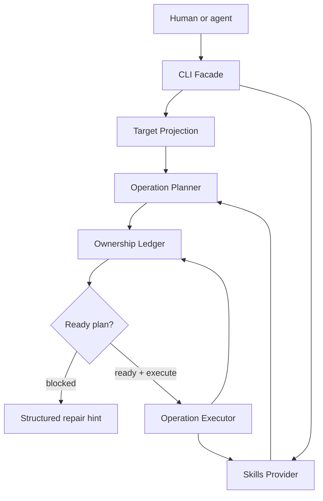

# Skillport MVP Architecture Support

## Purpose

Support the Skillport MVP implementation plan with a durable architecture map,
pressure evidence, source research, and prototype verdicts.

Primary requirements source:

- `docs/brainstorms/2026-06-17-skillport-mvp-requirements.md`

Supporting visual seam report:

- `docs/research/2026-06-17-skillport-seam-report.html`

## Architecture Thesis

Skillport is an agent-native safety shell around the existing `skills` provider.
It does not reimplement the skills ecosystem. It makes provider operations safe
for autonomous agents by adding plan/apply semantics, ownership checks, target
projection, and facade-backed observability.

The MVP shape is:



## Required MVP Modules

### 1. Skills Provider

**Role:** Interface seam around the wrapped provider.

**First adapter:** `skills` npm package.

**Test adapter:** fake provider or fixture provider.

**Pressure:** Raw provider behavior includes prompts, human output, broad
mutation flags, lock behavior, and provider-owned target rules. Letting commands
call the provider directly spreads these concerns across the CLI.

**Deletion-test consequence:** Removing this module leaks provider behavior into
planning, execution, target discovery, tests, and diagnostics.

**Planning implication:** Treat provider calls as an adapter. Keep provider
result normalization behind this seam.

### 2. Operation Planner / Executor

**Role:** Split preview from mutation.

**Pressure:** Safe agent execution requires the caller to inspect exact
operations before state changes. Raw provider commands can mutate immediately.

**Deletion-test consequence:** Removing this module makes dry-run, execution,
conflict handling, and changed-state reporting command-specific again.

**Planning implication:** Define a plan shape before command implementation.
Plan operations include add, remove, noop, and blocked.

### 3. Ownership Ledger

**Role:** Source-of-truth for what Skillport is allowed to touch.

**Pressure:** Directory existence is not ownership. Existing skills may be
human-managed, provider-managed, or installed from another source.

**Deletion-test consequence:** Removing this module makes same-name conflicts
and unrelated removal decisions depend on filesystem shape and command memory.

**Planning implication:** Ownership facts must include target, skill name,
source, provider identity, and Skillport management status.

### 4. Target Projection

**Role:** Validate and explain provider-supported agent targets.

**Pressure:** The `skills` provider already supports a broad `--agent`
vocabulary. Skillport should expose that vocabulary safely rather than fork
every target path rule.

**Deletion-test consequence:** Removing this module makes target validation and
all-target risk handling leak into each command.

**Planning implication:** Harden `codex` and `claude-code` first, but allow
other provider-supported target ids through the same path.

### 5. CLI Facade Front Door

**Role:** Agent-native public command surface.

**Pressure:** Agents need discovery metadata, parseable output, structured
failures, repair hints, changed-state reporting, and continuations.

**Deletion-test consequence:** Removing this module makes every command
hand-build help, JSON, diagnostics, and error envelopes.

**Planning implication:** Use `@side-quest/cli-command-facade` style from the
start. Plan must include discovery metadata, rendered help, argv
acceptance/rejection, and runtime semantics proof.

## Source Research

Context7 source:

- `/vercel-labs/skills`

Relevant upstream docs:

- `https://github.com/vercel-labs/skills/blob/main/_autodocs/configuration.md`
- `https://github.com/vercel-labs/skills/blob/main/_autodocs/types.md`
- `https://github.com/vercel-labs/skills/blob/main/_autodocs/architecture.md`

Findings to preserve:

- `skills` supports a broad `--agent` target vocabulary.
- Documented target ids include `codex`, `claude-code`, `cursor`,
  `gemini-cli`, `opencode`, and `universal`.
- `--agent` can be repeated.
- `--agent '*'` targets all supported agents.
- `list` supports `--json` and `--agent`.
- `add` and `remove` support non-interactive flags such as `--agent`,
  `--skill`, and `--yes`.
- `remove` supports broad forms such as all skills or all agents.
- Provider install flow owns source parsing, skill discovery, agent detection,
  install mechanics, lock updates, and telemetry.
- Provider remove flow owns installed-skill selection, target selection,
  filesystem removal, lock updates, and telemetry.

Planning consequence:

- Skillport should not copy provider-owned path logic.
- Skillport should intercept before mutation to create an ownership-aware plan.
- Skillport should treat broad provider flags as high-risk inputs that require a
  visible plan.

## Prototype Evidence

### Agent-native skills manager stress prototype

Question:

- Can an agent-native wrapper safely manage skills from a source without
  removing or overwriting unrelated skills?

Verdict:

- Yes, if the wrapper treats `skills-lock.json` source ownership as authority
  and refuses broad name-only mutations.

Evidence:

- Prototype passed 13/13 scenarios.
- Same-name add from another source must be blocked before provider mutation.
- Remove must require matching source ownership.
- Lock shape observed locally is object-shaped under `skills`.
- Raw `skills add` behavior was observed to overwrite same-name skills from a
  different source.

Guardrails carried into requirements:

- List available source skills before mutation.
- Snapshot target state and lock state before every operation.
- Install with explicit target, source, skill, and non-interactive flags.
- Remove only lock entries whose source matches the requested source.
- Refuse same-name adds when an existing lock points at another source.
- Refuse deletion without matching ownership.
- Avoid `skills update`, `experimental_install`, and `experimental_sync` in the
  default agent path.

### Skillport MVP seams prototype

Question:

- Do the five MVP seams preserve safety while wrapping the provider?

Verdict:

- Yes. The five seams fit together as one safety loop.

Scripted result:

- Safe add created Skillport-owned entries for `codex` and `claude-code`.
- Same-name `storybook` on `cursor` from `other/source` blocked before mutation.
- Human-owned `local-only` on `codex` blocked before mutation.
- Managed `storybook` on `codex` removed and its ledger entry disappeared.
- Facade-style output reported changed state, repair hint, and continuation.

Planning consequence:

- Do not collapse Ownership Ledger into incidental command validation.
- Do not execute a plan that has conflicts.
- Do not let target projection bypass the planner.
- Keep changed-state vocabulary in the CLI facade.

## Pattern Pressure

### Kept non-GoF labels

- **Ports and Adapters / Hexagonal:** Skills Provider.
- **Anti-Corruption Layer:** translation around raw provider behavior.
- **Functional Core / Imperative Shell:** planner, ledger, target projection,
  and executor.
- **Plan / Apply:** mutation lifecycle.
- **Policy Gate:** Ownership Ledger.
- **Contract-First CLI:** facade-backed command surface.

### Kept GoF labels

- **Adapter:** Provider seam.
- **Command:** Plan operations.
- **Facade:** CLI front door.

### Deferred

- **Strategy:** target-specific behavior is not yet varied inside Skillport.
- **Memento:** rollback/history is not MVP.
- **Reconciler:** useful once decks or desired-state sync exists.
- **Plugin Architecture:** wait for a second real provider.

### Rejected for MVP

- **Saga:** no distributed transaction pressure yet.
- **Event Sourcing:** ledger is current ownership state, not event replay.
- **Microkernel:** no independently loaded extensions yet.
- **Repository:** pressure is ownership policy, not persistence abstraction.

## Planning Unit Shape

Recommended implementation units:

1. Package skeleton and command facade owner.
2. Provider adapter and provider fixture.
3. Target projection and supported-target discovery.
4. Ownership ledger model and lock/read snapshot.
5. Operation planner for add/remove.
6. Operation executor for ready plans.
7. CLI commands wired through facade.
8. Command Surface Alignment Proof.
9. AGENTS.md bootstrap route and later Skillport skill placeholder.

Each unit should have a public behavior check. Private helpers are optional
unless their behavior cannot be observed through the CLI.

## Command Surface Sketch

Candidate command tree for planning:

```text
skillport source list <source> --json
skillport targets list --json
skillport status --target <agent-id> --json
skillport plan add --source <source> --skill <name> --agent <id> --json
skillport plan remove --source <source> --skill <name> --agent <id> --json
skillport apply --plan <plan-id-or-file> --execute --json
skillport doctor --json
```

Planning should validate whether `apply` consumes a persisted plan file, an
inline plan token, or a current-run plan reference. The requirement is explicit
execute after preview, not a specific storage mechanism.

## Risks

| Risk | Consequence | Mitigation |
| --- | --- | --- |
| Provider behavior changes | Skillport safety assumptions drift | Keep provider adapter tests and source-research notes current |
| Broad target operations | Agent mutates too much | Treat all-target intent as high-risk plan-only until explicit execute |
| Ownership mismatch | Unrelated skills removed | Block without matching Ownership Ledger record |
| Human output scraping | Agents make brittle decisions | Require JSON/facade output for agent path |
| Over-copying provider target rules | Skillport becomes stale provider fork | Target Projection validates ids but leaves path rules provider-owned |

## Open Planning Questions

- Where should real Skillport source live in this repo or a Side Quest package
  repo?
- Should plans be persisted as files, run-scoped data, or both?
- How should Skillport read and reconcile existing provider lock files?
- What is the first package-owned result vocabulary?
- What Branch Stations prove MVP behavior without overfitting the prototype?
- Which command ships first: `doctor`, `source list`, or `plan add`?

## Next Safe Action

Run planning from:

- `docs/brainstorms/2026-06-17-skillport-mvp-requirements.md`

Attach this architecture support doc and the seam report:

- `docs/research/2026-06-17-skillport-mvp-architecture.md`
- `docs/research/2026-06-17-skillport-seam-report.html`

