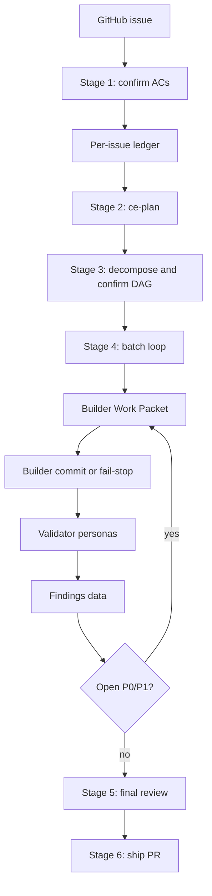
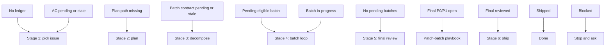

# Issue-to-PR Skill V2 Audit

## Scope

This is an audit and v2 design review only. It does not implement changes to the runbook, helper, ledger template, README, or installed copy.

Reviewed artifacts:

- `runbooks/issue-to-pr/issue-to-pr.md`
- `runbooks/issue-to-pr/README.md`
- `runbooks/issue-to-pr/issue-N-ledger.template.md`
- `runbooks/issue-to-pr/decompose.ts`
- `docs/adr/0001-stage-4-context-isolation.md`
- `docs/adr/0002-runbooks-and-skills-use-prose-as-orchestrator.md`
- Related plans that recently touched Issue-to-PR helper and Builder attempt behavior

Review lens:

- Progressive disclosure
- Clean workflow orchestration
- Operator cognitive load
- Resume safety
- Contract ownership
- v2 skill architecture
- ADR 0002 placement rule: prose orchestrates, CLI validates
- XML/tagged prompt boundaries for cross-agent handoffs

## Executive Summary

`issue-to-pr.md` has crossed the threshold where more precision makes the workflow less executable.

The current file is 1,293 lines. It contains the live stage router, Builder contract, Builder preflight rules, ledger schema semantics, helper command catalog, final-review patch-batch protocol, persona selector, Validator normalization rules, ce-plan prompt addendum, finding lifecycle rules, failure handling, and fallback driver prompt. Per `write-a-skill`, a formal `SKILL.md` should stay under 100 lines, with detailed material split into one-level references once it exceeds the hot-path budget. Even if Issue-to-PR remains a runbook rather than a formal Codex skill, this artifact is far beyond the size where agents can reliably hold the live route, current ledger state, target repo context, plan, issue body, and review output together.

The core architecture is sound. The bloat is not random prose. It accumulated because the runbook is trying to encode important safety properties:

- Orchestrator and Builder context isolation
- Durable ledger gates
- User confirmation before contract mutation
- Strict `batch.files` authority
- Validator-owned findings
- Helper-backed digest and schema invariants
- Repair through confirmed patch batches

The v2 move should not be "shorten the runbook". The v2 move should be to separate:

- **Hot path orchestration:** what the active agent must do next this turn
- **Durable contracts:** schemas, invariants, and helper-enforced rules
- **Role packets:** Builder and Validator prompts, envelopes, and authority boundaries
- **Tagged prompt templates:** XML-bounded handoff packets for Builder, Validator, and patch proposals
- **Conditional playbooks:** replacement batches, final-review patches, host fallbacks
- **Reference material:** glossary, risk classification, persona selector, issue parsing details

My staff-engineer recommendation: build v2 as a small orchestration shell plus one-level references, then promote repeatable packet shapes into templates. Keep `decompose.ts` as the executable contract boundary and push more "checkable truth" into helper modes rather than hot prose.

ADR 0002 should be treated as a governing constraint for v2, not background context. The v2 architecture should make the prose runbook the Orchestrator and introduce a `cli.ts` front door for every deterministic command the runbook needs. `decompose.ts` can remain the validation engine behind that front door, but agents should call the CLI, not memorize individual helper internals from prose.

## Current Shape

### Size And Loading Cost

| Artifact | Size or role | Observation |
| --- | ---: | --- |
| `issue-to-pr.md` | 1,293 lines | Loads every time the runbook is followed. Contains orchestration, contracts, schemas, prompts, and references. |
| `README.md` | Human/runbook overview | Repeats issue shape, Builder dispatch, turn protocol, fix protocol, risk, glossary, ledger format. Useful, but overlaps hot path. |
| `issue-N-ledger.template.md` | Ledger schema and operator hints | Also repeats schema rules and Builder attempt semantics. |
| `decompose.ts` | Executable invariant boundary | Already validates many rules that the prose restates in full. |

Large sections in `issue-to-pr.md`:

| Section | Lines | Assessment |
| --- | ---: | --- |
| Builder dispatch contract | 67-247 | Important, but most of it belongs in a Builder reference and Work Packet template. |
| Stage 1 pick issue | 319-445 | Too detailed for hot path. Issue extraction heuristics should be a reference. |
| Stage 3 decompose | 494-662 | Mixes stage actions, helper contract, Contract Review policy, and failure handling. |
| Stage 5 final-review | 735-882 | Contains a whole patch-batch sub-workflow. This should be its own playbook. |
| Persona selector | 962-996 | A lookup table, not orchestration. |
| Inner loop | 997-1175 | Core, but contains Builder rules, Validator rules, normalization, dedupe, persistence, and hatches. |
| ce-plan addendum | 1193-1267 | Prompt payload. Should be a template or reference, loaded only at Stage 2. |

### Architecture In One Picture



The problem is not this graph. The problem is that the current hot file contains almost every node's internal policy inline.

## Primary Findings

### F1. The Hot Path Is Not A Hot Path

Severity: P0 for v2 skill usability.

The active agent needs to answer one question on every turn: "What is the next legal action from durable state?" The current file makes it scan a full 1,293-line policy manual to answer that.

Evidence:

- The stage router starts around line 276, but the first 247 lines are scope, reviewer lists, ADR guardrails, role boundaries, Builder dispatch, Builder preflight, Builder envelope, and replacement batch policy.
- The "start of every resumed turn" rule appears at lines 280-312, but it is surrounded by enough detail that it does not read as the central state machine.
- The README also defines a turn protocol at `README.md` lines 236-254, which means the workflow has two places that explain turn routing.

Why it matters:

- Resume behavior is the hardest part of this workflow. It should be the clearest part of the skill.
- Agents will over-read, miss the current state, or import irrelevant details into the active reasoning context.
- The cognitive cost compounds because each run also loads the issue, plan, ledger, diffs, findings, and target repo instructions.

v2 action:

- Rewrite `issue-to-pr.md` as a state router and stage shell under 400-500 lines (**revised** from 250-350; see Target Hot File Budget for derivation).
- Put "read this when" links beside each branch.
- Make the resumed-turn algorithm the first executable block after the one-paragraph purpose.

### F2. Contracts, References, And Prompt Payloads Are Collapsed Into One File

Severity: P0 for progressive disclosure.

The file contains at least five different document types:

- Orchestration procedure
- Builder role contract
- Validator role contract
- Ledger and helper schema reference
- Prompt payload for `/ce-plan`

Evidence:

- Builder Work Packet content and exclusions are inline at lines 74-99.
- Builder return envelope shape is inline at lines 181-211.
- Persona selector is a static lookup table at lines 962-996.
- ce-plan structured-output payload is inline at lines 1193-1267.
- Finding status semantics are inline at lines 1268-1281.

Why it matters:

- These sections have different load triggers. Loading all of them for every stage defeats progressive disclosure.
- Prompt payloads are especially costly because they are copied verbatim into another agent or skill. They should be assets or references, not hot-path prose.

v2 action:

- Extract role contracts into `references/builder-dispatch.md` and `references/validator-loop.md`.
- Extract prompt payloads into `templates/ce-plan-addendum.md` and `templates/builder-work-packet.md`.
- Extract static lookup tables into `references/persona-selector.md` and `references/finding-lifecycle.md`.
- Use XML/tagged prompt templates for cross-agent handoffs where boundary clarity matters. Do not use XML tags as a replacement for helper-validated YAML or ledger data.

### F3. The Runbook Repeats Truth Already Enforced By `decompose.ts`

Severity: P1 for maintainability and drift.

`decompose.ts` is doing real contract work. It validates execution modes, path shape, DAGs, patch proposal constraints, replacement batch invariants, ledger batch metadata, Builder attempts, reachable commits, finding rows, duplicate findings, table drift, and AC coverage. The runbook repeats many of those details in prose.

Evidence:

- Helper constants define execution modes, statuses, Builder attempt statuses, finding statuses, batch statuses, and guardrail prefixes in `decompose.ts` lines 92-158.
- Batch contract validation starts at `decompose.ts` line 313.
- Replacement batch validation starts at `decompose.ts` line 1229.
- Ledger batch and Builder attempt validation spans `decompose.ts` lines 1302-1503.
- Findings validation spans `decompose.ts` lines 1685-1904.
- Public helper modes are declared at `decompose.ts` lines 2051-2117.

Why it matters:

- Prose and executable validation will drift unless one owns each rule.
- Long prose tempts agents to reason manually instead of using helper modes.
- v2 should make deterministic helper calls feel mandatory and obvious.

v2 action:

- Keep only the helper command and expected routing result in the hot path.
- Move schema details into `references/helper-contract.md`.
- Add a helper mode index that says which command owns which invariant.
- Prefer adding helper modes for repeated manual transformations, especially finding normalization and Work Packet validation.

### F4. Stage 5 Is A Nested Workflow Masquerading As A Stage

Severity: P1 for orchestration clarity.

Stage 5 contains a complete final-review remediation workflow: fallback review waves, mechanical-diff fallback, patch-batch proposal-only Builder dispatch, helper validation, user confirmation, Stage 4 return, finding closure, rerun final review, and local-check failure rerouting from Stage 6.

Evidence:

- Stage 5 starts at line 735 and runs to line 882.
- Mechanical-diff fallback starts at line 764.
- Patch-batch proposal path spans lines 790-865.
- Stage 6 routes local check failures back into final-review patch-batch flow at lines 904-914.

Why it matters:

- The "final review" label hides a second planning and confirmation loop.
- The agent must hold Stage 5, Stage 4, findings, helper validation, and user gates in mind at once.
- This is where accidental Orchestrator implementation is most likely, because the instructions describe how to judge whether a fix is bounded.

v2 action:

- Keep Stage 5 hot path to: run review, persist findings, gate P0/P1, either advance or invoke the patch-batch playbook.
- Extract the patch-batch protocol into `references/final-review-patch-batches.md`.
- Add a small decision table that routes each final finding: `no blocker`, `bounded patch candidate`, `needs replan`, `accepted risk`.

### F5. Builder Dispatch Is Correct Architecturally But Too Heavy In The Orchestrator Body

Severity: P1 for context isolation.

The Builder contract is one of the strongest parts of the current design. It encodes exactly the boundary ADR 0001 wants: Orchestrator owns ledger and handoff, Builder owns one scoped attempt, Validators own correctness. The issue is placement.

Evidence:

- ADR 0001 states the Orchestrator owns Work Packet assembly and envelope validation, Builder owns one attempt, and Validators own correctness.
- `issue-to-pr.md` lines 67-247 place the full Builder dispatch contract before the stage protocol.
- The README also has a Builder dispatch overview at `README.md` lines 83-157.

Why it matters:

- Builder details should be loaded when assembling or validating a Work Packet, not when picking an issue or confirming ACs.
- The Builder should receive a focused packet template, not a copy of the entire runbook.

v2 action:

- Move Builder contract to `references/builder-dispatch.md`.
- Add `templates/builder-work-packet.md` with fill-in fields.
- Add `templates/builder-return-envelope.schema.md` or a compact schema reference.
- In hot path, say: "Before Builder dispatch, read `references/builder-dispatch.md` and fill `templates/builder-work-packet.md`."

### F6. Static Policy Tables Belong In References

Severity: P2 for readability.

Several tables are valid but not stage orchestration:

- Persona selector
- Escape hatches
- Finding status and resolution table
- Risk classification
- Local glossary

Evidence:

- Persona selector: lines 962-996.
- Escape hatches: lines 1176-1192.
- Closing finding table: lines 1268-1281.
- README risk classification: `README.md` lines 278-297.
- README glossary: `README.md` lines 299-343.

Why it matters:

- Lookup tables are ideal progressive-disclosure references.
- Keeping them inline elongates the path between stage steps.

v2 action:

- Move all lookup tables to references.
- Keep one-line pointers in the hot file.
- For hatches, keep only hatch names in the hot stage loop and load the table only when a hatch may fire.

### F7. The README Is Competing With The Runbook Instead Of Acting As The Human Index

Severity: P2 for documentation ownership.

The README is useful, but it overlaps with the runbook in ways that create duplicate contract surfaces.

Evidence:

- README Issue shape compatibility overlaps Stage 1 extraction behavior.
- README Builder dispatch overview overlaps Builder dispatch contract.
- README Turn protocol overlaps the runbook's resumed-turn protocol.
- README Fix protocol overlaps Inner loop.
- README Ledger format overlaps the ledger template and helper validation.

Why it matters:

- A maintainer cannot tell which file is authoritative for a rule.
- v2 extraction will fail if the README remains a parallel policy manual.

v2 action:

- Make README a human index: purpose, invocation, install path, file map, compatibility notes.
- Make `issue-to-pr.md` the hot orchestrator shell.
- Make `references/*` the policy material.
- Make `decompose.ts` the executable truth for checkable invariants.

### F8. There Is No Explicit "Do Not Load Yet" Map

Severity: P1 for skill behavior.

A progressive-disclosure skill needs navigation that says when to read each reference. The current file references README and a brainstorm source, but it does not offer a clear resource-loading plan.

Evidence:

- `write-a-skill` recommends one-level references directly linked from the skill body, with clear guidance on when to read them.
- Current source links to `docs/brainstorms/2026-05-21-issue-to-pr-builder-sub-agent-requirements.md` from several hot sections, but that brainstorm is provenance, not an operational reference.

Why it matters:

- Agents will either read too much or miss the relevant details.
- Provenance documents are too large and too historical to serve as live instructions.

v2 action:

- Add a "Reference Loading" table near the top of `issue-to-pr.md`.
- Apply a tiered depth rule (**revised** from the original "one-level only" constraint):
  - **Static lookup references** (host-adapters, ledger-and-helper) are one level from the hot file and do not chain.
  - **Active orchestration references** (Stage 4, Stage 5, Builder, findings-and-validators) may chain one additional hop, but no further. This acknowledges the natural workflow chains (Stage 4 → builder-dispatch → findings-and-validators) instead of pretending they are flat.
- Move provenance to a short "Sources" section inside references, not the hot path.

## What I Would Build For V2

### Design Goal

Build a workflow skill that answers this in under 10 seconds of reading:

> Given durable ledger state, what is the next permitted action, what file may I read next, what helper must I run, and when must I stop for Nathan?

### Proposed File Layout

**Revised:** the original layout proposed 16 references + 5 templates = 21 new files. The adversarial pass demonstrated this is bloat-relocation rather than reduction (operator day-30 cognitive load becomes "remember 20 files and their load triggers"). Several references were tightly coupled and have been merged. Stage 5's nested patch-batch playbook is dissolved into Stage 4 (see W2 / "Stage 5 restructuring" below). Net reduction: ~10 references + 5 templates.

```text
runbooks/issue-to-pr/
├── README.md
├── issue-to-pr.md
├── lib/                               # decompose.ts split per A2 below
│   ├── validate.ts
│   ├── digest.ts
│   ├── ledger.ts
│   ├── route.ts
│   └── cli.ts                         # thin dispatch shim
├── decompose.test.ts                  # may be split alongside lib/
├── issue-N-ledger.template.md
├── references/
│   ├── stage-1-pick-issue.md          # also covers issue-shape detail
│   ├── stage-2-plan.md
│   ├── stage-3-decompose.md
│   ├── stage-4-batch-loop.md          # absorbs final-review patch-batches per W2
│   ├── stage-5-final-review.md        # shrinks to read-only gate
│   ├── stage-6-ship.md
│   ├── builder-dispatch.md            # covers Builder and Proposer roles (W3)
│   ├── findings-and-validators.md     # merges persona-selector + validator-loop + finding-lifecycle
│   ├── ledger-and-helper.md           # merges ledger-contract + helper-contract
│   └── host-adapters.md
└── templates/
    ├── ce-plan-addendum.md
    ├── builder-work-packet.md
    ├── builder-return-envelope.md
    ├── validator-envelope.md
    └── patch-proposal.md
```

Note that `stage-router.md` is dropped as a separate reference; the router lives in the hot file as its operational center.

If this is promoted from runbook to formal Codex skill, the equivalent structure should be:

```text
issue-to-pr/
├── SKILL.md
├── scripts/
│   └── decompose.ts
├── references/
│   └── ...
└── assets/
    └── templates/
        └── ...
```

Do not create that formal skill structure until the repo decides whether Issue-to-PR is meant to be invoked as a Codex skill or stay as a Claude-style runbook. The progressive-disclosure shape applies either way.

### Target Hot File Budget

**Revised:** The original draft proposed 250-350 lines for the hot file. The adversarial pass demonstrated (see appendix E1 of the adversarial pass) that the ten non-negotiable invariants, the resumed-turn algorithm, the state router, the six-stage shell with realistic per-stage budgets, the stop-and-ask consolidation, and the helper command index together floor at ~400 lines. A 250-350 target forces unsafe elision. The honest budget is 400-500 lines.

| File | Target length | Purpose |
| --- | ---: | --- |
| Formal `SKILL.md`, if promoted | 80-120 lines | Trigger, core invariants, current-turn router, and reference-loading map only. |
| `issue-to-pr.md` | 400-500 lines | Live orchestration shell and reference-loading map. |
| Each stage reference | 80-180 lines | Stage-specific details and failure handling. |
| Builder dispatch reference | 150-220 lines | Role contract and packet rules. |
| Validator loop reference | 150-220 lines | Persona dispatch, normalization, findings persistence. |
| Helper contract reference | 100-180 lines | Command index and invariant ownership. |
| Templates | As needed | Copyable prompt or envelope payloads. |

If this remains a Claude-style runbook, `issue-to-pr.md` can carry the 400-500 line orchestration shell. If it becomes an installed Codex skill, the formal `SKILL.md` should be smaller: it should mostly point to the runbook shell, helper, and one-level references.

To stay honest, the v2 designer must produce a worked enumeration before extraction begins: list every non-negotiable invariant, every stage shell, the router table, and the helper command index, and verify the total fits the budget. If it does not, the budget flexes upward, not the invariants downward.

### XML / Tagged Prompt Strategy

Use XML-style tags for prompt packets, not for the whole runbook.

The runbook currently mixes natural-language procedure, machine-readable YAML, JSON-like envelopes, and sub-agent prompt payloads. XML tags are useful only in the handoff payloads where the model needs clear boundaries between authority, context, task, evidence, and output contract. They should not replace:

- ledger YAML;
- helper-validated batch YAML;
- JSON validator envelopes;
- Markdown reference docs;
- human-readable stage instructions.

Recommended tagged templates:

| Template | Use tags? | Why |
| --- | --- | --- |
| `templates/builder-work-packet.md` | Yes | Builder needs hard separation between authority, allowed files, target finding, evidence, and output contract. |
| `templates/validator-prompt.md` | Yes | Validators need read-only scope, diff refs, persona rubric, evidence, and exact envelope requirements. |
| `templates/ce-plan-addendum.md` | Partial | Use tags around canonical ACs and required unit schema, but keep the YAML schema fenced. |
| `templates/patch-proposal.md` | Yes | Proposal-only Builder dispatch must not blur into implementation authority. |
| `issue-to-pr.md` hot path | No | The router should stay short Markdown; tags would add noise. |

Example Builder packet shape (**revised** to correct tag granularity per the XML granularity correction in "Revisions From The Adversarial Pass"):

```xml
<contract>
You are Builder for exactly one Issue-to-PR batch attempt. You may edit only files listed in <allowed_files>. If the contract is stale or unsafe, return a fail-stop envelope before editing.
</contract>

<batch_contract>
id: example-batch
goal: ...
execution_mode: proof_first
</batch_contract>

<allowed_files>
- path/one.ts
- path/one.test.ts
</allowed_files>

<target_finding>
null for implementation attempts, or one committed P0/P1 finding signature for repair attempts.
</target_finding>

<local_law_read_order>
- target repo root AGENTS.md when present
- nearest package AGENTS.md when present
- every file in <allowed_files>
</local_law_read_order>

<output_contract>
Return exactly one Builder envelope with status (success | fail-stop-preflight | fail-stop-out-of-scope | fail-stop-host-readiness | infrastructure-failure | proposal-only-success), commit_sha, files_touched, blockers, probe_results, implementation_steps, tests_run, risks, deferred, and suggested_validator_focus. Return fail-stop if preflight cannot prove the batch is safe, if required files are stale, or if relevant surfaces exist outside <allowed_files>.
</output_contract>
```

Note that this example wraps natural-language framing prose. The `<batch_contract>` payload is YAML and is already validated by the helper; do not invent XML inside it. The `<allowed_files>` list is a sub-field of the batch contract hoisted to top-level for boundary clarity, which is a deliberate redundancy. The Work Packet has additional content slots (issue + repo, attempt_type, iteration, prior commits, prior attempts, batch findings, batch notes, mechanic discipline, probe catalog) that this example elides; the v2 template must address all of them, either with additional tags or with Markdown sub-headings inside one of the existing tags.

Design rule: each tagged packet should be assembled from durable ledger state plus the relevant template. Never paste the full runbook, full ledger, raw validator envelopes, or unrelated batches into tagged packets. XML improves boundary clarity only when the packet is already aggressively scoped and only where the wrapped content has no other contract.

### What Stays In `issue-to-pr.md`

Keep:

- One-paragraph purpose
- Ledger location and target repo assumption
- Non-negotiable invariants
- Reference loading table
- Resumed-turn state router
- Six-stage shell
- "Stop and ask Nathan" conditions
- The exact helper command index only if short
- Exit criteria

Remove:

- Full Builder Work Packet schema
- Builder preflight detail
- Full Builder return envelope fields
- Full Validator normalization rules
- Full persona selector
- Full issue extraction heuristics
- Full ce-plan addendum
- Final-review patch-batch procedure
- Finding status reference table
- `/loop` fallback prompt body

### Proposed Hot Path Skeleton

```markdown
# Issue to PR

Drive one GitHub issue to a PR using a per-issue ledger, Builder attempts, and Validator gates.

## Core invariants

1. Durable ledger state beats transcript memory.
2. User confirms ACs before planning.
3. User confirms batch contract before Builder work.
4. Builder edits only confirmed `batch.files`.
5. Validators own correctness findings.
6. Open P0/P1 blocks convergence and ship.
7. Stage transitions require a clean tree.

## Reference loading

| Need | Read |
| --- | --- |
| Stage details | `references/stage-<n>-*.md` |
| Builder dispatch | `references/builder-dispatch.md` |
| Validator loop | `references/validator-loop.md` |
| Final-review patches | `references/final-review-patch-batches.md` |
| Helper commands and invariants | `references/helper-contract.md` |

## Start every turn

1. Read the ledger if it exists.
2. Run `bun ~/.claude/runbooks/issue-to-pr/decompose.ts --confirmation-state <ledger-path>`.
3. Route from durable state using the router table.
4. Load only the reference for the chosen stage or playbook.
5. Execute one visible workflow action.
6. Commit required ledger checkpoint or fail-stop.
7. Echo durable state.
```

### Proposed State Router



The router should be the operational center of v2.

## Progressive Disclosure Split Plan

| Current source | Move to | Load trigger |
| --- | --- | --- |
| Lines 13-21, file scope | Hot path invariant plus `references/ledger-contract.md` | Always for invariant, details only during Stage 3 or Builder dispatch. |
| Lines 22-35, suggested reviewers | `references/persona-selector.md` | Before Validator dispatch. |
| Lines 36-42, ADR guardrails | `references/validator-loop.md` | When recording Validator findings. |
| Lines 43-66, role boundaries | Hot path summary plus `references/builder-dispatch.md` | Summary always, full details before Builder or Validator handoff. |
| Lines 67-247, Builder dispatch contract | `references/builder-dispatch.md` and templates | Stage 4 dispatch or repair only. |
| Lines 257-318, clean tree and stage overview | Hot path | Always. This is core orchestration. |
| Lines 319-445, Stage 1 | `references/stage-1-pick-issue.md` | No ledger, AC pending, AC stale. |
| Lines 446-493, Stage 2 | `references/stage-2-plan.md` and `templates/ce-plan-addendum.md` | Plan path missing. |
| Lines 494-662, Stage 3 | `references/stage-3-decompose.md` and `references/helper-contract.md` | Batch contract pending, stale, or blocked by Stage 3 findings. |
| Lines 663-734, Stage 4 outer loop | Hot path plus `references/stage-4-batch-loop.md` | Pending or in-progress batch. |
| Lines 735-882, Stage 5 | `references/stage-5-final-review.md` and `references/final-review-patch-batches.md` | No pending batches, final findings open. |
| Lines 883-961, Stage 6 | `references/stage-6-ship.md` | Final review complete. |
| Lines 962-996, Persona selector | `references/persona-selector.md` | Before Validator dispatch. |
| Lines 997-1175, Inner loop | `references/validator-loop.md` and `references/builder-dispatch.md` | Stage 4 active. |
| Lines 1176-1192, Escape hatches | `references/finding-lifecycle.md` | Open P0/P1 or hatch candidate. |
| Lines 1193-1267, ce-plan addendum | `templates/ce-plan-addendum.md` | Stage 2 only. |
| Lines 1268-1281, closing findings | `references/finding-lifecycle.md` | Closing or rendering findings. |
| Lines 1282-1293, `/loop` fallback | README | Human invocation only. |

## Contract Ownership Model

v2 should assign each rule to one owner:

| Rule type | Owner | Example |
| --- | --- | --- |
| Human invocation | README | `/goal` vs `/loop`, installed path, compatibility. |
| Live routing | `issue-to-pr.md` | Which stage to execute from ledger state. |
| Checkable schema | `decompose.ts` | Batch shape, findings shape, AC coverage, digest state. |
| Role packets | Templates | Builder Work Packet, Validator envelope, ce-plan addendum. |
| Role policy | References | Builder authority, Validator normalization, patch-batch playbook. |
| Durable state | Ledger template | Frontmatter and YAML sections. |
| Historical rationale | ADRs and plans | Why context isolation and helper choices exist. |

The current artifact blurs these owners. v2 should make ownership visually obvious.

## Helper Boundary Recommendations

`decompose.ts` is the right place for deterministic checks. v2 should make that boundary stronger.

Keep helper-owned:

- Batch YAML parsing
- DAG validation
- AC coverage
- Digest computation
- Ledger batch validation
- Replacement batch invariants
- Patch proposal validation
- Findings data validation
- P0/P1 assertion
- Builder attempt persistence validation
- Commit reachability and touched-file scope

Consider adding helper support for:

- Rendering `## Findings` from `## Findings data`
- Normalizing raw Validator envelopes into candidate finding rows
- Validating raw Builder envelopes before persistence
- Emitting the current stage route from ledger state
- Generating the Builder Work Packet from the ledger and batch id

The more v2 can say "run the helper and route from its output", the less hot prose it needs.

## Proposed V2 Reference Contents

### `references/stage-router.md`

Purpose:

- Explain durable state routing.
- Define stage detection from ledger frontmatter and sections.
- Keep the "one visible action per turn" rule.

Key content:

- Router table
- Confirmation state meanings
- Clean tree precondition
- Resume rules
- Stop conditions

### `references/builder-dispatch.md`

Purpose:

- Define Builder authority and Work Packet assembly.
- Keep ADR 0001 semantics outside the hot path.

Key content:

- Builder owns one batch attempt.
- Orchestrator never implements Stage 4 directly.
- Work Packet include and exclude lists.
- Local Law Read Order.
- Preflight checklist.
- Deterministic probe catalog.
- Return envelope contract.
- Host readiness versus infrastructure failure.

### `references/validator-loop.md`

Purpose:

- Define Validator dispatch and findings processing.

Key content:

- Persona resolution and selector handoff.
- Read-only reviewer contract.
- Envelope shape.
- Finding normalization.
- Deduplication rules.
- Ledger persistence.
- P0/P1 gate.
- P2/P3 deferral.

### `references/final-review-patch-batches.md`

Purpose:

- Isolate the complex Stage 5 remediation workflow.

Key content:

- Final-review result routing.
- Bounded patch candidate criteria.
- Proposal-only Builder dispatch.
- Patch proposal schema.
- Helper validation command.
- User confirmation.
- Return to Stage 4.
- Rerun final review.

### `references/helper-contract.md`

Purpose:

- List every helper mode and its invariant ownership.

Key content:

| Command | Owns |
| --- | --- |
| `--confirmation-state` | Durable gate routing. |
| `--plan-digest` | Plan content digest. |
| `--ac-digest` | AC section digest. |
| `--candidate-contract-digest` | Candidate plan batch digest. |
| `--validate-ac-coverage` | AC coverage by batch mapping. |
| `--validate-ledger-batches` | Confirmed batch ledger invariants. |
| `--batch-contract-digest` | Confirmed batch contract digest. |
| `--patch-proposal` | Final-review patch-batch proposal shape. |
| `--validate-findings` | Findings data and rendered table consistency. |
| `--assert-no-open-p0p1` | Blocking gate before convergence or ship. |

### `references/ledger-contract.md`

Purpose:

- Keep ledger shape out of hot path.

Key content:

- Frontmatter fields.
- AC section.
- Batches YAML schema.
- Builder attempts compact shape.
- Findings data schema.
- Findings table render contract.
- Notes append-only usage.

### `references/host-adapters.md`

Purpose:

- Preserve host-neutral contract language while giving each host a small adapter recipe.

Key content:

- Claude Code mapping.
- Codex mapping.
- Tool availability checks.
- What counts as host readiness.
- What to record when a host capability is unavailable.

This avoids polluting the main runbook with host-specific mechanics while still making the workflow executable in real harnesses.

## Surgical Action Plan

### Phase 0: Freeze Before Cutting

Goal: avoid changing behavior while moving text.

Actions:

- Capture current helper tests and runbook search checks.
- Record a line-map from old sections to new references.
- Treat v2 extraction as a behavior-preserving refactor first.
- Do not change helper semantics in the same slice as text extraction.

Deliverable:

- A migration checklist that proves every current section has a destination.

### Phase 1: Extract References Without Rewriting Semantics

Goal: progressive disclosure without semantic churn.

Actions:

- Move Builder dispatch, Validator loop, persona selector, finding lifecycle, ce-plan addendum, and final-review patch-batches into one-level references or templates.
- Leave short pointers in `issue-to-pr.md`.
- Keep old wording mostly intact during extraction.

Deliverable:

- `issue-to-pr.md` drops below 600 lines with no intended behavior change.

### Phase 2: Rewrite The Hot Path As A Router

Goal: make the live file read like an orchestration shell.

Actions:

- Put resumed-turn logic at the top.
- Add the state router table covering all reachable durable states (see "Router state space" note below, not the five-row simplification from the original draft).
- Compact each stage to inputs, load reference, action summary, exit condition, stop conditions.
- Keep only core invariants inline.

Deliverable:

- `issue-to-pr.md` drops to 400-500 lines (**revised** from 250-350).

**Router state space note:** the `--confirmation-state` output has three orthogonal axes (`acceptance_criteria`, `batch_contract`, `digests`) each with four values (`pending`, `confirmed`, `stale`, `blocked`). The reachable subset is approximately twelve distinct routings, not the nine in the Mermaid diagram below. The v2 router table must enumerate at least: no-ledger, AC-pending, AC-stale, plan-missing, batch-pending, batch-stale (digests confirmed), batch-blocked (Stage 3 Contract Review), digests-stale (re-route to Stage 3), batch-eligible, batch-in-progress, no-pending-batches, final-P0/P1-open, final-reviewed, shipped, replacement-batch-active. The current runbook handles several of these inline (digest re-check at `:296-311`, replacement-batch dependency rewrites at `:236-247`); v2 must not silently lose them.

### Phase 3: Promote Packet Shapes To Templates

Goal: make sub-agent dispatch deterministic.

Actions:

- Create Builder Work Packet template.
- Create Builder return envelope template.
- Create Validator envelope template.
- Move ce-plan addendum to a template.
- Create patch proposal template.
- Use XML-style tags inside cross-agent prompt templates to separate role, authority, durable inputs, evidence, stop conditions, and output contract.
- Keep helper-validated YAML and JSON envelope shapes fenced inside those templates rather than converting them to XML.

Deliverable:

- Hot path instructs agents to fill templates instead of reconstructing prompt payloads from prose; tagged prompt packets make handoff boundaries explicit without adding hot-path bulk.

### Phase 4: Strengthen Helper Ownership

Goal: reduce prose that describes machine-checkable invariants.

Actions:

- Add helper support only where repeated manual work remains after extraction.
- Candidate first helpers: render findings table, validate raw Builder envelope, generate Work Packet, route current stage.
- Keep helper changes separate from prose-only extraction.

Deliverable:

- A helper contract reference that maps each invariant to either code or prose.

### Phase 5: Forward-Test V2

Goal: prove the new disclosure shape works for real agents.

Actions:

- Run one happy-path smoke issue in a disposable repo.
- Run one stale-contract or replacement-batch scenario.
- Run one final-review patch-batch scenario.
- Validate that agents load only the relevant reference for each turn.

Deliverable:

- A short findings report that updates the references if agents over-read, under-read, or misroute.

## Priority Cut List

If only three cuts are made, do these:

1. Extract `ce-plan addendum` to a template.
2. Extract `Builder dispatch contract` to a reference plus Work Packet template.
3. Extract `final-review patch-batches` to a reference.

Those three remove the biggest context blocks while preserving the most important safety behavior.

If only one structural improvement is made, make the state router the first executable section in `issue-to-pr.md`.

## Risks In The V2 Refactor

### R1. Over-splitting Can Hide Critical Safety Rules

Mitigation:

- Keep core invariants inline.
- Add "read before doing X" pointers beside each action.
- Apply the tiered depth rule (static one-level, active orchestration max two hops); do not promise flatness the workflow cannot deliver.
- Any rule whose violation produces silent incorrectness (e.g., Builder authority boundary, iteration cap, digest re-check) stays inline in the hot file, even at line-budget cost.

### R2. Behavior Drift During Extraction

Mitigation:

- Extract before rewriting.
- Preserve old text in references first.
- Use a line-map checklist.
- Run helper tests after each code-touching slice.

### R3. Agents Might Skip References

Mitigation:

- Make reference loading explicit in each stage step.
- Use templates for dispatch payloads so the agent has to load the right asset.
- Add route-specific "required reads" lists.

### R4. README And Runbook Could Keep Competing

Mitigation:

- Define README as human invocation and map only.
- Define `issue-to-pr.md` as live orchestrator.
- Move policy details into references.

### R5. Host-Neutral Language Could Become Too Abstract

Mitigation:

- Keep contracts host-neutral.
- Add `references/host-adapters.md` with concrete per-host mappings.
- Require adapters to preserve the same authority boundary.

## Revisions From The Adversarial Pass

The following sections were added or expanded after the adversarial second pass surfaced gaps in the original draft. They are load-bearing for any v2 implementation; do not skip them.

### Stage 5 restructuring (W2)

The original draft proposed extracting Stage 5's patch-batch protocol into `references/final-review-patch-batches.md`. The adversarial pass argued this preserves Stage 5's mixed responsibility instead of resolving it. The stronger move is to **dissolve** the patch-batch protocol into Stage 4.

Rationale: Stage 5 currently does two distinct jobs. The first (`/ce-code-review` + mechanical-diff fallback + persona dispatch) is a Validator dispatch equivalent to the inner loop. The second (proposal-only Builder dispatch + user confirmation + return-to-Stage-4) is a constrained batch that already has a precedent in the Stage 4 replacement-batch flow. Treating final-review findings that need fixes as just-another-batch in the DAG eliminates the nested workflow.

V2 action:

- Stage 5 becomes a read-only gate: run final review, persist findings, gate on open P0/P1.
- When P0/P1 findings exist, create one or more patch batches and **return to Stage 4**; do not handle the fix inside Stage 5.
- The patch-batch contract generalization lives in `references/stage-4-batch-loop.md` alongside the replacement-batch flow.
- Stage 5 prose shrinks to ~30 lines instead of the 150 lines the original draft expected to extract into a playbook.

### Builder role leak under proposal-only dispatch (W3)

The original draft treated Builder/Validator separation as architecturally sound. The adversarial pass identified a leak: proposal-only Builder dispatch is **not a Builder role**. It has Builder's read authority and probe catalog, but it does not commit, does not edit, and does not append `builder_attempts`. The current Builder envelope (six statuses) has no slot for "produced a candidate proposal."

V2 must address this leak. Two options:

- **Option A (preferred):** introduce a distinct `Proposer` role with its own envelope contract. `references/builder-dispatch.md` covers both Builder and Proposer with explicit boundaries between them. The envelope for Proposer outputs a candidate batch contract YAML and has no `commit_sha` or `builder_attempts` semantics.
- **Option B (acceptable if A is too costly):** keep the role folded into Builder, but document the leak explicitly in `references/builder-dispatch.md` and add a `status: proposal_only` value to the existing envelope.

Either way, the runbook must specify what envelope status a successful proposal-only dispatch returns. The current runbook does not.

### XML granularity correction (X2, X4)

The original XML strategy (use tagged packets for Builder Work Packet, Validator prompt, patch proposal) is retained, but the specific tag set in the original example was wrong on three counts:

1. **Collapse `<role>` and `<authority>` into a single `<contract>` tag.** The role and the authority are the same statement. Splitting them invites the model to treat `<role>` as flavor text.
2. **Rename `<required_reads>` to `<local_law_read_order>`.** The current runbook uses the term "Local Law Read Order"; tag-name drift undermines auditability. Use the runbook's vocabulary.
3. **Fold `<stop_conditions>` into `<output_contract>`.** Fail-stop is a status value inside the envelope, not a separate concern. Splitting them invites the model to satisfy the output contract without evaluating stop conditions.

Additionally, reframe the XML-vs-no-XML rule: **XML is useful only when the content has no other contract.** Helper-validated YAML, JSON envelopes, and Markdown references already have contracts (the helper validator, the envelope schema, prose review). Wrapping them in XML shadows their existing contracts and forces dual validation. The Work Packet's structured payload (batch contract YAML, findings rows, prior attempts) is *mostly* not a good XML candidate. The framing prose around it (contract, allowed files, target finding, output contract) is the part where XML may help disambiguate.

### Install topology and migration semantics (M1, M2, M5)

The original draft was silent on the installed copy at `~/.claude/runbooks/issue-to-pr/`. The repo source at `runbooks/issue-to-pr/` is what gets edited, but the runbook prose references the installed path throughout. V2 must specify:

- **Install topology:** which files are installed, and how the install script changes for v2. If `references/` and `templates/` are not synced into the installed copy, every Builder dispatch under v2 will fail to load `references/builder-dispatch.md`. The install script must add the new subdirectories to its sync set.
- **Version detection:** add a `runbook_version` field to ledger frontmatter. The agent's first turn-start helper call should check this field; if the installed runbook version does not match the ledger's `runbook_version`, the agent must stop and ask the operator before proceeding.
- **Migration semantics:** pick one and document it.
  - **Atomic landing:** all in-flight ledgers must be drained to `shipped` or `blocked` before v2 ships. Document the operational gate.
  - **Deprecation window:** v1 prose ships in parallel for N weeks; new issues use v2; in-flight v1 ledgers continue under v1 until they close. Document the dual-prose layout.
- **Partial migration risk (M1):** Phase 1's "drops below 600 lines" deliverable is a half-extracted state. The v2 PR landing pattern should be a single atomic merge of the full reference tree plus the rewritten hot file, not an incremental sequence of "extract one section per PR" merges.

### Regression matrix (M3, R5)

Phase 5's three smoke runs (happy path, stale contract, final-review patch-batch) are not coverage. The current `decompose.test.ts` has 77 tests covering helper-validated invariants. Twelve prose-only invariants are not covered by any test and exist only in the runbook's prose:

1. Local Law Read Order (`issue-to-pr.md:115-128`)
2. Mechanic Discipline rules (`:130-134`)
3. Public Contract Rule (`:136-140`)
4. Domain Language Rule (`:142-145`)
5. Preflight Checklist semantics (`:148-160`)
6. Probe Catalog choices (`:166-174`)
7. Decision tree for "≤2 files vs. needs replan" (`:790-861`)
8. "Smallest patch that adjusts contract" heuristic (`:852-859`)
9. Mechanical-diff fallback >80% line threshold (`:764-773`)
10. Default-broad-reviewer-set fallback condition (`:976-981`)
11. Selector signal precedence (overlap between `auth` and `migrations/`)
12. Host-readiness-vs-infrastructure-failure boundary (`:687-694, :1027-1034`)

V2 must ship with a regression matrix that exercises each of these under both v1 prose and v2 prose. The matrix can be a documented checklist of scripted scenarios, not necessarily automated tests, but the verification must happen before v2 lands. Phase 5's current smoke-test list exercises at most three of these in any given run; that is not coverage.

### Helper output structuring (M6, Phase 4)

Every new helper mode added in Phase 4 must ship with `--json` structured output and a fixed schema. The agent never parses prose stdout for routing decisions. The existing nine modes can keep their prose output for human-readability, but their machine consumers (the agent) must be migrated to `--json` over time.

Rationale: as helper modes multiply, the implicit contract between helper stdout and agent parsing becomes load-bearing. Without structured output, the agent-helper contract lives in runbook prose, which is exactly the prose-drift failure mode F3 warns against.

### decompose.ts itself needs v2 (A2)

The original draft's F3 and Phase 4 recommendations push more truth into `decompose.ts`. The adversarial pass demonstrated that `decompose.ts` is already 87,112 bytes / 2,164 lines, with one `describe` block and 77 tests in a 5,174-line test file. Adding render-findings-table, normalize-Validator-envelope, validate-raw-Builder-envelope, and route-current-stage modes (Phase 4) would push it to ~3,200 lines.

The structural recommendation in F3 (push more truth into code) is correct. The placement recommendation (extend `decompose.ts`) is not. V2 should split the helper into modules per the proposed file layout above:

- `lib/validate.ts` — schema validators (AC coverage, batch contract shape, DAG cycles, findings rows).
- `lib/digest.ts` — content hashing (plan, AC, batch contract digests).
- `lib/ledger.ts` — persistence and cross-document integrity (frontmatter, fenced YAML, supersedes references, commit reachability).
- `lib/route.ts` — workflow routing (`--confirmation-state`, `--next-action`).
- `lib/cli.ts` — thin dispatch shim.

Each module's test file caps at 1,500 lines. The CLI dispatch becomes a thin shim that picks the right module per flag. This decouples Phase 4's helper extension work from the original file's growing single-file complexity.

### Observability (O1)

The original draft has no observability surface. Diagnosing a stuck workflow under v2 (when the agent has loaded only the hot file and the operator suspects a missed rule in an unloaded reference) requires infrastructure the original draft does not propose. V2 must add:

- **Helper `--diagnose <ledger-path>` mode:** prints inferred current state, the expected reference for the current state, and any drift (digest mismatch, finding-table drift, frontmatter version skew).
- **Dispatch evidence in ledger Notes:** every Builder/Proposer dispatch appends a row recording which references were loaded before the dispatch decision.
- **Escape-hatch reference tracking:** every escape-hatch fire records which reference (if any) was loaded immediately before. This catches "agent skipped the reference and fired the wrong hatch" failure modes.

These are operator-facing surfaces, not agent-facing. Without them, v2's reference-based structure makes diagnosis harder than v1, not easier.

## Non-Goals For V2

- Do not remove the ledger.
- Do not weaken user confirmation gates.
- Do not collapse Builder and Orchestrator roles.
- Do not let Validators fix code.
- Do not remove helper validation.
- Do not move all details into README.
- Do not introduce a new generic workflow framework unless a second workflow needs it.

The original draft included "Do not split references more than one level deep." That commitment is **removed** in favor of the tiered depth rule (see F8 and R1): static lookup references stay one-level, active orchestration references may chain one additional hop. The depth limit is on chain depth from the hot file, not a flat-fan-out promise.

## Acceptance Criteria For A Successful V2

- `issue-to-pr.md` is under 500 lines (**revised** from 350; floor justified in Target Hot File Budget).
- Every reference file is linked directly from `issue-to-pr.md`, and every chained reference is linked from its parent reference.
- Every reference link includes a clear "read when" trigger.
- Builder Work Packet and ce-plan addendum are templates, not inline prose.
- Cross-agent prompt templates use clear boundary mechanisms (XML or Markdown headings) where they reduce ambiguity, with tag granularity that does not split a single contract across multiple tags (see "XML granularity correction" below).
- The active turn path can be determined from ledger state without reading Builder or final-review patch details.
- Helper-owned invariants are named once in `references/ledger-and-helper.md`.
- Every new helper mode added in Phase 4 ships with `--json` output and a fixed schema; agents do not parse helper prose stdout for routing.
- README no longer repeats detailed workflow policy.
- **Operationalized resume metric** (**revised** from "under one screen"): in a new Claude Code session with the runbook and ledger loaded by `/goal`, the agent's first non-read tool call after loading the runbook is `bun ~/.claude/runbooks/issue-to-pr/decompose.ts --confirmation-state ...`, with no intermediate file reads other than the ledger and the runbook itself. This is testable; "one screen of reading" was not.
- No behavior is weakened relative to ADR 0001.
- Every prose-only invariant in the regression matrix (see "Regression matrix" section) passes under both v1 and v2 prose.
- Ledger frontmatter gains a `runbook_version` field that lets the agent detect mid-conversation version skew (see "Install topology and migration semantics").

## Bottom Line

The current runbook is bloated because it is carrying real architectural load. Do not delete the load. Move it behind progressive-disclosure boundaries.

The v2 skill should be a router first, a contract index second, and a policy manual only through references. The Builder/Validator architecture is worth keeping, but the hot path should only orchestrate it. The detailed contracts should live where they are loaded at the moment of need.
