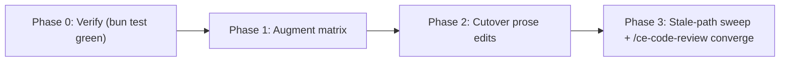

# Runbook: V2 public cutover (U9)

**Seam:** The final v2 refactor unit. By the time U9 lands, the
deterministic probes the master plan named as U9 deliverables already
exist — U4 shipped them as `cli.test.ts` ACs, U5 shipped them as
`lib/packets.test.ts` MUST-NOT-leak deny-list tests, U6 shipped them as
`lib/route.test.ts` + `cli.test.ts` runbook-version + install-presence
tests. The U1 regression matrix is also already populated with the
twelve prose-only invariants and the five deterministic probe targets.

So U9's real job shrinks to two coupled jobs:

1. **Prove the existing probe surface is wired to the regression
   matrix.** Augment every `cli.ts ... --json` row in
   `regression-matrix.md` with the test file path + `it()` description
   verbatim, so a reviewer can trace contract → test in one hop.
2. **Flip the public entry point from v1 to v2.** Two prose edits —
   add a legacy-pointer block at the top of
   `runbooks/issue-to-pr/README.md`, trim the "shadow until U9"
   caveat from `runbooks/issue-to-pr-v2/README.md`. v1 stays on disk
   as a frozen baseline; v2 becomes the public runbook.

Plus two verifications: the probe suite is green, and no v2 prose
still names v1 paths (a sweep for stale `~/.claude/runbooks/issue-to-pr/`
strings inside the v2 tree).

**Central risk: cutover before proof.** Publishing v2 before the
deterministic probes pass means promoting a tree whose behavior is
asserted only by reviewer eyeballs. The refactor plan's R12/R13
explicitly require automated coverage for the brittle surfaces
(install-presence, version-skew, route classification, packet leak,
drift reporting) before public invocation flips. U9 enforces that
ordering: cutover edits land only after a green `bun_runTests` run.

**Ledger:** [u9-cutover-ledger.md](u9-cutover-ledger.md)

**Invocation:** see [README.md - Invocation](README.md#invocation).

**Turn protocol:** see [README.md - Turn protocol (shared)](README.md#turn-protocol-shared).

## Pre-existing probe surface (read-only audit anchor)

These tests were shipped by earlier units and are the deterministic
audit surface U9 cites. U9 must NOT duplicate them, but Phase 1's
matrix augmentation must point at them.

| Probe area | Test file | Owning unit |
| --- | --- | --- |
| `cli.ts state --json` schema + route_id field | `runbooks/issue-to-pr-v2/cli.test.ts` AC2 (~L196-282) | U4 |
| `cli.ts next --json` minimal + no-imperative | `runbooks/issue-to-pr-v2/cli.test.ts` AC3 (~L285-313) | U4 |
| `cli.ts contract route_ids --json` matches `ROUTE_IDS` | `runbooks/issue-to-pr-v2/cli.test.ts` AC5 (~L407+) | U4 |
| `cli.ts diagnose --json` drift + install presence shape | `runbooks/issue-to-pr-v2/cli.test.ts` AC4 (~L315-394) | U4 |
| Route id determinism across repeat invocations | `runbooks/issue-to-pr-v2/cli.test.ts` AC6 (~L497-518) | U4 |
| Packet leak deny-list (5 roles × multiple bait tokens) | `runbooks/issue-to-pr-v2/lib/packets.test.ts` MUST-NOT-leak sections (51 `.not.toContain` assertions) | U5 |
| `runbook_version` matched/missing/mismatched + stop-required gate | `runbooks/issue-to-pr-v2/cli.test.ts` L1312-1462, `runbooks/issue-to-pr-v2/lib/route.test.ts` L195-548 | U6 |
| `installedArtifactPresence()` real recursive walk + failure modes | `runbooks/issue-to-pr-v2/lib/route.test.ts` L611-760 | U6 |

If a row in `regression-matrix.md` cannot be wired to one of these
tests (or a manual scenario), that is the audit gap U9 fills — file it
as a finding before claiming cutover-readiness.

## Files in scope

**Writable (Phase 1 — matrix augmentation + verification):**

- `runbooks/issue-to-pr-v2/references/regression-matrix.md` (modify:
  for every `Deterministic probe targets` row whose `probe` field is
  `cli.ts ... --json`, append a `test_anchor` column citing the
  specific test file path + `it()` description verbatim. Mark every
  `Prose-only invariants` row with verification class `manual` —
  these are judgment-heavy by design and the matrix already says so.
  No new probe rows; no new probe code.)

**Writable (Phase 2 — cutover, two prose edits + two verifications):**

- `runbooks/issue-to-pr/README.md` (modify: add ONE legacy-pointer
  blockquote at the top — "frozen v1 reference; active runbook lives
  at runbooks/issue-to-pr-v2/". Nothing else in v1 changes.)
- `runbooks/issue-to-pr-v2/README.md` (modify: replace the "shadow
  until U9" opening sentences with a one-line "v1 stays on disk as a
  frozen behavior baseline" statement. Preserve U8's finder
  discipline; do NOT restructure the README beyond that one paragraph.)

**Read-only (frozen — preserve verbatim):**

- All `runbooks/issue-to-pr/` files except `README.md`'s single
  legacy-pointer block
- `runbooks/issue-to-pr-v2/issue-to-pr.md` (U7 hot router)
- `runbooks/issue-to-pr-v2/cli.ts` (U4/U5/U6 source)
- `runbooks/issue-to-pr-v2/decompose.ts` (U3 source)
- All `runbooks/issue-to-pr-v2/lib/*.ts` source (U3-U7 source — tests
  do NOT change in U9; the test surface is already complete)
- All `runbooks/issue-to-pr-v2/lib/*.test.ts` files (already shipped
  by U3-U7; U9 references them, does not edit them)
- All `runbooks/issue-to-pr-v2/references/*.md` except
  `regression-matrix.md`
- All `runbooks/issue-to-pr-v2/templates/*.md`
- `runbooks/issue-to-pr-v2/issue-N-ledger.template.md`
- `runbooks/issue-to-pr-v2/cli.test.ts` (U4-U6 test surface — no U9
  edits)
- `runbooks/issue-to-pr-v2/decompose.test.ts` (U3 test surface)
- `tsconfig.json` (already includes `runbooks/issue-to-pr-v2/**/*.ts`
  per U3/U4 work; no U9 edit)
- `install.sh` (already surfaces v2 install-artifact presence via the
  U6 `check_v2_artifact_presence` block; no U9 edit)

**Read-only (anchors — this seam consumes them):**

- `docs/plans/2026-05-22-002-refactor-issue-to-pr-v2-runbook-plan.md`
  (U9 plan section L656-L706)
- `runbooks/issue-to-pr-v2/references/regression-matrix.md` (U1
  anchor; U9 augments existing rows but does not add new sections)
- `runbooks/issue-to-pr-v2/lib/contract.ts` (`ROUTE_IDS`,
  `RUNBOOK_VERSION` — referenced by existing tests U9 cites)
- `runbooks/issue-to-pr-v2/cli.ts` `HELP_DATA` (already locked by
  existing AC tests U9 cites)

## What U9 is NOT — explicit anti-list

These belong to other units and must not be implemented here:

- **New probe code.** U4-U6 already shipped the probes the master
  plan named as U9 deliverables. U9 must NOT add a new
  `v2-regression.test.ts` file; must NOT add new `it()` blocks to
  `cli.test.ts`, `decompose.test.ts`, `lib/route.test.ts`, or
  `lib/packets.test.ts`. If the matrix-augmentation step surfaces a
  genuinely missing probe, file it as a finding with risk `high` and
  ask before adding it — do not silently expand U9.
- **Deleting v1.** v1 stays on disk as a frozen baseline. U9 must
  NOT delete files under `runbooks/issue-to-pr/`, and must NOT remove
  `runbooks/issue-to-pr/` from the `tsconfig.json` `include` glob.
- **Rewriting v1 prose.** The only v1 edit is the single
  legacy-pointer block at the top of `runbooks/issue-to-pr/README.md`.
  Any other v1 edit is out of scope.
- **Restructuring the v2 README.** U8 owns its layout. U9 trims one
  opening paragraph (the "shadow until U9" caveat). Any other v2
  README edit is out of scope.
- **Hot-router edits.** U7 owns `runbooks/issue-to-pr-v2/issue-to-pr.md`.
  If a sweep surfaces stale v1 path references inside the hot router,
  that is a U7 follow-on — file it as a finding rather than patching
  the hot file.
- **New CLI commands, envelope fields, or packet roles.** U4/U5/U6
  own those surfaces. U9 only references the existing ones via the
  regression matrix.
- **New `lib/*.ts` source.** Source does not change in U9.
- **Ledger schema changes.** U6 owns the schema.
- **`tsconfig.json` or `install.sh` edits.** Both were already
  brought to the v2-ready state by U3/U4 (tsconfig include) and U6
  (install.sh status block).

## Phase shape



Cutover edits MUST NOT land until Phase 0 verification passes. The
seam's `/ce-code-review` loop treats any Phase 2 edit landed
alongside a red `bun_runTests` run as a P0 finding.

## Suggested reviewer personas

Always-on (every sweep):

- `compound-engineering:ce-correctness-reviewer` — does the
  legacy-pointer link in v1 README resolve to the right v2 location?
  Does the v2 README caveat trim preserve U8's finder discipline?
  Does every matrix `test_anchor` point at a test that actually
  exists with the cited `it()` description?
- `compound-engineering:ce-testing-reviewer` — does matrix coverage
  match probe-surface reality row-for-row? Are there any
  prose-invariant rows the matrix marks `manual` that an existing
  test actually covers (i.e. were silently auto-promoted by U4-U6)?
- `compound-engineering:ce-api-contract-reviewer` — do the cited
  test names match what's in the test files verbatim? Any envelope-
  or route-id-shape drift between matrix prose and `lib/contract.ts`?
- `compound-engineering:ce-scope-guardian-reviewer` — does the diff
  respect the anti-list? Specifically: no new probe code; no v1
  edits beyond the single legacy pointer; no hot-router edits; no
  `lib/*.ts` source edits; no `tsconfig.json` or `install.sh` edits;
  no v2 README restructure.
- `compound-engineering:ce-maintainability-reviewer` — is the
  regression matrix readable as a contract after the test-anchor
  column lands? Does the v1 legacy-pointer block convey "this is
  frozen" without requiring the reader to chase a link first?

Conditional:

- `compound-engineering:ce-project-standards-reviewer` — added if
  the v2 README caveat trim touches conventions
  Nathan's CLAUDE.md / AGENTS.md encode (Mermaid-for-flows,
  em-dash policy, frontmatter rules).

## ADR guardrails

- **ADR 0001 (Orchestration / mechanic split).** The probes U9
  cites all test mechanics. Orchestration prose stays in the hot
  router; U9 makes no orchestration claim.
- **ADR 0002 (CLI emits facts, not orchestration).** Already pinned
  by `cli.test.ts` AC3 (next no-imperative) and AC2 (state JSON
  shape). U9 inherits, does not extend.
- **R-no-orchestrator-CLI.** Preserved.
- **R10 (preserve U3/U4/U5/U6/U7/U8 split).** No `lib/*.ts` source
  changes; no test edits; no hot-router edits; no U8 README
  restructure.
- **R12 (cutover safety).** v1 stays on disk and stays type-checked
  (tsconfig still includes it). The single legacy-pointer block is
  the only v1 edit.
- **R13 (probe-before-publish).** Cutover edits gate on a green
  `bun_runTests` run. Treated as P0 if violated.

## Per-snapshot contracts (MUST include / MUST NOT leak)

### Regression matrix augmentation (MUST include)

In `runbooks/issue-to-pr-v2/references/regression-matrix.md`, the
`Deterministic probe targets` table gains a `test_anchor` column
naming the specific test file path + `it()` description for each row
whose `probe` is `cli.ts ... --json`. Example shape:

```text
| probe-cli-state | `cli.ts state --json` | ... | `cli.ts state --json` | U4 | mapped | runbooks/issue-to-pr-v2/cli.test.ts: "data carries confirmation_state, digest_drift, version_skew, route_id, required_reference_ids, blocking_gates" |
```

The `Prose-only invariants` table gains the same `test_anchor`
column, but every row's value is `manual: <one-line rationale>`
because U1 already classified these as judgment-heavy. The column is
filled for symmetry, not because new probes are expected.

If a `Prose-only invariants` row turns out to be covered by an
existing test (e.g. helper validation actually rejects the named
violation deterministically), the row may be promoted to
`automated-probe` with a test_anchor — but only if the test
genuinely asserts the invariant. Inflating coverage by pattern-
matching test names is the U9 central anti-pattern.

### v1 README legacy pointer (MUST include exact shape)

A single blockquote block at the top of
`runbooks/issue-to-pr/README.md`, above the existing H1:

```markdown
> **Frozen v1 reference.** The active runbook lives at
> [`runbooks/issue-to-pr-v2/`](../issue-to-pr-v2/README.md). This v1
> tree stays on disk as a behavior baseline for the v2 refactor; it
> is no longer the public entry point.
```

No other v1 edits. No changes to the existing H1, body sections,
links, code samples, or formatting.

### v2 README shadow-caveat trim (MUST include exact shape)

The current `runbooks/issue-to-pr-v2/README.md` opens with:

> Maintainer-facing index for the v2 shadow tree at
> `runbooks/issue-to-pr-v2/`. The v2 install is in **shadow** until
> U9 cuts over the public hot-router entry point. The runnable,
> public reference remains the v1 install at
> `~/.claude/runbooks/issue-to-pr/` until that cutover lands.

Replace those three sentences with:

> Maintainer-facing index for the v2 install at
> `runbooks/issue-to-pr-v2/`. v1 stays on disk at
> `~/.claude/runbooks/issue-to-pr/` as a frozen behavior baseline.

The rest of the v2 README (file map, anti-list, helper execution
context, etc.) does not change.

### Stale-path sweep (MUST hold)

After the cutover prose edits land, a sweep over the v2 tree
(`runbooks/issue-to-pr-v2/`) must surface zero remaining references
to `~/.claude/runbooks/issue-to-pr/` (the v1 install path) in:

- `issue-to-pr.md` (hot router) — any hit is a U7 follow-on, not a
  U9 fix; file as a finding with risk `high` and ask.
- `references/*.md` — any hit is a U2/U7 follow-on; file as a
  finding with risk `high` and ask.
- `templates/*.md` — any hit is a U2/U5 follow-on; file as a
  finding with risk `high` and ask.

The sweep is read-only inside U9; remediation goes through the
owning seam.

### MUST NOT leak

- **No new probe code.** Phase 1's matrix augmentation is the only
  Phase 1 edit. If a probe is found missing, file as a finding and
  ask before adding it.
- **No CLI/lib source edits.** U9 is matrix + two prose edits.
- **No `tsconfig.json` or `install.sh` edits.** Already done.
- **No v2 README restructure beyond the one-paragraph caveat trim.**
- **No v1 edits beyond the single legacy-pointer block.**

## Scoped audit prompt

````text
Review U9 public cutover. Phase 1 adds a `test_anchor` column to
`runbooks/issue-to-pr-v2/references/regression-matrix.md` citing the
existing test that exercises each deterministic probe row. Phase 2
adds a single legacy-pointer blockquote at the top of
`runbooks/issue-to-pr/README.md` and trims the shadow-caveat opening
of `runbooks/issue-to-pr-v2/README.md`.

Audit items:

1. Does every `Deterministic probe targets` row in
   `regression-matrix.md` carry a `test_anchor` value naming the
   test file path + `it()` description verbatim?
2. Does each cited `it()` description actually exist in the named
   test file?
3. Does any `Prose-only invariants` row claim
   `automated-probe` without a real test asserting the invariant?
4. Is the v1 README legacy-pointer block exactly the shape specified
   in this runbook? Does the link resolve to
   `runbooks/issue-to-pr-v2/README.md`?
5. Is the v2 README shadow-caveat trim exactly the shape specified
   in this runbook? Does U8's finder discipline survive (file map,
   anti-list, helper execution context, See-also sections intact)?
6. Does the v2 tree contain any remaining references to
   `~/.claude/runbooks/issue-to-pr/` (the v1 install path) outside
   the `references/regression-matrix.md` line-map (which legitimately
   cites v1 source paths)?
7. Does the diff respect the anti-list? Specifically: no new probe
   code; no v1 edits beyond the single legacy pointer; no hot-router
   edits; no `lib/*.ts` source edits; no `tsconfig.json` or
   `install.sh` edits; no v2 README restructure.
8. Did `bun_runTests` pass against
   `runbooks/issue-to-pr-v2/` before any cutover prose edit landed?

Severity:

- P0: cutover edit landed without a green `bun_runTests` run; v1
  source edit beyond the legacy pointer; hot-router edit; new probe
  code added; new CLI surface; new packet role; stale v1 path
  reference left inside the v2 tree.
- P1: matrix `test_anchor` cites a test that does not exist; matrix
  promotes a prose invariant to `automated-probe` without an actual
  asserting test; legacy-pointer link wrong; v2 README caveat trim
  wrong shape.
- P2: matrix `test_anchor` cites a test but description does not
  match verbatim; matrix column header missing on a row.
- P3: minor formatting; matrix row order drift.

Return findings with stable kebab-case signatures (e.g.
`matrix-test-anchor-missing`, `v1-legacy-pointer-link-broken`,
`v2-readme-caveat-trim-wrong-shape`, `stale-v1-path-in-hot-router`).

Do NOT propose new probe code. Do NOT propose edits to v1
source/helper files beyond the single legacy-pointer block. Do NOT
propose edits to the U7 hot router. Do NOT propose new CLI commands,
envelope fields, packet roles, or `lib/*.ts` source. Do NOT propose
`tsconfig.json` or `install.sh` edits.
````

## Closing a finding without fixing it

Seam-specific close reasons:

- `not-in-u9-scope` — finding belongs to a different unit (U2/U5/U7
  follow-on).
- `deferred-to-u7-followon` — finding is about hot-router prose; U7
  owns the file.
- `deferred-to-u2-followon` — finding is about a reference or
  template; U2 owns those files.
- `already-shipped-by-uN` — finding requests work U4/U5/U6/U7 already
  completed; the matrix entry is the audit trail.
- `manual-only-by-design` — finding requests automation of an
  invariant U1 marked `manual` for documented reasons (judgment-
  heavy, host-coupled, operator-confirmation-required).

## Stop condition

Stop when ALL of the following hold:

1. `bun_runTests` is green across `runbooks/issue-to-pr-v2/` and
   `runbooks/issue-to-pr/` (the cutover does not bitrot the v1 type
   surface either).
2. `tsc_check` is green across both trees.
3. `biome_lintCheck` is green across the diff.
4. `regression-matrix.md` `Deterministic probe targets` table has a
   `test_anchor` value for every row, and each anchor points at a
   real test.
5. The stale-path sweep returns zero hits in `issue-to-pr.md`,
   `references/*.md`, and `templates/*.md` (the
   `references/regression-matrix.md` line-map citing v1 source paths
   is excluded — it legitimately cites v1 by design).
6. The v1 legacy-pointer block and the v2 README caveat trim are in
   place and match the exact shapes specified.
7. The most recent `/ce-code-review` pass returns zero new findings.
8. Every ledger row is `fixed` or `closed`.

## /loop fallback

```text
/loop 5 Follow docs/runbooks/issue-to-pr-v2-refactor/u9-cutover.md.
Re-read the runbook and u9-cutover-ledger.md at the start of every
turn. Echo the full ledger status table inline at the end of every
turn.
```
