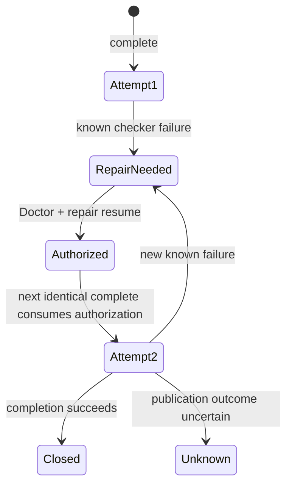

# Vault Git Completion Repair Re-entry

## Outcome

Let an operator recover a known failed background completion:

```text
complete fails
  -> Doctor proves repairable
  -> repair resume restores receipt write authority
  -> next identical complete starts one fresh Attempt
  -> existing Completion Task closes
```

Preserve the stable Task ID. Preserve the failed Attempt as immutable evidence.
Never retry automatically.

## Confirmed Bug

The public process test reproduces this sequence:

1. Begin a transaction.
2. Run `complete` with a deterministic failing checker.
3. Wait for its Completion Task to reach `repair_needed`.
4. Run Doctor. Doctor names `repair resume`.
5. Run `repair resume`. The receipt returns to `writing`.
6. Install a passing checker.
7. Run the same `complete` command.

Step 7 returns the old `vault_check_failed` result in about 20 ms. No worker
launches. The transaction remains open despite the approved repair.

Focused reproduction:

```bash
cd runtime/vault-git-transaction-manager
bun test tests/smoke/durable-phase-matrix.integration.test.ts \
  -t 'repairable re-enters completion'
```

Expected: the same Task ID reaches `in_progress`, then `closed`.

Actual: the same Task ID immediately returns its old terminal
`repair_needed` result.

## Root Cause

Three individually valid owners disagree after repair:

1. `repair.ts` restores the transaction receipt to `writing`.
2. `task-store.ts` keeps one immutable receipt-scoped claim and returns its
   latest Task state for every matching `claimOrJoin` call.
3. `task-state.ts` makes terminal `repair_needed` absorbing except for a
   transition to `closed`.

`cli.ts` only launches for a new claim, a `claimed` Task, or bounded recovery
of an expired unacknowledged launch. A joined terminal Task skips launch and
projects its old result.

`reconcileTaskClosure` only reconciles a proven closed transaction. It does not
connect a successful `repair resume` to Task re-entry.

The receipt says “writing may continue.” The Completion Task says “this worker
attempt is permanently finished.” The model lacks an Attempt boundary.

## Falsified Alternatives

- Changed input: false. The retry returns `vault_check_failed`, not
  `task_input_mismatch`.
- New worker overwritten by reconciliation: false. The response returns before
  spawn and retains the old terminal revision.
- Activation, lease, or capability loss: false. No corresponding blocker is
  emitted; the old checker failure is replayed.
- Slow checker or remote: false. The refusal completes in milliseconds.

## Domain Model

### Completion Task

Stable user-visible outcome for one receipt-scoped completion intent.

Identity and immutable binding remain unchanged across repair:

- Task ID
- receipt ID
- transaction ID
- lease generation
- remote
- normalized completion input
- owner-capability digest

### Attempt

One authorized worker execution within a Completion Task.

Each Attempt has:

- monotonic attempt number
- exact launch generation
- bounded pre-ack launch-attempt counter
- launch and worker identity evidence already required by the worker protocol
- admitted, running, and terminal checkpoints
- sanitized terminal result

Attempt history is append-only. An old worker can only mutate its exact current
Attempt and launch generation.

`attempt number` and the existing `launchAttempt` are different:

- Attempt number counts explicit completion executions separated by repair.
- `launchAttempt` counts bounded pre-ack process replacement inside one Attempt.
- A repaired Attempt increments Attempt number and resets `launchAttempt`.

### Repair Authorization

Single-use private evidence that permits one fresh Attempt after explicit
repair.

It binds:

- Task ID
- failed Attempt number
- failed Task revision
- transaction ID
- receipt ID
- lease generation
- existing task binding digest
- repaired receipt revision
- repair action `resume`
- recorded time

It contains no capability bytes, paths, raw checker output, Git output, or
credentials.

## Required Lifecycle



Rules:

1. `repair resume` publishes Repair Authorization. It never launches a worker.
2. Only the next explicit, identical `complete` may consume the authorization.
3. One CAS winner creates the next Attempt. Concurrent callers join it.
4. The Task ID remains stable.
5. The Attempt number increases by one.
6. The new Attempt receives a fresh launch generation.
7. The previous terminal result remains immutable history.
8. Changed input refuses and does not consume authorization.
9. `unknown` never re-enters through this path.
10. A new known failure requires a new Doctor diagnosis and repair.
11. Heartbeat freshness remains observational. It grants no lease or write
    authority.
12. Existing engine, Git adapter, ledger, receipt, capability, and atomic-close
    fences run unchanged for every Attempt.

Task state keeps a monotonic private no-reentry fence after any `unknown`
publication outcome, including schema-one task history. Later Doctor refinement
may improve diagnosis, but it cannot make that Attempt repair-authorizable.

## Owner Changes

### `task-state.ts`

Own:

- Completion Task and Attempt vocabulary
- monotonic Attempt transitions
- single-use Repair Authorization shape
- terminal history invariants
- late Attempt and launch-generation refusal

Allow `repair_needed -> claimed` only through the store operation that consumes
an exact Repair Authorization. Keep the generic transition function unable to
re-arm a terminal Task.

### `task-store.ts`

Own one deep operation:

```ts
claimOrJoinRepairedAttempt(input):
  | { status: "winner"; task; attempt }
  | { status: "joined"; task; attempt }
  | { status: "refused"; reason }
```

The operation must atomically:

1. Load the immutable receipt claim.
2. Validate the exact Task binding.
3. Load the latest Task and Attempt revision.
4. Validate an unconsumed matching Repair Authorization.
5. Consume the authorization with revision CAS.
6. Append the next claimed Attempt.

Keep append-only revision history as the authority. Do not restore a mutable
`current.json` mirror.

Encode the pending authorization and its consumption in Task revisions. Do not
add a second mutable current-state owner or a generic job store.

### `repair.ts` and repair CLI composition

After `resume` durably appends a `writing` receipt, publish the matching Repair
Authorization through the Task Store.

When a matching background Completion Task exists, the repair result may report
full success only after either:

- the authorization is durable, or
- the receipt was already closed and Task closure reconciliation completed.

A transaction without a background Task remains valid legacy state and needs
no Repair Authorization.

If the receipt append succeeds but authorization publication is interrupted,
the next Doctor or identical `repair resume` must materialize the same
authorization idempotently. It must not create a second authorization.

### `cli.ts`

For `complete`:

- join active Attempts
- return closed Tasks
- return terminal Tasks without authorization
- consume valid repair authorization and launch one fresh Attempt
- refuse mismatched input without consuming authorization

Preserve the existing foreground acknowledgement budget.

### `task-worker.ts`

Bind acknowledgement, heartbeat, engine entry, and terminal publication to:

- Task ID
- the current Task revision and semantic Attempt selected by the Task Store
- the fresh launch generation created for that Attempt

The worker protocol does not add a second Attempt-number credential. The exact
launch generation already identifies and fences the current Attempt.

A late worker from an older Attempt must refuse before capability custody and
before engine entry.

### `task-reconciliation.ts`

Own idempotent recovery for the receipt-written/authorization-missing crash
window. Continue to reconcile proven transaction closure without launching a
worker.

Never turn `unknown` into a repaired Attempt.

## Public Contract

Keep `vault-git.lifecycle-result` schema `1` additive.

Preserve:

- `task_id`
- `task_state`
- existing transaction and continuation fields

Add optional:

- `task_attempt_number`: current Attempt number
- `task_previous_failure`: sanitized previous Attempt terminal result, only
  while useful for repair inspection

Never expose:

- Repair Authorization
- binding or capability digests
- launch generation
- worker PID or process identity
- private state paths
- raw child, checker, or Git output

After repaired admission, foreground `complete` returns:

```json
{
  "outcome": "advanced",
  "task_id": "same stable task ID",
  "task_attempt_number": 2,
  "task_state": "in_progress"
}
```

## Crash and Concurrency Contract

| Boundary | Required result |
| --- | --- |
| Receipt repaired before authorization append | Doctor or repeated exact repair materializes one authorization; no worker starts implicitly |
| Authorization appended before repair response | Next explicit identical complete may consume it |
| Twenty identical completes race | One new Attempt and one worker; nineteen joins |
| Changed input races valid input | Changed input refuses; valid winner remains possible |
| Old worker wakes after re-entry | Refuses before engine entry |
| New worker dies before acknowledgement | Existing bounded launch recovery applies only to that Attempt |
| New worker fails checker | Attempt becomes `repair_needed`; no automatic third Attempt |
| Push outcome becomes uncertain | Task becomes `unknown`; no repair re-entry |
| Transaction closes before Task terminal append | Doctor reconciles the same Task to `closed`; no new Attempt |

## Acceptance Criteria

1. The focused public-process reproduction passes with the same Task ID and one
   fresh Attempt.
2. Exactly one real atomic close occurs after repair.
3. Local and remote main align; the lease is released; unrelated worktree bytes
   remain unchanged.
4. Twenty identical repaired completions start one worker.
5. Changed summary, transaction, receipt, generation, remote, or capability
   digest refuses without consuming authorization.
6. A late prior-Attempt worker fails before capability custody and engine entry.
7. Every receipt/authorization crash boundary has deterministic idempotent
   recovery.
8. `unknown` and uncertain publication never re-enter automatically or through
   `resume`.
9. Public output contains no private evidence, process identity, raw output, or
   secret-derived material.
10. Existing issue 361 background-worker, exact-path, atomic-close, Doctor,
    repair, two-clone, and activation suites remain green.
11. Production executable-source closure includes every new runtime source.
12. `CONTEXT.md` gains Completion Task, Attempt, and Repair Authorization only
    when implementation lands.

## Implementation Units

### U1: Task and Attempt state

- Add RED unit tests for Attempt monotonicity, terminal history, exact repair
  binding, single consumption, and changed-input non-consumption.
- Implement state and Task Store CAS only.

### U2: Repair composition

- Add RED tests for authorization publication after `resume`.
- Cover receipt-written/authorization-missing recovery.
- Keep repair worker-free.

### U3: Public vertical slice

- Make the existing smoke RED pass.
- Add `task_attempt_number` discovery, rendering, parser, and runtime proof.

### U4: Adversarial lifecycle proof

- Add twenty-caller, late-worker, parent-death, malformed-state, privacy, and
  unknown-publication rows.
- Run focused suites, package typecheck, Biome, Fallow, and full package tests.

### U5: Daily-driver qualification

- Run installed-command proof against an isolated fixture.
- Run hosted CI at the exact PR head.
- Keep live vault mutation separately approved.

## Pressure Gate

Use a plain completion-lifecycle module or extend the existing Task State and
Task Store owners. Do not introduce a generic job framework.

Pressure:

- one receipt claim currently conflates a stable user outcome with one worker
  execution
- repair needs another execution without replacing the stable Task
- crash and authority rules otherwise spread across CLI, repair, Task Store,
  Task State, worker, and reconciliation

The seam earns depth because it centralizes Attempt creation, authorization
consumption, and stale-worker fencing. It does not earn a generic framework:
Background Preflight remains a separate domain and no second adapter exists.

## Non-goals

- automatic retry
- lease renewal from Task heartbeat
- generic background-job infrastructure
- replacing the existing engine, Git adapter, remote ledger, receipt store, or
  capability custody
- changing `repair resume` into a worker-launching command
- permitting re-entry after uncertain publication

## Next Safe Action

Qualify U5 at the exact implementation head: run the full package suite,
publish the pull request, require hosted CI, then run the separately approved
installed-command proof.
