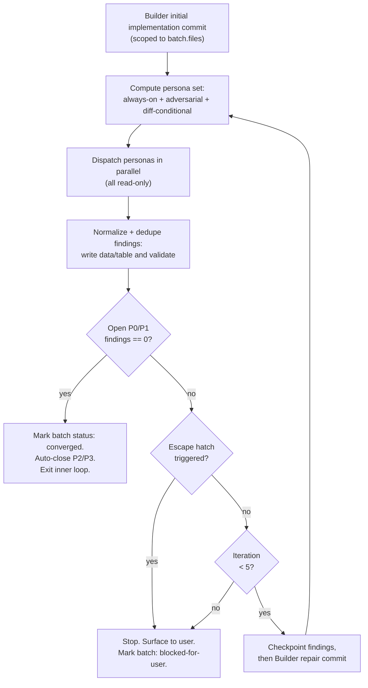

# Stage 4: batch-loop reference

**v1 source anchors:** `runbooks/issue-to-pr/issue-to-pr.md` L683-701, L715-753
(outer loop, lifecycle checkpoints, convergence, accepted risk, batch-loop
exit); L1017-1035 (inner-loop diagram); L806-886 (final-review patch-batch
decision tree — moved here per the U2 plan); L872-879
(smallest-contract-patch heuristic).

**Read trigger:** open this reference when entering or resuming `batch-loop`,
before selecting the next pending batch, before any Builder dispatch (the
pre-dispatch readiness check from [host-adapters.md](host-adapters.md)
applies), when an inner-loop iteration completes, or when Stage 5 routes a
final-review finding back here for patch-batch remediation. See also:
[builder-dispatch.md](builder-dispatch.md),
[host-adapters.md](host-adapters.md),
[findings-and-validators.md](findings-and-validators.md),
[stage-5-final-review.md](stage-5-final-review.md).

## Inputs

Ledger with batches in topological order. If Stage 4 resumes with a batch
already `in-progress` and another Builder dispatch is needed, do not select a
new pending batch and do not change batch status. Verify host Builder
readiness for the current in-progress batch immediately before dispatch (see
[host-adapters.md](host-adapters.md)).

## Pre-stage gates (must clear before any Builder dispatch)

Stage 4 inherits two stop-required gates from the durable ledger snapshot
exposed by `cli.ts state <ledger-path> --json`. The orchestrator routes
off the returned envelope, not conversation memory:

- **Version-skew gate.** If `data.runbook_version_skew` is `missing` or
  `mismatched` (and not `continuation-evidence-present`), `route_id` is
  `blocked-runbook-version-skew` and `blocking_gates` contains a
  `{kind: "field", field: "frontmatter.runbook_version", value: ...}`
  entry. Do not dispatch Builder, Proposer, or Validator packets, do not
  ship; stop and ask the operator to either align `runbook_version` or
  record continuation evidence per
  [ledger-and-helper.md](ledger-and-helper.md#continuation-evidence-shape-u6).
- **Install-presence gate.** If
  `data.installed_artifact_presence.all_present` is `false`, the v2
  install is incomplete. The full shape is
  `{references: bool, templates: bool, cli_ts: bool, lib_dir: bool, all_present: bool, missing: ('references'|'templates'|'cli_ts'|'lib_dir')[]}`;
  any per-root boolean that is `false` appears in the
  `missing` list. Stop and surface the `missing` list to the
  operator; Builder dispatch against a partial install would render
  packets without their templates.

Both gates re-fire on every turn: a resumed run must `cli.ts state` first
and short-circuit before selecting a batch.

## Outer loop (v1 L692-753)

1. **Select the next batch.** First batch in YAML order where
   `status == pending` AND every batch in `depends_on` has terminal-success
   status (`converged` or `accepted-risk`).
2. **Eligibility gate.** If pending batches remain but none are eligible,
   fail-stop with `blocked_reason: no-eligible-batch` and print the blocked
   dependencies. If no batches remain pending, skip host readiness and
   advance when step 8 applies.
3. **Pre-dispatch host readiness.** Verify host Builder readiness for the
   selected eligible batch before any batch status mutation. The full
   capability list and the
   `blocked_reason: host-builder-tools-unavailable` outcome live in
   [host-adapters.md](host-adapters.md).
4. **Lifecycle checkpoint: start batch.** Mark `status: in-progress` and
   commit a ledger-only lifecycle checkpoint before Builder starts:
   `chore(issue-{issue-number}): start <batch-id> batch`. This is a
   stage-visible `batch-loop` turn. It does not count toward `iterations`,
   and it is outside Builder scope discipline because the orchestrator owns
   ledger lifecycle state. Stage only the per-issue ledger path and verify
   the working tree is clean after the commit.
5. **Run the inner loop** (see Inner loop section below).
6. **On inner-loop success.** Set `status: converged`, append the Builder
   commit refs to `builder_commits`, append compact records for every
   well-formed Builder envelope to `builder_attempts`, set `iterations` to
   the number of well-formed Builder envelopes for that batch (committed or
   Builder-authored fail-stop, excluding Validator persona waves), and set
   `final_verdict: converged`. Auto-close batch P2/P3 findings as
   `deferred-P2` / `deferred-P3`, update the rendered findings table, run
   `--validate-findings`, and commit a ledger-only lifecycle checkpoint:
   `chore(issue-{issue-number}): converge <batch-id> batch`. This is a
   stage-visible `batch-loop` turn. It does not count toward `iterations`,
   and it may touch only the per-issue ledger path. Continue at step 1.
7. **On inner-loop escape-hatch fire or iteration-cap hit.** Fail-stop and
   ask the user. Options:
   - **Accept remaining findings as risk.** Close the relevant
     `## Findings data` rows with `status: accepted-risk` and
     `resolution: "accepted-risk: <reason>"`, set batch
     `status: accepted-risk`, set `final_verdict: accepted-risk`, commit, and
     let dependents proceed.
   - **Reframe the batch.** Set `status: blocked`,
     `final_verdict: blocked-for-user`, record the decision in Notes, and use
     the replacement-batch flow ([builder-dispatch.md](builder-dispatch.md)) when
     the revised contract should supersede the blocked original.
   - **Abandon the run.** Set `status: blocked`,
     `final_verdict: blocked-for-user`, and stop.
8. **No batches remain pending.** Working tree must be clean; advance to
   Stage 5.

## Exit condition

Every batch has `status: converged` (or `accepted-risk` with user
confirmation); working tree clean.

## Inner loop (v1 L1017-1035)

For each batch:

**Inner-loop iteration cap: 5.** After 5 well-formed Builder envelopes in one
batch (committed or Builder-authored fail-stop), stop and ask the user.

Builder execution rules (scope discipline, initial implementation commit, one
finding per fix commit, follow `execution_mode`, pin behaviour first,
tautological-test escape hatch, read before writing) live verbatim in
[builder-dispatch.md](builder-dispatch.md).

Validator invocation, normalization, dedupe, and `--validate-findings`
behaviour live in
[findings-and-validators.md](findings-and-validators.md).

### Packet rendering for Stage 4 dispatch

Builder, Proposer, and Validator dispatch material is rendered
deterministically from ledger state plus templates, not assembled by the
orchestrator inline. Use the v2 packet CLI to produce the canonical
dispatch packet (each command writes one `CliSuccessEnvelope` to stdout,
carrying both `packet` (machine-readable) and `packet_markdown`
(human/agent-readable) plus `dispatch_evidence`):

- Builder implementation attempt:
  `cli.ts packet builder --ledger <ledger-path> --batch <batch-id> --attempt-type implementation --json`
- Builder repair attempt (target-finding-signature required):
  `cli.ts packet builder --ledger <ledger-path> --batch <batch-id> --attempt-type repair --target-finding-signature <signature> --json`
- Validator persona:
  `cli.ts packet validator --ledger <ledger-path> --batch <batch-id> --persona <skill-name> --commit <ref> --touched-file <path> [--touched-file <path> ...] --json`
- Proposer (final-review finding handoff):
  `cli.ts packet proposer --ledger <ledger-path> --finding <finding-id> --json`
- Patch-proposal candidate persistence:
  `cli.ts packet patch-proposal --ledger <ledger-path> --finding <finding-id> --patch-id <patch-NNN> --patch-name <title> --patch-goal <sentence> --patch-execution-mode <mode> --patch-rationale <text> [--patch-file <path> ...] [--patch-depends-on <batch-id> ...] [--patch-acceptance-test <text> ...] --json`

## Final-review patch-batch decision tree (v1 L806-886)

Stage 5 routes every open P0/P1 finding from `/ce-code-review` back to this
section. Stage 5 itself is read-only ([stage-5-final-review.md](stage-5-final-review.md));
the patch-batch decision tree below is the only mutation path for final-review
findings.

For each open P0/P1 final-review finding, treat the Validator finding as
routing evidence, not as an Orchestrator-authored implementation plan. The
Orchestrator may only decide whether the finding appears eligible for the
bounded patch-batch path or must fail-stop for user re-planning.

- **If the Validator finding appears fixable in ≤2 files** (and those files
  are already in some confirmed batch's `files` OR are new files of comparable
  shape with an explicit `new-file-patch-exception:` rationale; use
  `high-risk-new-file-patch-exception:` for auth, payment, API, data, privacy,
  or other high-risk paths) → request a **proposal-only Builder dispatch**
  for one candidate patch-batch. The dispatch is read-only and
  pre-confirmation: Builder must not edit files, make commits, append
  `builder_attempts`, or increment `iterations`.
  - The proposal Work Packet contains the final-review finding row, its
    signature and reviewer evidence, the confirmed ledger batch summaries
    needed for terminal dependencies and file-scope checks, the current
    confirmation/digest state, local-law read order, the
    `decompose.ts --patch-proposal` helper contract, and the scratch proposal
    schema. It does not contain unrelated raw Validator envelopes or invite
    whole-plan replanning.
  - Builder verifies the finding against ledger and code evidence, then
    either returns exactly one candidate **patch-batch** with `id: patch-NNN`
    (incrementing), terminal ledger-backed `depends_on`, proposed `files`,
    `ac_mapping: []` (patch-batches don't map to ACs by design), explicit
    `execution_mode`, `acceptance_tests`, and `rationale`, or fail-stops with
    blockers and `route_hint`. Default toward `proof_first` when the finding
    is a missing check or behavioural proof. Use `change_first` only under
    the same guardrails as Stage 3.
  - The Orchestrator may reject a missing, malformed, or obviously unbounded
    candidate, but must not fill in missing files, dependencies,
    `execution_mode`, tests, or rationale from its own correctness reasoning.
    Until helper validation and user confirmation pass, the Builder candidate
    remains evidence only.
  - The Orchestrator writes the Proposer's returned candidate envelope to a
    scratch file (the Proposer itself performs no filesystem write) and runs
    `decompose.ts <patch-proposal-path> --patch-proposal <ledger-path>`. The
    helper validates against confirmed ledger state: exact fields, concrete
    paths, terminal ledger-backed dependencies, exactly one patch batch,
    files already in confirmed ledger scope unless `new-file-patch-exception:`
    is present, high-risk new files only when
    `high-risk-new-file-patch-exception:` is present, `execution_mode`,
    `acceptance_tests`, patch `ac_mapping: []`, and `change_first` guardrails.
  - Print the validated patch-batch proposal and ask the user to confirm the
    files, dependencies, execution mode, tests, and rationale. The user
    confirmation gate, not Builder or reviewer output, authorizes the patch
    contract.
  - On `n`, stop and discuss.
  - On `y`, append the confirmed helper output row to `## Batches`, mark its
    status `pending` if the helper output did not already do so, recompute
    `batch_contract_digest` with
    `decompose.ts --batch-contract-digest <ledger-path>`, keep
    `batch_contract_confirmation_status: confirmed`, update
    `batch_contract_confirmed_at`, and run
    `cli.ts state <ledger-path> --json` before returning to Stage 4
    (batch-loop). The envelope must report
    `confirmation_state.batch_contract: "confirmed"` and
    `route_id: "batch-loop"` with the appended patch-batch present in
    `## Batches` and pending. The appended patch-batch
    is now a confirmed batch; the Stage 4 Builder owns one implementation or
    repair attempt against that confirmed contract.
  - When the patch-batch converges, update the original `batch_id: final`
    finding row in `## Findings data` to `status: fixed` with
    `resolution: patch-batch <id>` (or `resolution: commit <sha>` when the
    commit is recorded in a terminal ledger batch) before evaluating the
    Stage 5 exit condition.

### Smallest contract patch heuristic (v1 L872-879)

- **If the finding's fix touches >2 files** → first ask whether a smaller
  patch exists that adjusts the *contract* the finding cites (a documentation
  claim, an acceptance test, a comment, a runbook section) rather than the
  full implementation surface. If yes, propose that 1-2-file patch-batch
  through the normal patch-batch path with rationale starting
  `contract-softening-exception:`. If no (the finding is genuine behaviour
  drift that requires the full sweep), fail-stop and ask the user to re-plan.
  `frontmatter.status = blocked`,
  `blocked_reason: final-review-needs-replan`.

Apply the same iteration cap, `same-signature-twice` hatch, and
`finding-count-rises` hatch used by the batch inner loop, keyed by final
finding signature across patch-batch attempts. After all patch-batches
converge, re-invoke `/ce-code-review` from the top of Stage 5.

## See also

- [builder-dispatch.md](builder-dispatch.md) for the Builder execution rules,
  authority boundary, and replacement-batch mechanics referenced here.
- [host-adapters.md](host-adapters.md) for the pre-dispatch and post-dispatch
  host-readiness boundary that gates Builder dispatch.
- [findings-and-validators.md](findings-and-validators.md) for Validator
  invocation, persona selector, broad-reviewer fallback, and findings table
  shape.
- [stage-5-final-review.md](stage-5-final-review.md) for the read-only
  final-review gate that hands findings back here.
- [`templates/proposer-envelope.md`](../templates/proposer-envelope.md) for
  the read-only Proposer dispatch envelope this seam dispatches in the
  patch-batch decision tree.
- [`templates/patch-proposal.md`](../templates/patch-proposal.md) for the
  Orchestrator-written scratch-file schema consumed by
  `decompose.ts --patch-proposal`.
