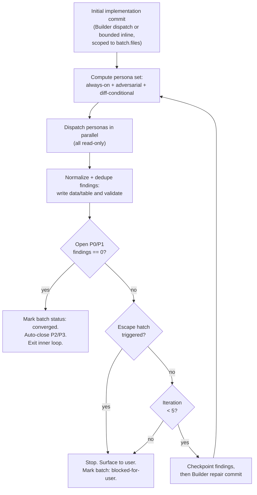

# Runbook: Issue to PR

**Seam:** Drive a GitHub issue to a green PR using the Builder/Validator
pattern over DAG-ordered batches.

**Ledger:** per-issue, at `docs/runbooks/issue-to-pr/issue-<N>-ledger.md` in
the target repo. Template at [issue-N-ledger.template.md](issue-N-ledger.template.md).

**Invocation:** see [README.md - Invocation](README.md#invocation).

**Turn protocol:** see [README.md - Turn protocol (shared)](README.md#turn-protocol-shared).

## Files in scope

This runbook does not own a fixed file list. Stage 4 implementation attempts
are only permitted to touch the files listed in the current batch's `files`
field (see `## Batch schema`). A missing path listed in `files` may be created
by Builder or by a bounded Orchestrator-inline attempt, but Builder must
fail-stop if preflight suggests the path is stale, mistyped, wrong-package, or
semantically unauthorized. Out-of-scope edits trigger a fail-stop (see
`## Inner loop` and `## Escape hatches`).

## Suggested reviewer personas

Always-on, dispatched in parallel after every committed implementation attempt
inside `## Inner loop`:

- `compound-engineering:ce-correctness-reviewer`
- `compound-engineering:ce-testing-reviewer`
- `compound-engineering:ce-maintainability-reviewer`
- `compound-engineering:ce-project-standards-reviewer`
- `compound-engineering:ce-adversarial-reviewer`

Conditional, dispatched only when the diff matches. See `## Persona selector`
for the trigger rules.

## ADR guardrails

This runbook does not pin ADRs of its own (it is a workflow definition, not a
codebase boundary). It does enforce the **target repo's** ADRs at validate
time: if any persona surfaces a finding citing the target repo's `docs/adr/*`,
the inner-loop `ADR-contradicts-<id>` escape hatch fires.

## Role boundaries

The role language is executable contract language:

- Planner (`/ce-plan`) proposes candidate batches, files, dependencies,
  `execution_mode`, acceptance tests, AC mapping, and rationales.
- `decompose.ts` parses the candidate plan and rejects machine-checkable drift.
- User gates confirm the AC list at stage 1 and the DAG plus execution modes
  at stage 3.
- The ledger stores the confirmed execution contract.
- Orchestrator owns stages, ledger writes, user gates, Builder dispatch,
  Builder envelope validation, Validator dispatch, and final workflow gates.
- Builder is dispatched as a fresh Builder sub-agent per *Builder* attempt.
  The Orchestrator does not play Builder during Stage 4, with one bounded
  exemption: a `change_first` attempt may be implemented Orchestrator-inline
  while inline eligibility holds (the batch is not a patch-batch, <=2 touched
  files, obvious, low-risk, non-behavioural, non-governance,
  non-public-contract, no broad discovery, no heavy Orchestrator context load,
  and not the third consecutive inline attempt without an explicit
  user-confirmed exception). `tdd`, `proof_first`, any repair after an open
  P0/P1, and every attempt on a patch-batch (`id: patch-NNN`, which carries an
  open final-review P0/P1 forward and is therefore never inline-eligible)
  always dispatch Builder.
- Builder implements exactly one batch attempt under the confirmed ledger
  contract, or fail-stops if that contract is unsafe or stale after reading
  the files. An Orchestrator-inline `change_first` attempt honours the same
  `batch.files` authority boundary as Builder and is recorded in its own
  audit lane on the ledger, separate from Builder attempt evidence.
- Validator personas are read-only reviewers. They do not fix, choose modes, or
  re-rank severity.

The Builder dispatch contract is sourced from
`docs/brainstorms/2026-05-21-issue-to-pr-builder-sub-agent-requirements.md`.

## Builder dispatch contract

**Applies to:** every `tdd` attempt, every `proof_first` attempt, every
repair attempt after an open P0/P1, every attempt on a patch-batch
(`id: patch-NNN`, which carries an open final-review P0/P1 forward and is
therefore never inline-eligible), and every `change_first` attempt after a
dispatch trigger fires (>2 touched files, non-doc or high-risk paths,
behavioural / public-contract / governance surface, broad discovery,
uncertainty, heavy Orchestrator context load, or the repeated-inline
threshold). Bounded inline-eligible `change_first` attempts run
Orchestrator-inline under the same `batch.files` authority boundary and
record their evidence in the Orchestrator-inline audit lane on the ledger,
separate from Builder attempt evidence; they do not use this dispatch
contract.

Stage 4 dispatches Builder as a fresh sub-agent per Builder attempt. The
dispatch is host-neutral: the runbook defines the Work Packet, authority
boundary, preflight rules, and return envelope, while each host maps that
contract to its own available execution primitive.

### Builder Work Packet

The Orchestrator sends Builder one batch-only Work Packet:

- issue number and target repo;
- `attempt_type: implementation | repair`;
- exactly one open P0/P1 target finding signature from committed
  `## Findings data` for repair attempts, and null otherwise;
- the confirmed batch contract verbatim: `id`, `name`, `goal`, `files`,
  `depends_on`, optional `supersedes`, `execution_mode`,
  `acceptance_tests`, `ac_mapping`, and `rationale`;
- the current iteration number, existing `builder_commits`, and compact prior
  `builder_attempts` for this batch;
- `## Findings data` rows for this batch only;
- non-authoritative Notes summaries for this batch only;
- Local Law Read Order, authority boundary, Mechanic Discipline, Builder
  Preflight Checklist, and return envelope contract.

The Work Packet must not include the full plan, full ledger, raw Validator
envelopes, unrelated batch state, `orchestrator_inline_attempts` as prior
Builder attempts, or rich Builder evidence that was not persisted in compact
`builder_attempts`. Inline attempt records are not Builder envelopes. They may
appear only as non-authoritative Notes context when relevant to a repair
route, never under `prior_builder_attempts`. Replacement-batch mechanics are
sourced from
`docs/brainstorms/2026-05-21-issue-to-pr-builder-sub-agent-requirements.md`.
When present, `supersedes` is read-only audit context for Builder. It does not
change Builder Preflight rules, authority boundaries, or return-envelope
shape.

When the batch depends on public-contract or domain-language constraints, the
Orchestrator must materialize the needed authority summary from the confirmed
batch contract or decomposition output before dispatch. Builder must not infer
that authority by reading the full plan or full ledger.

### Authority and Local Law

The ledger remains the source of authority. Builder may edit only files listed
in `batch.files`, may create a missing path only when that path is already
listed in `batch.files`, may make exactly one commit when preflight passes,
and may run targeted repo-local checks relevant to the batch.

Builder must not change acceptance criteria, dependencies, execution mode,
durable domain language, public contracts, dependencies, governance docs, or
files outside `batch.files` unless the confirmed batch contract explicitly
authorizes that change.

**Local Law Read Order:** before editing, Builder reads:

1. target repo root agent instructions, when present;
2. nearest package `AGENTS.md`, when present;
3. nearest package `CONTEXT.md`, when present;
4. package maps, ADRs, runbooks, or governance docs only when referenced by
   local law or triggered by package-boundary/public-contract work;
5. every file in `batch.files`;
6. nearby tests and implementation needed to understand the existing seam.

Builder may perform bounded read/search beyond `batch.files` for local law,
nearby tests, deterministic probes, and equivalent literal probes named by the
batch goal, rationale, or acceptance tests. Edits remain limited to
`batch.files`. Whole-repo archaeology routes to a fail-stop.

**Mechanic Discipline:** Builder finds an existing seam before editing, makes
the smallest coherent diff, avoids opportunistic cleanup, avoids speculative
abstractions, avoids generic helper dumping grounds, avoids dependency changes
unless explicitly scoped, preserves local domain/system language, runs targeted
checks where possible, and reports uncertainty instead of hiding it.

**Public Contract Rule:** Builder may change exported symbols, API shapes, CLI
flags/output, schemas, event payloads, config shapes, environment-variable
expectations, migration manifests, or package boundaries only when the
confirmed batch contract explicitly names the public surface and includes
checks/proofs for the change.

**Domain Language Rule:** Builder preserves existing target-repo language from
local law, nearby tests, and nearby code. Unowned terms may appear
provisionally in the envelope only. If missing language affects ownership, API,
behaviour, or durable meaning, Builder fail-stops.

### Builder Preflight Checklist

Preflight is required before any Builder edit. Builder verifies that:

- task and attempt type are understood;
- acceptance criteria are present;
- package ownership is clear enough for this batch;
- an existing seam is found, or a missing listed path can be created without
  stale-path, typo, wrong-package, or semantic-authorization risk;
- test/proof strategy is clear enough for the confirmed `execution_mode`;
- public API impact is `none` or explicitly authorized;
- domain language is existing or safely provisional;
- required fixtures, types, and environment are available or not needed;
- targeted checks can be run, or the inability to run them is explainable.

No readiness, no build. If readiness fails, Builder returns a fail-stop
envelope before editing or committing.

Builder may run only deterministic probes from this catalog, plus equivalent
literal probes named by the batch goal, rationale, or acceptance tests:

- rename path probe: old path literal to new path literal;
- identity flip probe: old package/plugin identity literal to new identity
  literal;
- command/path reference probe: command or path literal named in the batch;
- public API probe: exported symbol or manifest surface named in the batch;
- package governance probe: package map, `AGENTS.md`, `CONTEXT.md`, and
  package-knowledge references for package-boundary work.

If a probe finds relevant matches outside `batch.files`, Builder must not
expand scope opportunistically. It returns `status: fail-stop-preflight` with
blockers, probe results, route hint, and optional non-authoritative scope
suggestions.

### Builder return envelope

Builder returns one structured envelope. Status is one of `committed`,
`fail-stop-preflight`, `fail-stop-out-of-scope`,
`fail-stop-execution-mode-mismatch`, `fail-stop-read-failed`, or
`fail-stop-other`.

The envelope includes `attempt_type`, optional target finding signature,
`commit_sha`, `files_touched`, `route_hint`, `blockers`, `probe_results`,
`suggested_scope_changes`, `implementation_steps`, `existing_seams_used`,
`tests_run`, `assumptions`, `risks`, `deferred`,
`suggested_validator_focus`, and `notes`. Required array fields may be empty;
missing `suggested_validator_focus` is malformed. Status owns workflow
transition; `route_hint` is only next-owner guidance. The Builder return
envelope has no inline-only fields; Orchestrator-inline attempt evidence is
recorded in the separate inline audit lane.

Well-formed Builder fail-stops count as Builder attempts in workflow language.
Every well-formed Builder envelope appends one compact ledger
`builder_attempts` record with `attempt_type`, `status`, `commit_sha`,
`files_touched`, `route_hint`, `blockers`, `probe_results`, and `notes`.
Persisted `blockers` and `probe_results` are compact string summaries, not raw
envelope object arrays. Rich evidence such as implementation steps, tests run,
assumptions, risks, deferred items, and suggested Validator focus is passed to
Validators or summarized in Notes rather than persisted wholesale.

On a well-formed `fail-stop-preflight`, do not dispatch Validators. Append the
blockers, probe results, and route hint to Notes, set the current batch
`status: blocked` and `final_verdict: blocked-for-user`, append a compact
fail-stop `builder_attempts` record with `commit_sha: null`, increment
`iterations`, and route repair through a replacement batch when the contract
is stale or unsafe.

### Replacement batches and `supersedes`

Replacement-batch behavior is sourced from
`docs/brainstorms/2026-05-21-issue-to-pr-builder-sub-agent-requirements.md`.

A replacement batch is used when Builder Preflight proves the confirmed batch
contract is stale or unsafe, typically because relevant surfaces exist outside
`batch.files`. The original batch remains in the ledger as blocked evidence:
`status: blocked` and `final_verdict: blocked-for-user`. The replacement row
uses `supersedes: <blocked-batch-id>` to preserve the audit trail.

`supersedes` is one-way audit metadata. It is not an implicit dependency
resolver. `depends_on` remains the DAG truth.

The replacement row must:

- supersede only a blocked batch;
- preserve every AC index from the superseded batch's `ac_mapping`;
- include rationale prose when `files`, `acceptance_tests`, or
  `execution_mode` differ from the superseded batch;
- go through helper validation, digest recomputation, and user confirmation
  before Stage 4 continues.

When a replacement supersedes a blocked batch, pending downstream batches that
depend on the blocked original must have `depends_on` rewritten from the
original id to the replacement id. Because this mutates the confirmed batch
contract, Orchestrator reruns
`bun ~/.claude/runbooks/issue-to-pr/decompose.ts --validate-ledger-batches <ledger-path>`,
recomputes `--batch-contract-digest`, and asks the user to confirm the
replacement DAG before dispatching Builder again. The confirmation prompt must
show:

- the replacement batch row verbatim, including `supersedes`;
- each dependency rewrite as `<dependent-id>: <old depends_on> -> <new depends_on>`;
- the superseded batch id and final blocked status;
- the AC coverage check result;
- the new `batch_contract_digest`.

After user confirmation, set `batch_contract_confirmation_status: confirmed`,
set `batch_contract_confirmed_at` to the current timestamp, overwrite
`batch_contract_digest` with the new digest, run `--confirmation-state`, and
commit the ledger before resuming Stage 4.

If any dependent of the blocked original is already `in-progress`,
`converged`, `accepted-risk`, or `blocked`, stop instead of rewriting automatically. The
stop prompt must show the dependent batch id and status, the blocked original
id, the replacement id, and these options: manually revise the dependent and
confirm a new DAG, abandon the replacement and keep the original blocked, or
abandon the run. If a dependent already lists both the original and
replacement, helper validation rejects the duplicate dependency before
confirmation.

## Scoped audit prompt

This runbook's "audit prompt" is not a `/ce-code-review` prompt body. It is
the stage protocol below. The final-review stage does invoke `/ce-code-review`
once over the cumulative diff; that prompt is generated from ce-code-review's
own skill body, not declared here.

---

## Inter-stage precondition: clean tree

Before transitioning from stage N to stage N+1, the working tree MUST be
clean (`git status --porcelain` returns empty). Implementation commits inside
batch-loop must land before any stage transition. The decompose stage's
ledger edits, frontmatter updates, and YAML block insertions all count: they
must be committed (one commit per stage transition is the convention) before
the next stage begins.

Stage 4 lifecycle ledger checkpoints are the same kind of orchestrator-owned
state transition. They are visible `batch-loop` turns, but they are not
implementation commits and they do not count toward the implementation /
Validator
iteration count.

A non-empty working tree at stage transition is a runbook bug. Fail-stop and
surface the diff.

---

## Stages

Six stages, walked in order. Each turn advances exactly one stage, commits one
ledger lifecycle checkpoint, or, for `batch-loop`, runs exactly one inner-loop
iteration.

Once the ledger exists, at the start of every resumed turn, first read durable
confirmation state:

- `bun ~/.claude/runbooks/issue-to-pr/decompose.ts --confirmation-state <ledger-path>`

The command reports whether `acceptance_criteria`, `batch_contract`, and the
digest triple are `pending`, `confirmed`, `stale`, or `blocked`. A resumed
agent must route from that state, not from conversation memory. `pending`
means the relevant user gate has not been durably checkpointed yet;
`confirmed` means stored confirmation evidence still matches current ledger or
plan content; `stale` means confirmed evidence no longer matches current
content; `blocked` means the relevant gate is blocked by durable ledger state
such as Stage 3 Contract Review blockers or an explicit gate status.

Before every stage transition after stage 3, recompute current
`plan_digest`, `batch_contract_digest`, and `ac_digest` values and compare
them with the stored frontmatter values. If any digest command exits non-zero,
any stored digest is null while `## Batches` is populated, or any current
digest differs from its stored value, fail-stop and return to stage 3
confirmation before Builder or ship work continues. Existing stale digest
routing remains mandatory even when `--confirmation-state` has already reported
the stale state. `batch_contract_digest` covers only immutable batch contract
fields: id, name, goal, files, depends_on, supersedes, execution_mode,
acceptance_tests, ac_mapping, and rationale. It does not cover mutable
lifecycle fields such as status, builder_commits, iterations, or
builder_attempts, or final_verdict.
Compute the three current digests with:

- `bun ~/.claude/runbooks/issue-to-pr/decompose.ts --plan-digest <plan-path>`
- `bun ~/.claude/runbooks/issue-to-pr/decompose.ts --batch-contract-digest <ledger-path>`
- `bun ~/.claude/runbooks/issue-to-pr/decompose.ts --ac-digest <ledger-path>`

Run every helper command from the target repo root. The helper's path and git
checks are intentionally bound to the current working directory:
repo-relative `files` are validated against the active checkout, and
`builder_commits` plus fixed `commit <sha>` resolutions must exist and be
reachable from `HEAD` in the active target git repository.

### Stage 1: `pick-issue`

**Inputs:** `{issue-number}` (required), `{target-repo}` (optional, defaults
to `git remote get-url origin` parsed to `owner/repo`).

**Pre-conditions:**

- Working tree must be clean (`git status --porcelain` returns empty). If
  dirty, fail-stop and ask.
- Stage 1 may start on the default branch, but only for read-only issue
  inspection, AC confirmation, blocker checks, and branch preflight. It must
  create or check out the issue feature branch before the first ledger
  mutation. If a ledger file is created or changed while still on the default
  branch, fail-stop and surface the diff.

**Actions:**

1. `gh issue view {issue-number} --repo {target-repo} --json
   number,title,body,labels,state,assignees,url`.

2. Validate `state`:
   - `open` → proceed.
   - `closed` + label `reopen-for-implementation` → proceed.
   - `closed` otherwise → ask user; on `y` proceed, on `n` fail-stop.

3. **Extract `## Blocked by` section.** If present, parse referenced issue
   numbers (matching `#\d+`). For each, run `gh issue view <n> --repo
   {target-repo} --json state`. If any blocker is `state: open`, check the
   target issue labels from step 1:
   - If the target issue has a `force-run` label, proceed and document the
     blocker override in the ledger Notes section after the ledger exists.
   - If the target issue does not have a `force-run` label, fail-stop:
     `Issue #{issue-number} is blocked by open issues: #A, #B, #C. Resolve
     them first, add a 'force-run' label to override, or run on the
     unblocked dependency first.`

4. **Branch preflight before durable gate writes.** Ensure the current branch
   is an issue feature branch before creating or changing any ledger file.
   Run this before the AC confirmation prompt so a user-confirmed AC list can
   be written immediately after `y`, without relying on conversational memory
   across branch setup.
   - Resolve the default branch from
     `gh repo view {target-repo} --json defaultBranchRef`.
   - If a feature branch matching `feat/issue-{issue-number}-*` already
     exists locally, check it out.
   - Otherwise create `feat/issue-{issue-number}-pending` from the current
     clean HEAD. The slug is filled in after stage 2 from the plan title.
     Starting from the default branch is allowed for this step.
   - If branch checkout or creation fails, fail-stop. Do not mutate the
     ledger on the default branch.

5. **Extract Acceptance Criteria from the body as a CANDIDATE list.** Never
   accept as final without user confirmation. Try these patterns in order;
   stop at the first that produces at least one item:
   - `## Acceptance criteria` (any case) + `- [ ]` checkboxes → source =
     `gold-standard`, confidence = high (the `/to-issues` shape).
   - `## Acceptance`, `## AC`, `## Definition of done`, `## Done when` (any
     case) + checkboxes or bulleted list → source = `variant-heading`,
     confidence = medium.
   - Any contiguous block of `- [ ]` checkboxes anywhere in the body →
     source = `loose-checkbox-block`, confidence = low.
   - Numbered list (`1.`, `2.`, ...) under a heading containing `must`,
     `should`, or `requirement` → source = `numbered-requirements`,
     confidence = low.
   - Nothing matched → source = `none`.

6. **Present + confirm.** Echo the extracted list (or the "none found"
   prompt) inline at end of turn. The user gates every run:
   - **Heuristic matched:** show the list with its source label
     (e.g. "extracted from `## Acceptance criteria` heading, high
     confidence"). Ask `y` / `edit` / `abort`.
   - **Heuristic did not match (source = `none`):** ask the user one of:
     - `paste` → user pastes a `- [ ]` checkbox list inline. Source =
       `pasted`. Re-display for confirm.
     - `draft` → synthesise a candidate list from the issue's `## What to
       build` prose (or the issue body if no such heading). Source =
       `drafted`. Re-display for confirm (drafted lists ALWAYS need
       confirm).
     - `abort` → stop, write nothing.
   - On `edit`: take the user's revised list, re-present. Loop on `edit`
     until `y` or `abort`.
   - On `y`: immediately create or resume the ledger and checkpoint the
     confirmed AC state in durable ledger evidence before doing any later
     stage work.
   - On `abort`: stop, fail-stop.

7. Create or resume the ledger at
   `docs/runbooks/issue-to-pr/issue-{issue-number}-ledger.md`.
   - If the ledger already exists and frontmatter `status == in-progress`
     with `started_at` within the last hour, fail-stop with the
     concurrent-run warning (see Failure mode 11).
   - If the ledger already exists and frontmatter `status == shipped`, ask
     user whether to start a re-run (re-run on an already-shipped issue) or
     abandon.
   - If the file does not exist, copy from
     `~/.claude/runbooks/issue-to-pr/issue-N-ledger.template.md`.
   Populate frontmatter: `issue_number`, `issue_title`, `issue_url`,
   `target_repo`, `started_at` (ISO 8601 with timezone),
   `status: in-progress`, `ac_source: <one of the source values above>`,
   `ac_confirmation_status: confirmed`, `ac_confirmed_at: <current ISO 8601
   timestamp>`, `batch_contract_confirmation_status: pending`, and
   `batch_contract_confirmed_at: null`. Set `ship_mode: standard` and
   `final_reviewed_at: null`.
   Write the confirmed AC list to the ledger's `## Acceptance criteria`
   section as `- [ ]` checkboxes. Compute and store `ac_digest` with
   `bun ~/.claude/runbooks/issue-to-pr/decompose.ts --ac-digest <ledger-path>`.
   Leave `plan_digest` and `batch_contract_digest` null until stage 3. If a
   `force-run` blocker override was used in step 3, append the override
   evidence to Notes in the same ledger checkpoint.

8. Run
   `bun ~/.claude/runbooks/issue-to-pr/decompose.ts --confirmation-state <ledger-path>`.
   It must report `acceptance_criteria: confirmed`,
   `batch_contract: pending`, and `digests: pending`. If any value differs,
   fail-stop and repair the ledger evidence before committing or transitioning
   to stage 2. Commit the ledger before transitioning to stage 2:
   `chore(issue-{issue-number}): checkpoint acceptance criteria`.

**Exit condition:** Ledger exists with populated `## Acceptance criteria` and
frontmatter `ac_confirmation_status: confirmed`; `ac_digest` matches the
ledger AC section; user has confirmed the AC list; no open blockers (or
override recorded); current branch is a feature branch; working tree is clean
(ledger has been committed).

**Stage 1 → stage 2 transition:** Echo ledger frontmatter + AC list at end
of turn. Next turn starts at stage 2.

### Stage 2: `plan`

**Inputs:** Confirmed AC list in ledger's `## Acceptance criteria` section
(from stage 1).

**Actions:**

1. Invoke `/ce-plan` at the top level of this orchestrator session in
   Issue-to-PR pipeline planning posture. The planner should produce the plan
   artifact and structured Implementation Units, then return control to this
   runbook. It must not open its post-generation menu, deepen the plan, offer
   to implement, or start a separate review flow unless it cannot produce a
   usable plan without user input. Pass it:
   - The issue title + body.
   - The ledger's `## Acceptance criteria` section as the canonical AC list.
   - The structured-output addendum (verbatim, see `## ce-plan addendum`).
   - This instruction: "Issue-to-PR pipeline planning posture: write the plan
     and structured unit YAML only; skip post-generation menus, deepening
     prompts, implementation offers, and separate review flows; return the
     plan path."

2. `/ce-plan` writes its plan document to
   `docs/plans/<date>-<NNN>-feat-<slug>-plan.md` per its own conventions.

3. **Verify the plan file exists at the path ce-plan reported.** If
   `/ce-plan` reported success but no file is present, re-invoke once. If
   still no file, fail-stop with `blocked_reason: ce-plan-no-output`.

4. Record the plan path in ledger frontmatter as `plan_path`.

5. Rename the feature branch from `feat/issue-{issue-number}-pending` to
   `feat/issue-{issue-number}-<slug-from-plan-title>`.

6. Commit the ledger (plan path recorded) and the plan file before
   transitioning to stage 3:
   `chore(issue-{issue-number}): record plan path`.

**Exit condition:** Plan file exists at the path recorded in
`frontmatter.plan_path`; branch renamed; ledger and plan file committed;
working tree clean.

**Failure modes:**

- ce-plan asks clarifying questions → forward to user; do not auto-answer.
- ce-plan produces a plan with zero Implementation Units → fail-stop, ask
  user to expand the issue or supply more context. Ledger frontmatter
  `status: blocked`, `blocked_reason: no-implementation-units`.

### Stage 3: `decompose`

**Inputs:** Plan document from stage 2; AC list in ledger with durable
confirmation state `acceptance_criteria: confirmed`.

Stage 3 Contract Review behavior is sourced from
`docs/brainstorms/2026-05-21-issue-to-pr-builder-sub-agent-requirements.md`.

**Helper context:** all helper commands in this stage must run from the target
repo root. This keeps commit reachability, repo-relative path validation, and
ledger checks pointed at the target repository rather than the installed
runbook checkout.

**Actions:**

1. Invoke the decompose helper:
   `bun ~/.claude/runbooks/issue-to-pr/decompose.ts <plan-path>`.
   - Output: a YAML batches block printed to stdout.
   - Errors: non-zero exit with a parse-error message on stderr.

2. If the helper exits non-zero, fail-stop with the parse error verbatim.
   Frontmatter `status: blocked`,
   `blocked_reason: decompose-parse-error`.

3. Validate the parsed DAG:
   - Every batch has all required fields.
   - Every batch id is unique.
   - Every `depends_on` reference resolves to a batch id.
   - The DAG is acyclic (topological sort succeeds).
   - Every batch has at least one file and at least one acceptance test.
   - Every file path is repo-relative, stays inside the repo, and is unique
     within the batch.
   - Every batch has an `execution_mode` of `tdd`, `proof_first`, or
     `change_first`.
   - Every normal batch has at least one AC index in `ac_mapping`; only
     `patch-*` batches may use `ac_mapping: []`.
   - Every AC index in `ac_mapping` is unique within the batch and falls
     inside the ledger's AC range.
   - `change_first` batches pass the runbook guardrails: docs-only paths are
     allowed by default; non-doc generated config, mechanical changes,
     runtime changes, and investigation placeholders must carry an explicit
     rationale prefix so the stage 3 user gate can accept them deliberately.

4. **Validate AC coverage.** Invoke
   `bun ~/.claude/runbooks/issue-to-pr/decompose.ts <plan-path>
   --validate-ac-coverage <ledger-path>`. Every AC index (1..N) in the
   ledger's `## Acceptance criteria` section must appear in at least one
   batch's `ac_mapping`. Any AC not covered triggers fail-stop:
   `AC <i> ('<text>') is not covered by any batch. Re-invoke ce-plan with
   explicit instruction, or accept by adding a batch with ac_mapping: [<i>]
   and rationale: 'out-of-scope: investigation-required' (creates a
   follow-up issue placeholder).`

5. **Surface rationales.** If any batch has a non-null `rationale` field,
   print it alongside that batch in the confirm prompt. The user sees why
   ce-plan deviated from 1:1 AC-to-batch mapping and which `change_first`
   exceptions they are accepting.

6. Compute candidate digests for the plan file, the ledger's
   `## Acceptance criteria` section, and the candidate batch contract. Use
   the helper commands so every run hashes the same payloads:
   - `bun ~/.claude/runbooks/issue-to-pr/decompose.ts --plan-digest <plan-path>`
   - `bun ~/.claude/runbooks/issue-to-pr/decompose.ts --ac-digest <ledger-path>`
   - `bun ~/.claude/runbooks/issue-to-pr/decompose.ts <plan-path> --candidate-contract-digest`

7. **Run Contract Review before batch confirmation.** Dispatch a read-only
   Contract Reviewer with:
   - the authored plan file path and content;
   - the user-confirmed AC list;
   - the parsed candidate DAG;
   - the candidate contract digest;
   - this rubric: catch plan/DAG drift, missing AC coverage not visible to the
     helper, unsafe dependencies, stale file ownership, mode/rationale drift,
     and batch boundaries that would push plan-wide decisions into Builder
     Preflight.

   Default to one Contract Reviewer. Run escalated Contract Review only when
   deterministic triggers fire: rename, identity flip, migration, public API,
   auth/data/privacy, many-file changes, or cross-package governance. Contract
   Reviewer returns the existing Validator envelope shape:
   `{"reviewer":"<persona>","findings":[],"residual_risks":[],"testing_gaps":[]}`.

   Normalize findings with `batch_id: stage-3`. Open P0/P1 findings block
   Stage 3 and prevent writing candidate batches to the ledger. Set
   frontmatter `batch_contract_confirmation_status: blocked`, record those
   blockers in `## Findings data`, render `## Findings`, run
   `bun ~/.claude/runbooks/issue-to-pr/decompose.ts --validate-findings <ledger-path>`,
   then run
   `bun ~/.claude/runbooks/issue-to-pr/decompose.ts --assert-no-open-p0p1 <ledger-path>`.
   If the assertion fails, do not write to `## Batches`; send the plan back
   for revision. When a plan/DAG revision lands, close the Stage 3 blockers
   with `status: fixed` and
   `resolution: plan-revision <sha>`, reset
   `batch_contract_confirmation_status: pending`, clear `plan_digest` and
   `batch_contract_digest` to null, and preserve or recompute `ac_digest` from
   the current `## Acceptance criteria` section so the AC gate remains durable.
   Then rerun helper parsing, AC coverage, digest computation, and Contract
   Review before asking for confirmation again.

   The Stage 3 Contract Review loop has a five-cycle cap. Hitting the cap
   fail-stops with `blocked_reason: contract-review-cycle-cap` and asks the
   user how to proceed. P2/P3 Contract Review findings are surfaced in the
   confirmation prompt, but they do not block writing confirmed batches to the
   ledger.

8. **Ask for confirmation.**
   Print the candidate batch list inline at end of turn, including each
   `execution_mode`, any rationale, all three digests, and any nonblocking
   Stage 3 P2/P3 Contract Review findings. Ask the user to confirm the exact
   AC text, DAG, execution modes, and surfaced Contract Review advisories
   before entering `batch-loop`. On `n`, stop and discuss.

9. On `y`, immediately checkpoint the user gate in durable ledger state before
   any later stage can rely on it: set
   `batch_contract_confirmation_status: confirmed`,
   `batch_contract_confirmed_at: <current ISO 8601 timestamp>`, and store the
   confirmed `plan_digest`, `ac_digest`, and `batch_contract_digest` values in
   frontmatter. Leave `## Batches` unchanged until the re-check below passes.
   A resumed agent can regenerate the candidate DAG from `plan_path` and
   compare it with these stored digests using `--confirmation-state`.

10. Re-run the helper and AC coverage check, then recompute the plan digest,
    AC digest, and batch contract digest. If any digest changed, set
    `batch_contract_confirmation_status: stale`, do not write candidate
    batches to `## Batches`, print the changed candidate batch list, and ask
    for confirmation again.

11. After the re-check passes with matching digests, paste the YAML block into
   the ledger's `## Batches` section. Set all batches to `status: pending`.
   The ledger's `## Batches` section is the confirmed execution contract;
   never write candidate batches there before the user confirms the current
   digest triple. Store `plan_digest`, `batch_contract_digest`, and
   `ac_digest` in the ledger frontmatter with the confirmed values. Keep
   `batch_contract_confirmation_status: confirmed`.

12. Commit the ledger (batches recorded) before transitioning to stage 4:
   `chore(issue-{issue-number}): record batch DAG`.
   Before the commit, run
   `bun ~/.claude/runbooks/issue-to-pr/decompose.ts --validate-ledger-batches <ledger-path>`
   and `bun ~/.claude/runbooks/issue-to-pr/decompose.ts --batch-contract-digest <ledger-path>`.
   Then run
   `bun ~/.claude/runbooks/issue-to-pr/decompose.ts --confirmation-state <ledger-path>`;
   it must report `acceptance_criteria: confirmed`,
   `batch_contract: confirmed`, and `digests: confirmed`.

**Exit condition:** Ledger has populated `## Batches` YAML block with all
batches at `status: pending`; frontmatter
`batch_contract_confirmation_status: confirmed`; every AC covered; user has
confirmed the digest triple, DAG, and execution modes; `--confirmation-state`
reports all three states as `confirmed`; working tree clean.

**Failure modes:**

- Cyclic DAG → fail-stop, print the cycle, ask user to revise the plan.
  `blocked_reason: cyclic-dag`.
- Implementation Unit with no files → fail-stop, ask user. A batch with no
  files cannot be validated by the persona suite.
- Implementation Unit with no acceptance tests → fail-stop, ask user. Every
  batch needs a verifiable acceptance condition.
- Implementation Unit with missing or invalid `execution_mode` → fail-stop,
  ask user to revise the plan. Builder cannot infer whether the batch should
  use TDD, proof-first execution, or change-first execution.
- AC uncovered → fail-stop (see step 4).
- Contract Review open P0/P1 findings → record `batch_id: stage-3` findings,
  revise the plan, close them with `resolution: plan-revision <sha>`, and
  rerun Contract Review before confirmation.
- Contract Review loop cap hit → fail-stop with
  `blocked_reason: contract-review-cycle-cap`.

### Stage 4: `batch-loop`

**Inputs:** Ledger with batches in topological order.

If Stage 4 resumes with a batch already `in-progress` and another
implementation attempt is needed (Builder dispatch or bounded
Orchestrator-inline), do not select a new pending batch and do not change
batch status. Verify host Builder readiness for the current in-progress batch
immediately before the next implementation attempt.

**Outer loop:**

1. Select the next batch: first batch in YAML order where `status ==
   pending` AND every batch in `depends_on` has terminal-success status
   (`converged` or `accepted-risk`). (v1 sequential mode: this is always the
   next eligible pending row.)
2. If pending batches remain but none are eligible, fail-stop with
   `blocked_reason: no-eligible-batch` and print the blocked dependencies. If
   no batches remain pending, skip host readiness and advance when step 8
   applies.
3. Verify host Builder readiness for the selected eligible batch before any
   batch status mutation. The host must be able to create a fresh isolated
   Builder dispatch with the required Builder tool set and authority boundary:
   read/search target-repo files, edit only `batch.files`, run deterministic
   repo-local checks/probes, inspect git status and diffs, create exactly one
   commit for a successful attempt, return the structured envelope, deliver
   the Work Packet, expose git status and commit refs, capture the Builder
   envelope, and classify timeout/failure. If any capability is unavailable,
   record frontmatter `status: blocked` and
   `blocked_reason: host-builder-tools-unavailable`, append Notes evidence,
   leave every batch status unchanged, append no implementation attempt
   evidence, do not increment `iterations`, do not dispatch Validators, and do
   not fall back to Orchestrator-inline implementation as a workaround for host
   unavailability (the inline path is gated on the same host readiness; a
   missing Builder capability means repairs cannot dispatch later, so no
   implementation attempt may begin).
4. Mark `status: in-progress` and commit a ledger-only lifecycle checkpoint
   before the implementation attempt starts:
   `chore(issue-{issue-number}): start <batch-id> batch`.
   This is a stage-visible `batch-loop` turn. It does not count toward
   `iterations`, and it is outside implementation scope discipline because the
   orchestrator owns ledger lifecycle state (this applies to both Builder
   dispatch and Orchestrator-inline implementation paths). Stage only the
   per-issue ledger path and verify the working tree is clean after the commit.
5. Run the inner loop (see `## Inner loop` below).
6. On inner-loop success: set `status: converged`, preserve path-specific
   attempt evidence (Builder commit refs in `builder_commits`, compact Builder
   envelope records in `builder_attempts`, and Orchestrator-inline evidence in
   its separate audit lane), set `iterations` to the number of well-formed
   implementation attempts for that batch (committed Builder attempts,
   Builder-authored fail-stops, and committed Orchestrator-inline attempts,
   excluding Validator persona waves), and set
   `final_verdict: converged`.
   Auto-close batch P2/P3 findings as `deferred-P2` / `deferred-P3`, update
   the rendered findings table, run `--validate-findings`, and commit a
   ledger-only lifecycle checkpoint:
   `chore(issue-{issue-number}): converge <batch-id> batch`.
   This is a stage-visible `batch-loop` turn. It does not count toward
   `iterations`, and it may touch only the per-issue ledger path. Continue to
   step 1.
7. On inner-loop escape-hatch fire or iteration-cap hit: fail-stop and ask
   the user. Options:
   - Accept remaining findings as risk: close the relevant `## Findings data`
     rows with `status: accepted-risk` and
     `resolution: "accepted-risk: <reason>"`, set batch
     `status: accepted-risk`, set `final_verdict: accepted-risk`, commit the
     ledger, and let dependents proceed.
   - Reframe the batch: set `status: blocked`, set
     `final_verdict: blocked-for-user`, record the decision in Notes, and use
     the replacement-batch flow when the revised contract should supersede
     the blocked original.
   - Abandon the run: set `status: blocked`, set
     `final_verdict: blocked-for-user`, and stop.
8. When no batches remain pending: working tree must be clean; advance to
   stage 5.

**Exit condition:** Every batch has `status: converged` (or `accepted-risk`
with user confirmation); working tree clean.

### Stage 5: `final-review`

**Inputs:** Cumulative diff after all batches converged
(`git diff <default-branch>...HEAD`).

**Actions:**

1. Clean up completed Builder and Validator agents from earlier stages when
   the host provides an agent close primitive and the run has already seen a
   cap-related agent failure. Do not preemptively reduce fanout in hosts such
   as Claude Code where `/ce-code-review` can run its normal suite. If cleanup
   is unavailable, continue and record that in Notes.

2. Invoke `/ce-code-review` at the top level of this orchestrator session.
   Pass it the diff range (current branch vs default branch). Invoke in
   read-only / report-only mode; the Builder applies fixes, not the
   reviewer. (The Builder/Validator separation is the whole point of this
   runbook; do NOT use `mode:autofix`.) Full `/ce-code-review` is the default.
   Only fall back after a concrete cap-related failure. If that happens, close
   completed agents if possible and retry the full review once. If it still
   cannot run, preserve the intended reviewer list and run report-only
   reviewer waves. Start with one reviewer per wave when the remaining headroom
   is unknown; otherwise use the largest wave size the host has already proven
   can run. Close completed agents between waves when the host supports it.
   Prefer completing the full reviewer list sequentially over dropping
   reviewers. Reduce the suite only as the last fallback, keep the largest set
   the host can run, and record any omitted reviewers plus the cap reason in
   Notes. If the fallback cannot cover correctness and testing, fail-stop.

   **Mechanical-diff fallback.** When the cumulative diff is dominated by
   mechanical changes (>80% of changed lines are pure renames, identifier
   substitutions, or doc-pointer refreshes that batch-level validators have
   already covered), the orchestrator may substitute a single
   `ce-correctness-reviewer` subagent for the full `/ce-code-review` wave.
   The subagent prompt MUST include the full list of ledger-recorded finding
   signatures so it can signature-deduplicate and surface only NEW findings.
   This is not a cap fallback; it is a cost-and-time choice for diffs where
   the full reviewer suite would re-litigate already-closed surfaces. Record
   the choice (and the >80% mechanical-line estimate) in Notes.

3. ce-code-review returns findings. Write them into `## Findings data` with
   `batch_id: final`, then update the human-readable `## Findings` table from
   that data. Run
   `bun ~/.claude/runbooks/issue-to-pr/decompose.ts --validate-findings <ledger-path>`
   before reading the open P0/P1 gate.

4. Apply the same P0/P1 gate as the inner loop:
   - If open P0/P1 == 0 → run
     `bun ~/.claude/runbooks/issue-to-pr/decompose.ts --assert-no-open-p0p1 <ledger-path>`,
     close final-review P2/P3 rows as described in step 5, then advance to
     stage 6.
   - If open P0/P1 > 0 → enter the **final-review inner loop**:
     - For each open P0/P1, treat the Validator finding as routing evidence,
       not as an Orchestrator-authored implementation plan. The Orchestrator
       may only decide whether the finding appears eligible for the bounded
       patch-batch path or must fail-stop for user re-planning.
       - If the Validator finding appears fixable in ≤2 files (and those
         files are already in some confirmed batch's `files` OR are new files
         of comparable shape with an explicit `new-file-patch-exception:`
         rationale; use `high-risk-new-file-patch-exception:` for auth,
         payment, API, data, privacy, or other high-risk paths) → request a
         **proposal-only Builder dispatch** for one candidate patch-batch.
         This dispatch is read-only and pre-confirmation: Builder must not
         edit files, make commits, append `builder_attempts`, or increment
         `iterations`.
         - The proposal Work Packet contains the final-review finding row,
           its signature and reviewer evidence, the confirmed ledger batch
           summaries needed for terminal dependencies and file-scope checks,
           the current confirmation/digest state, local-law read order, the
           `decompose.ts --patch-proposal` helper contract, and the scratch
           proposal schema. It does not contain unrelated raw Validator
           envelopes or invite whole-plan replanning.
         - Builder verifies the finding against ledger and code evidence,
           then either returns exactly one candidate **patch-batch** with
           `id: patch-NNN` (incrementing), terminal ledger-backed
           `depends_on`, proposed `files`, `ac_mapping: []` (patch-batches
           don't map to ACs by design; they're remediation, not feature),
           explicit `execution_mode`, `acceptance_tests`, and `rationale`, or
           fail-stops with blockers and `route_hint`. Default toward
           `proof_first` when the finding is a missing check or behavioural
           proof. Use `change_first` only under the same guardrails as stage 3.
         - The Orchestrator may reject a missing, malformed, or obviously
           unbounded candidate, but must not fill in missing files,
           dependencies, `execution_mode`, tests, or rationale from its own
           correctness reasoning. Until helper validation and user
           confirmation pass, the Builder candidate remains evidence only.
         - Write the Builder-owned candidate proposal to a scratch file and
           run
           `bun ~/.claude/runbooks/issue-to-pr/decompose.ts <patch-proposal-path> --patch-proposal <ledger-path>`.
           The helper validates against confirmed ledger state: exact fields,
           concrete paths, terminal ledger-backed dependencies, exactly one
           patch batch, files already in confirmed ledger scope unless
           `new-file-patch-exception:` is present, high-risk new files only
           when `high-risk-new-file-patch-exception:` is present,
           `execution_mode`, `acceptance_tests`, patch `ac_mapping: []`, and
           `change_first` guardrails.
         - Print the validated patch-batch proposal and ask the user to
           confirm the files, dependencies, execution mode, tests, and
           rationale. The user confirmation gate, not Builder or reviewer
           output, authorizes the patch contract.
         - On `n`, stop and discuss.
         - On `y`, append the confirmed helper output row to `## Batches`,
           mark its status `pending` if the helper output did not already do
           so, recompute `batch_contract_digest` with
           `bun ~/.claude/runbooks/issue-to-pr/decompose.ts --batch-contract-digest <ledger-path>`,
           keep `batch_contract_confirmation_status: confirmed`, update
           `batch_contract_confirmed_at`, and run `--confirmation-state`
           before returning to stage 4 (batch-loop) to converge it. The
           appended patch-batch is now a confirmed batch that remediates an
           open final-review P0/P1; it is Builder-only on every attempt,
           never Orchestrator-inline, because it carries an open P0/P1
           forward. Repairs remain Builder-only.
         - When the patch-batch converges, update the original
           `batch_id: final` finding row in `## Findings data` to
           `status: fixed` with `resolution: patch-batch <id>` (or
           `resolution: commit <sha>` when the commit is recorded in a
           terminal ledger batch) before evaluating the stage 5 exit
           condition.
       - If finding's fix touches >2 files → first ask whether a smaller
         patch exists that adjusts the *contract* the finding cites (a
         documentation claim, an acceptance test, a comment, a runbook
         section) rather than the full implementation surface. If yes,
         propose that 1-2-file patch-batch through the normal patch-batch
         path with rationale starting `contract-softening-exception:`. If
         no (the finding is genuine behaviour drift that requires the full
         sweep), fail-stop and ask the user to re-plan.
         `frontmatter.status = blocked`,
         `blocked_reason: final-review-needs-replan`.
     - Apply the same iteration cap, `same-signature-twice` hatch, and
       `finding-count-rises` hatch used by the batch inner loop, keyed by
       final finding signature across patch-batch attempts.
     - After all patch-batches converge, re-invoke `/ce-code-review` from
       the top of stage 5.

5. When ce-code-review returns zero open P0/P1, run
   `bun ~/.claude/runbooks/issue-to-pr/decompose.ts --assert-no-open-p0p1 <ledger-path>`.
   Then close final-review P2 rows
   as `status: deferred-P2` and final-review P3 rows as
   `status: deferred-P3`, preserving their summaries and signatures. Set
   frontmatter `final_reviewed_at` to the current ISO 8601 timestamp. Update
   the rendered findings table, re-run `--validate-findings`, commit the
   ledger, then advance to stage 6. If final review found zero findings and
   the table would not otherwise change, the `final_reviewed_at` frontmatter
   update is the required final-review checkpoint.

**Exit condition:** `frontmatter.final_reviewed_at` is set; `## Findings data`
rows with `batch_id == final` all have status `fixed`, `accepted-risk`,
`deferred-P2`, or `deferred-P3`; working tree clean.

### Stage 6: `ship`

**Inputs:** Clean working tree (everything committed by batch-loop and
final-review fix cycles).

**Actions:**

1. Run the target repo's local checks if they exist. Resolve checks in this
   order:
   - Repo or package runbooks and nearest `AGENTS.md` / `CLAUDE.md`.
   - MCP runners when available, always with `response_format: "json"`:
     `bun_runTests` for tests, `tsc_check` for type checks, and
     `biome_lintCheck` / `biome_formatCheck` for lint or format gates.
   - Repo-specific package scripts or wrappers when an MCP runner is
     unavailable or does not fit the package.
   - Raw shell commands such as `bun test`, `tsc --noEmit`, or `biome check`
     only as the last fallback.
   MCP runner path rejection is a valid "does not fit" case when the file or
   repo is outside the active harness repository, such as runbook helper tests
   under `~/.claude/runbooks/issue-to-pr/` or disposable smoke repos under
   `/tmp`. Some MCP runner schemas also have no `cwd`, so they cannot target
   a scratch repo that is not the active harness repo. In those cases, shell
   fallback is expected and allowed. Record the rejected runner and the shell
   command that replaced it.
   Record each check name, command or runner, exit code, and summary in the
   ledger Notes section. If any check fails, route the failure as if it were
   a P0 finding from `ce-correctness-reviewer` (signature:
   `local-check-failure-<check-name>`, `batch_id: final`). Do not fix in
   stage 6. Write the finding to `## Findings data`, return to stage 5, and
   run `--validate-findings`. Commit the ledger checkpoint before rerouting
   so stage 5 starts from a clean tree. Resolve the finding through the
   validated patch-batch path. After that patch-batch converges, run a fresh
   final-review pass before entering stage 6 again.

2. **Ship path.** Standard mode is mandatory for real repos: run
   `gh pr view --json number,url,state 2>/dev/null`, then invoke
   `/ce-commit-push-pr`.
   - If an open PR exists for the current branch: invoke
     `/ce-commit-push-pr` in description-update mode (it appends or
     replaces sections in the existing PR body rather than creating a new
     PR).
   - If no PR exists: invoke `/ce-commit-push-pr` in create-PR mode.
   - Direct `git push` plus `gh pr create` is allowed only in
     `smoke-direct` mode. This mode is constrained to disposable smoke-test
     repos where the user explicitly asked to keep the smoke small. Before
     using it, verify the target repo and checkout path are disposable, set
     ledger frontmatter `ship_mode: smoke-direct`, and record the reason in
     Notes. If any of those checks are uncertain, use standard mode.

3. After `/ce-commit-push-pr` returns, or after direct smoke ship completes,
   re-run `gh pr view --json number,url,state` to confirm the PR URL. Record
   it in ledger frontmatter as `pr_url`.

4. Append a `## Residual Review Findings` section to the PR body. List
   every P2 finding with `status: deferred-P2`, formatted as
   `- <persona>: <summary> (<signature>)`. If >5 P3 findings exist, append
   a one-liner: `N P3 advisory findings logged in ledger.`. This heading
   matches the one /lfg uses, so the PR body shape is consistent across
   both autopilot paths.

5. Set `frontmatter.status = shipped`.

6. Commit and push the final ledger update containing `pr_url`, residual
   findings, `ship_mode`, and `status: shipped`. Before committing, require
   `git diff --name-only`, `git diff --cached --name-only`, and
   `git ls-files --others --exclude-standard` to contain only the per-issue
   ledger path, or be empty. Stage and commit with an explicit ledger
   pathspec, never a broad add or broad commit. Any other changed, staged, or
   untracked path creates a `local-check-failure-final-ledger-commit` P0
   finding and returns to stage 5. After committing, assert
   `git show --name-only --format= HEAD` contains only the per-issue ledger
   path before any push. If this changes the PR body contents, update the PR
   body again. Echo the final ledger inline.

**Exit condition:** Ledger frontmatter has `pr_url`; `status: shipped`;
working tree clean; final ledger update pushed. Goal met.

---

## Persona selector

After every committed implementation attempt, compute the conditional persona
list from touched file names, the batch contract, and the real attempt evidence
source. Builder-dispatched attempts may contribute Builder
`suggested_validator_focus`; Orchestrator-inline attempts contribute compact
inline evidence and must not fabricate Builder focus. Orchestrator may read
full commit diff content only for authority checks, envelope integrity, and
lightweight correctness sanity checks; persona selection must not depend on
Orchestrator implementation analysis. When path/name signals or attempt focus
are incomplete, dispatch the default broad reviewer set. Existing path,
touched-file, and batch-contract signals that match the table below must
dispatch their validators regardless of Builder suggestion.
Before Validator dispatch, Orchestrator stops only for authority breaches,
malformed Builder envelopes, or malformed Orchestrator-inline evidence;
correctness concerns without an authority/evidence violation are passed only
as transient Validator focus.

The **default broad reviewer set** is the always-on reviewer list plus every
conditional reviewer in the table below, except
`ce-previous-comments-reviewer` unless the PR or issue signal is present or
unknown. Use it only when selector evidence is incomplete enough that a
path/name/focus-driven conditional set would risk false negatives.

| Selector signal | Persona dispatched |
| --- | --- |
| Paths, batch contract, or Builder focus matching `auth`, `session`, `token`, `password`, `crypto`, `oauth`, `sso`, `permission`, `acl`, `rbac`, `csrf` | `ce-security-reviewer` |
| Paths matching `migrations/`, `prisma/schema.prisma`, `schema.rb`, migration `*.sql` files | `ce-data-migrations-reviewer` |
| Any `index.ts`/`index.js` at a package boundary (re-exports), OpenAPI/Swagger spec, GraphQL schema | `ce-api-contract-reviewer` |
| Paths, batch contract, or Builder focus mentioning `bench`, `perf`, `virtualis`, loop-heavy large-N data, caching, or I/O-heavy work | `ce-performance-reviewer` |
| Paths, batch contract, or Builder focus mentioning retry, circuit-breaker, queue, timeout, or error-handling middleware | `ce-reliability-reviewer` |
| Files matching `*.swift`, `*.m`, `*.mm`, or paths under `ios/` | `ce-swift-ios-reviewer` |
| Files matching `*.rb`, `app/models/`, `app/controllers/`, `config/routes.rb` | `ce-dhh-rails-reviewer` AND `ce-kieran-rails-reviewer` |
| Paths, batch contract, or Builder focus for `*.tsx` React hooks/state work with race-shaped vocabulary (debounce, throttle, abort, signal, effect cleanup) | `ce-julik-frontend-races-reviewer` |
| Files matching `*.py` | `ce-kieran-python-reviewer` |
| Files matching `*.ts`/`*.tsx` AND no other language reviewer fired | `ce-kieran-typescript-reviewer` |
| The PR (if pre-existing) has prior review comments OR the issue body links a prior PR | `ce-previous-comments-reviewer` |

## Inner loop

Inside `batch-loop` for each batch:



**Inner-loop iteration cap: 5.** After 5 well-formed implementation attempts
in one batch (committed Builder attempts, Builder-authored fail-stops, and
committed Orchestrator-inline attempts), stop and ask the user.

Before every Stage 4 implementation attempt (Builder dispatch or bounded
Orchestrator-inline), including resumed implementation and repair attempts,
verify host Builder readiness against the current in-progress batch. If
readiness is unavailable, record frontmatter `status: blocked` and
`blocked_reason: host-builder-tools-unavailable`, append Notes evidence, leave
the current batch status unchanged, append no implementation attempt evidence,
do not increment `iterations`, do not dispatch Validators, and ask the user to
retry or abandon.

If Builder dispatch begins but timeout, permission, tool, serialization,
schema, or malformed-envelope failure prevents a well-formed Builder envelope,
record frontmatter `status: blocked` and
`blocked_reason: builder-infrastructure-failure`, append host/schema evidence
to Notes, leave the batch `in-progress`, do not append `builder_attempts`, do
not increment `iterations`, and do not dispatch Validators. Surface any
reachable Builder commit refs plus dirty/staged path summaries from git
status. Do not clean up, import, discard, or auto-revert side effects before
the user chooses retry, import, or abandon.

**Builder rules** (apply every iteration):

1. **Scope discipline.** Builder only edits files in the batch's `files`
   list. Editing outside that list triggers the `public-API-change` escape
   hatch (if the out-of-scope file is a public-API surface) OR a "stop and
   ask" for any other out-of-scope edit. Orchestrator-owned ledger lifecycle
   commits are separate from Builder commits and may touch only the per-issue
   ledger path.
2. **Initial implementation commit.** The first Builder commit for a pending
   batch implements the confirmed batch goal under the batch's
   `execution_mode`. Conventional commit format:
   `feat(issue-{issue-number}): implement <batch-id>` (use a more accurate
   conventional type such as `fix`, `docs`, or `chore` when the batch clearly
   warrants it -- for example, a pure `git mv` rename batch is a `chore`, a
   documentation refresh is a `docs`, and a code change behind an existing
   test is a `feat`). Body lists the batch id, AC mapping, and acceptance
   checks.
3. **One finding per fix commit.** After Validator findings have been written,
   rendered, validated, and committed as a ledger-only checkpoint, each Builder
   repair commit addresses exactly one P0/P1 finding by signature. Builder must
   fix only that target signature, not additional findings, P2/P3 debt,
   opportunistic cleanup, or unrelated refactors. Conventional commit format:
   `fix(issue-{issue-number}): <signature>`. Body lists the finding id and
   persona.
4. **Follow `execution_mode`.** The confirmed ledger chooses the execution
   discipline. Builder follows it or fail-stops if the contract is unsafe or
   stale after reading the files:
   - `tdd`: write one failing public-interface test for the next observable
     behaviour, make the smallest implementation change to pass, then repeat.
     Use this only when the batch has a clear public interface and observable
     behaviour that can fail before implementation. Do not write all tests
     first. This is a local execution discipline. Invoking a host `tdd` skill
     is optional when available, not required.
   - `proof_first`: write the target-state proof or characterization check
     before the change. This is for renames, migrations, scaffolds,
     compatibility preservation, and governance checks where a classic red
     test may be artificial.
   - `change_first`: apply the smallest scoped change, then run the batch's
     acceptance checks. Use by default only for docs-only paths where a red
     test or proof would be artificial. If the batch touches non-doc paths,
     Builder must fail-stop unless the ledger rationale is
     `out-of-scope: investigation-required` or starts with
     `change_first-exception:`. If the batch touches high-risk paths,
     Builder must fail-stop unless the ledger rationale starts with
     `high-risk-change_first-exception:`.
5. **Pin behaviour first.** Where a finding is "test missing", or where
   `execution_mode` is `tdd`, Builder writes the behaviour test first (red),
   then the fix (green).
6. **Tautological-test escape hatch.** If a persona's fix recommendation
   would produce a test that only restates implementation, Builder writes
   a different test that pins observable behaviour, and notes the
   deviation in the commit body.
7. **Read before writing.** Builder reads every file in the batch's
   `files` list before the first edit.

**Validator invocation and rules:**

1. Resolve each persona skill name against the host's available-skills list
   before dispatching. Use the exact listed name, including plugin namespace
   when present.
2. Pass each persona commit refs/ranges, touched file names, batch id, goal,
   files, `execution_mode`, acceptance tests, AC mapping, relevant ledger
   findings, and the real attempt evidence source. Builder-dispatched attempts
   include Builder evidence from the envelope (`implementation_steps`,
   `existing_seams_used`, `tests_run`, `assumptions`, `risks`, `deferred`,
   and `suggested_validator_focus`). Orchestrator-inline attempts include the
   implementation commit, touched files, inline-validity note, and any
   user-confirmed exception note. Include transient Orchestrator sanity
   concerns only as Validator focus; do not persist them as ledger entries or
   Orchestrator-authored findings.
3. Ask each persona to return this envelope:
   `{"reviewer":"<persona>","findings":[],"residual_risks":[],"testing_gaps":[]}`.
   Before writing the ledger, normalize the response:
   - `findings: []`, `{"findings":[]}`, and the full envelope with an empty
     `findings` array all mean no rows from that persona.
   - Extra envelope metadata is not copied into `## Findings data`. Only
     ledger-ready findings are copied.
   - A non-empty finding is ledger-ready only when it has `id`, `batch_id`,
     `signature`, `persona`, `severity`, `status`, `summary`, and
     `resolution`.
   - Missing `findings`, non-array `findings`, malformed JSON or YAML, or a
     partial finding is malformed output. Rerun that persona once with the
     envelope contract. If it is still malformed, treat it as unavailable per
     the unavailable-persona rule below and record the malformed shape in
     Notes.
   Produce candidate ledger rows only. Do not write `## Findings data` until
   after the dedupe step below. If every persona has empty findings, write
   `findings: []`.
4. Deduplicate normalized findings by `batch_id + signature` before writing
   the ledger. The group represents one underlying issue even when multiple
   personas report it. Keep one canonical finding row and mark the other rows
   `status: superseded` with `resolution: superseded-by-<canonical-id>`. The
   canonical row is usually open when first recorded; after convergence it may
   close normally.
   Choose the finding row with the highest severity as canonical. If multiple
   rows have the same highest severity, the first row in stable normalized
   order wins. Stable normalized order is the selected persona dispatch order
   from rule 1, preserving each persona's finding order. Preserve corroborating
   persona names or disagreements with a short "also reported by ..." clause in
   the canonical summary, and record the full duplicate context in Notes. In v1
   this is orchestrator-owned: `decompose.ts
   --validate-findings` enforces the final ledger invariant, but it does not
   normalize raw persona output into deduped rows. Add a helper normalizer only
   if a future real run shows repeated friction. After dedupe, write
   `## Findings data`, then render the `## Findings` table from that data.
   The table's `summary` column must equal the YAML `summary` field verbatim;
   `decompose.ts --validate-findings` rejects any drift. If a long summary
   reads awkwardly in the rendered table, shorten the YAML to match (do not
   shorten only the table).
5. Finding severity must be `P0`, `P1`, `P2`, or `P3`. Finding status must
   be `open`, `fixed`, `accepted-risk`, `deferred-P2`, `deferred-P3`,
   `out-of-scope-for-this-issue`, `ADR-contradicts-<id>`, or `superseded`.
   An open P0/P1 means `severity` is `P0` or `P1` and `status` is `open`.
   All convergence gates read this predicate from `## Findings data`, not
   from the rendered table.
   Run
   `bun ~/.claude/runbooks/issue-to-pr/decompose.ts --validate-findings <ledger-path>`
   after writing findings and before marking any batch converged or routing
   any P0/P1 to Builder repair.
   If `--validate-findings` passes, commit a ledger-only Validator findings
   checkpoint before any subsequent Builder repair dispatch:
   `chore(issue-{issue-number}): checkpoint <batch-id> validator findings`.
   This checkpoint may touch only the per-issue ledger path. It is
   orchestrator-owned workflow state, not a Builder commit, not a Builder
   attempt, and not part of `builder_commits` or `iterations`.
   Verify the working tree is clean after this checkpoint. A resumed run must
   route repair work from this committed findings state, never from transient
   persona output or an uncommitted findings table.
   Run
   `bun ~/.claude/runbooks/issue-to-pr/decompose.ts --assert-no-open-p0p1 <ledger-path>`
   before any convergence or ship transition that requires zero open P0/P1.
6. If a persona is unavailable, record it in Notes and continue with the
   remaining required personas. If fewer than the always-on personas can run,
   fail-stop and ask whether to use `/ce-code-review mode:report-only` as the
   validation fallback for that batch.
7. Personas are read-only by contract. If a persona's output suggests a
   fix, the runbook ignores the suggestion text; only the finding is
   recorded.
8. Severities (P0/P1/P2/P3) come from the persona's own rubric. The
   runbook does not re-rank.
9. P2 and P3 findings are auto-closed at batch convergence as
   `deferred-P2` / `deferred-P3`. They do NOT block the inner loop.

## Escape hatches

The inner loop stops early (before iteration cap) if any of these trigger:

| Hatch | Trigger | Response |
| --- | --- | --- |
| `ADR-contradicts-<id>` | A persona's finding cites a target-repo ADR and Builder's fix would violate it | Stop, summarise the conflict, ask user. Possible outcomes: revise the ADR, change the approach, accept-risk. |
| `public-API-change` | Builder's fix would change a re-exported symbol's signature, OR touch a file Builder was not authorised to edit (out-of-scope edit on a public surface) | Stop, ask user to confirm the API change is intentional. If yes, widen the batch's `files` list and proceed; if no, revert. |
| `execution-mode-mismatch` | Builder discovers the confirmed `execution_mode` cannot safely apply after reading the files, such as `tdd` without an observable public interface or `change_first` touching behaviour without an explicit exception rationale | Stop, ask user to change the batch mode, add an explicit exception, or re-plan. |
| `same-signature-twice` | A finding with the same `signature` was just closed in iteration N-1 and re-emerged in iteration N | Stop. The Builder is oscillating. Ask user to reframe the finding or accept-risk. |
| `risk-high-finding` | An open P0/P1 sits on a high-risk batch (see README, `## Risk classification`) | Stop before Builder attempts a fix. Ask user to confirm the fix approach. |
| `finding-count-rises` | The number of open P0/P1 findings is higher at iteration N than at iteration N-1 (Builder's fix introduced more problems than it solved) | Stop. Ask user. Likely indicates wrong approach. |

Each hatch fire writes a `## Notes` row to the ledger. Accepted-risk sets
`final_verdict: accepted-risk`; other user-blocked outcomes set
`final_verdict: blocked-for-user`.

## ce-plan addendum

When invoking `/ce-plan` in stage 2, append the following text after the
issue body and the ledger's `## Acceptance criteria` section:

````
## Structured-output requirement (issue-to-pr workflow)

The ledger's `## Acceptance criteria` section contains N items (extracted
from the source issue and confirmed by the user at stage 1). Produce ONE
Implementation Unit per AC by default, in the same order. Each unit's
`goal` field should restate the AC. Each unit's `acceptance_tests` field
should encode "AC <i> holds: <verifiable behaviour>" - typically the AC
text plus a test scenario that would prove it.

Each unit MUST include `execution_mode`, choosing exactly one. This is a
candidate execution contract: stage 3 validates and asks the user to confirm
it before Builder may act on it.

- `tdd`: feature or bug-fix behaviour where the public interface is clear
  enough to write the next failing test before implementation.
- `proof_first`: migration, rename, scaffold, compatibility, or
  governance work where the right first move is a target-state proof or
  characterization check before the change.
- `change_first`: docs-only work where a red test or proof would be
  artificial. Still include acceptance checks. For any non-doc path, include
  `rationale: "out-of-scope: investigation-required"` for investigation
  placeholders, or a non-empty rationale beginning with
  `change_first-exception:` so stage 3 can ask the user to accept it
  explicitly. For high-risk paths, use a non-empty rationale beginning with
  `high-risk-change_first-exception:` instead.

You MAY split an AC into 2+ units OR merge multiple ACs into 1 unit, but
ONLY when:

- Splitting: the AC requires changes in unrelated files that would
  otherwise fail the one-finding-one-commit rule (e.g. "must fail closed
  on missing config" needs the closed-fail path AND the test in different
  files).
- Merging: two ACs live in the same single file with inseparable tests
  (e.g. AC1 "reads X" and AC2 "writes X" both inside one module).

For any split, merge, investigation placeholder, or `change_first` exception,
add a one-line rationale to the unit's body explaining why. Split/merge
rationales do not authorize `change_first` on non-doc paths; non-doc
`change_first` still needs one of the explicit prefixes above, and high-risk
paths need the high-risk prefix. Stage 3 will surface these for user confirm.

Emit each unit's machine-readable shape as a fenced YAML code block
immediately after that unit's prose, using this exact schema:

```yaml
id: <stable-slug>
name: <Title from the Implementation Unit heading>
goal: <one-sentence outcome, ideally the AC verbatim>
files:
  - <repo-relative path>
  - <repo-relative path>
depends_on: []  # or list of ids; emit [] explicitly when none
execution_mode: tdd  # tdd | proof_first | change_first
acceptance_tests:
  - "AC <i> holds: <verifiable behaviour>"
ac_mapping:
  - <i>   # AC index (1-based) this batch satisfies; list multiple if merged
rationale: null  # string only for split/merge, placeholders, or change_first exceptions
```

The `ac_mapping` field is consumed by `decompose.ts --validate-ac-coverage`.
Every AC index must appear in at least one batch's `ac_mapping`. If an AC
has no implementation path, emit a unit with `goal: "AC <i>: investigation
required"`, `execution_mode: change_first`, `ac_mapping: [<i>]`, and
`rationale: "out-of-scope: investigation-required"` and surface as a
stage-3 user gate.
````

## Closing a finding without fixing it

Allowed statuses and resolutions:

| Status | Resolution | Meaning |
| --- | --- | --- |
| `fixed` | `commit <sha>` or `patch-batch patch-NNN` | The finding was fixed by a reachable implementation commit recorded in a terminal ledger batch, or a terminal patch-batch with reachable Builder commits. |
| `accepted-risk` | `accepted-risk: <reason>` | User explicitly accepted the finding; goes into PR body as a known-issue note. |
| `deferred-P2` | `deferred-P2` | Auto-closed at batch or final-review convergence (P2 severity). Surfaced in PR body. |
| `deferred-P3` | `deferred-P3` | Auto-closed at batch or final-review convergence (P3 severity). Logged only. |
| `out-of-scope-for-this-issue` | `out-of-scope-for-this-issue: <reason>` | The finding is real but belongs to a different issue. User creates the follow-up issue and notes its number here. |
| `ADR-contradicts-<id>` | `ADR-contradicts-<id>` | Finding would violate an ADR. Closed without fix. |
| `superseded` | `superseded-by-<finding-id>` | Duplicate finding kept for audit trail. The referenced finding id must exist, be the canonical non-superseded row, share the same batch id and signature, have equal-or-higher severity, and must not be itself. |

## /loop fallback

If `/goal` is unavailable, use:

```
/loop 60 Follow ~/.claude/runbooks/issue-to-pr/issue-to-pr.md. Target issue
is {issue-number} in {target-repo}. Re-read the runbook and the per-issue
ledger at docs/runbooks/issue-to-pr/issue-{issue-number}-ledger.md at the
start of every turn. Walk the six stages in order. Echo the ledger
frontmatter + batches YAML + findings data + findings table inline at end of
every turn. Stop when ledger frontmatter status is `shipped` or `blocked`.
```
