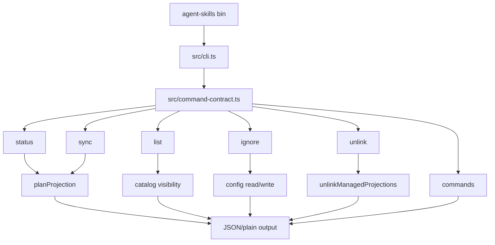
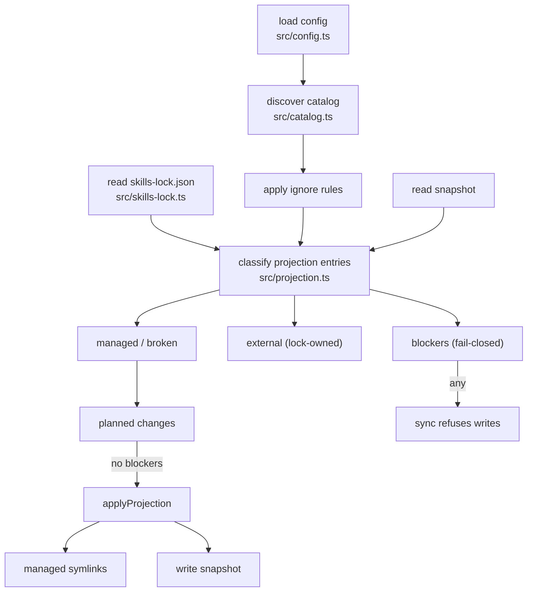

# Agent Skills Architecture

Package architecture for `agent-skills`.

## Shape

`agent-skills` is a facade-backed CLI over repo-local skill projection. It
reads one skill catalog, plans managed symlinks into projection roots, writes
them fail-closed, and reports health as JSON envelopes or terse plain output.

Its interface is:

- `agent-skills` bin (`src/cli.ts`, source-linked via `npm link`).
- `src/command-contract.ts` command facade contract built on
  `@side-quest/cli-command-facade`.
- JSON result envelopes with `contract_id` and `schema_version` for agents
  and CI.
- Plain output for humans (`status`, `sync`, `list`, `ignore`, `unlink`).
- Generated local state: managed links in projection roots plus
  `.agents/agent-skills-snapshot.json`.

The Module Map below is the single per-module owner list. `AGENTS.md` and
`README.md` point here instead of repeating it; `tests/docs-drift.test.ts`
keeps the map complete in both directions.

## CLI Entry Flow

## Command Surface

| Command | Posture | Owner |
| --- | --- | --- |
| `status` | Read-only projection health, counts, blockers, next action | `src/projection.ts`, `src/renderer.ts`, `src/cli.ts` |
| `sync` | Writes managed links and snapshot; `--check` previews; fail-closed on blockers | `src/projection.ts`, `src/cli.ts` |
| `list` | Read-only visibility listing with `--why` reasons | `src/catalog.ts`, `src/renderer.ts`, `src/cli.ts` |
| `ignore` | `list`/`suggest` read; `add`/`remove` edit `.agent-skills.yml` | `src/config.ts`, `src/renderer.ts`, `src/cli.ts` |
| `unlink` | Removes managed links only; `--check` previews | `src/projection.ts`, `src/cli.ts` |
| `commands` | Read-only command discovery metadata | `src/command-contract.ts`, `src/cli.ts` |

Exit codes are contract-owned: `0` success, `1` out-of-sync/blocked/repair
needed, `2` usage or input error.

## Module Map

- `package.json`: bin, exports, `test` and `typecheck` scripts, source-linked
  bin contract.
- `src/model.ts`: contract id, schema version, command ids, projection roots,
  snapshot path, noise threshold, health and station enums, catalog entry,
  visibility, snapshot, changes, blocker, external entry, and status types.
- `src/command-contract.ts`: facade contract entries per command, flags,
  exit-code meanings, result contracts, next-action metadata.
- `src/config.ts`: `.agent-skills.yml` parsing, catalog-repo auto-default,
  projection-root validation, imports migration error, ignore pattern
  add/remove, repo-root resolution.
- `src/catalog.ts`: direct-child catalog discovery, validity classification,
  ignore-glob matching, visibility states and reasons.
- `src/skills-lock.ts`: read-only `skills-lock.json` parsing for object and
  array shapes, lock-key validation, parse-failure diagnostics.
- `src/projection.ts`: snapshot reads, projection planning (entry
  classification: managed, broken, blocker, external), change computation,
  fail-closed apply, snapshot writes, managed-only unlink.
- `src/renderer.ts`: terse human output for status, sync, list, ignore, and
  unlink results.
- `src/cli.ts`: runtime hooks, dispatch, JSON envelope emission via the
  facade, version, error mapping to exit codes.
- `src/branch-station-catalog.ts`: package-owned station map naming
  deterministic command outcomes with expected exit codes and mutation
  expectations.
- `src/index.ts`: re-exports every module as the package seam.
- `tests/`: one suite per module, `entrypoint.integration.test.ts`
  process-boundary stations, `cli-surface.test.ts` contract drift, and
  `docs-drift.test.ts` module-map drift.

## Projection Flow

Classification stance:

- A projection-root entry resolving into the catalog is managed.
- A managed link with a stale or dangling target is broken and repairable.
- An entry whose id appears in the lockfile is external: reported, never
  written, never removed.
- Everything else is a blocker; sync fails closed and the CLI never deletes.
- A catalog id colliding with a lock id is a `catalog_conflict` blocker.
