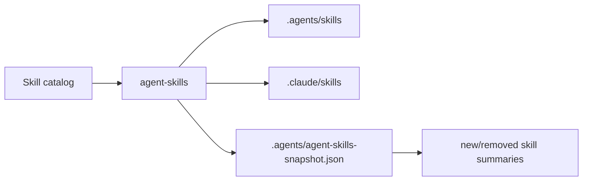

# agent-skills

Repo-local skill projection runtime for Codex, Claude Code, humans, and CI.

Package docs: `AGENTS.md` routes maintainers, `CONTEXT.md` owns vocabulary,
`ARCHITECTURE.md` owns the module map and flows, `TASKS.md` tracks active
work, and `runtime/agent-skills/docs/INDEX.md` indexes source brainstorms,
ideation, plans, and lineage.

`agent-skills` reads one skill catalog, writes local projection links for agent
runtimes, and reports projection health through a small facade-backed CLI.

It solves the worktree problem:

- Skills live in the repo or target repo, not in a global hidden folder.
- Worktrees can repair missing local skill links with one command.
- Agents get JSON with current state and next action.
- Humans get terse status and list output.
- Existing repos can keep tracked skill catalogs without deleting them.

## Mental Model



The catalog is source. Projection roots are generated local runtime views.

`agent-skills` is a projector, not a package manager. External skills are
acquired by the community `skills` CLI (`bunx skills add <source> -s <skill>`),
which writes hash-pinned copies into `.agents/skills/`, dedup symlinks into
agent dirs, and records them in a git-tracked `skills-lock.json`. Entries whose
id appears in that lockfile classify as `external`: counted by `status`,
explained by `list --why`, and never created, modified, or removed by `sync` or
`unlink`. The lock is read-only input; `agent-skills` never writes it. A catalog
id colliding with a lock id fails closed as a `catalog_conflict` blocker.

Default catalog:

```text
./skills
```

Default projection roots:

```text
.agents/skills
.claude/skills
```

Snapshot:

```text
.agents/agent-skills-snapshot.json
```

## Commands

Run from the target repo or worktree.

```bash
agent-skills status
agent-skills status --json
```

Show catalog counts, projection health, blockers, and one next action.

```bash
agent-skills sync --check --json
agent-skills sync
```

Preview or repair local projection links.

```bash
agent-skills list
agent-skills list --new
agent-skills list --why <skill>
```

List catalog skills and explain visibility.

```bash
agent-skills ignore list
agent-skills ignore add <pattern>
agent-skills ignore remove <pattern>
agent-skills ignore suggest
```

Inspect or edit repo ignore rules.

```bash
agent-skills unlink --check
agent-skills unlink
```

Remove managed projection links. Unmanaged real directories and foreign
symlinks are left alone.

```bash
agent-skills commands --json
```

Emit machine-readable command discovery metadata.

## Config

Config file:

```text
.agent-skills.yml
```

Supported keys:

```yaml
catalog: ./skills
ignore:
  - fixture-*
projection_roots:
  - .agents/skills
  - .claude/skills
```

Rules:

- `catalog` is a string path.
- `ignore` is a list of direct catalog-entry id globs.
- `projection_roots` is a list of repo-relative paths.
- Absolute projection roots are rejected.
- `..` projection roots are rejected.
- Unsupported config keys are rejected.
- `imports` is removed; the config fails with a migration error naming
  `bunx skills add <source> -s <skill>` as the replacement.

When `.agent-skills.yml` is absent and `./skills` exists, the CLI uses the
catalog-repo auto-default:

```yaml
catalog: ./skills
projection_roots:
  - .agents/skills
  - .claude/skills
```

When both config and `./skills` are absent, the CLI returns `missing_config`.

## Common Setups

### Normal Repo

Use this when source skills live in `./skills`.

```yaml
catalog: ./skills
projection_roots:
  - .agents/skills
  - .claude/skills
```

Run:

```bash
agent-skills sync
```

### Experience SDK Shape

Use this when `.agents/skills` is tracked source and Claude needs local links.

```yaml
catalog: ./.agents/skills
projection_roots:
  - ./.claude/skills
```

This keeps Codex-readable skills as source and generates Claude Code links only.
External skills (including CCC-owned ones) install with
`bunx skills add <source> -s <skill>`.

Expected status:

```text
catalog: <repo>/.agents/skills
roots: <repo>/.claude/skills
health: clean
```

### Worktrees

A new worktree may have source files but missing generated links. Run:

```bash
agent-skills sync --check --json
agent-skills sync
```

Recommended repo startup instruction:

```text
Repo-local skill visibility: humans inspect with agent-skills status;
agents/CI gate with agent-skills sync --check --json; repair with
agent-skills sync.
```

Repo `setup.sh` can call `agent-skills sync`. Also name the command in startup
instructions so agents can self-repair worktrees where setup has not run.

## Global Link For Local Dogfood

Until the package is published, link it from this repo:

```bash
cd runtime/agent-skills
npm link
```

Verify:

```bash
which agent-skills
agent-skills --version
```

The package is private but explicitly declares:

```json
{
  "sideQuest": {
    "sourceLinkedBin": true
  }
}
```

That is a temporary local-consumption contract. The workspace facade invariant
allows this package to expose a source-linked bin while continuing to reject
accidental private package bins elsewhere.

## JSON Contract

Use `--json` for agents and CI.

Stable fields include:

- `contract_id`
- `schema_version`
- `repo_root`
- `catalog_root`
- `checked_roots`
- `visible_count`
- `ignored_count`
- `invalid_count`
- `external_count`
- `externals`
- `missing_external_ids`
- `health`
- `station`
- `changes`
- `blockers`
- `newly_visible`
- `removed_since_snapshot`
- `next_action`
- `next_action_summary`

Health values:

- `clean`
- `needs_sync`
- `broken`
- `blocked`

Station values:

- `clean`
- `needs_sync`
- `synced`
- `unmanaged_blocker`
- `invalid_config`
- `invalid_usage`

Exact model owner:

```text
runtime/agent-skills/src/model.ts
```

Exact command contract owner:

```text
runtime/agent-skills/src/command-contract.ts
```

Do not duplicate exact schema or facade envelope details in other docs.

## Blockers

Sync refuses to write when a configured projection root contains unmanaged
entries.

Blocker reasons:

- `real_entry`: a real file or directory exists where a managed symlink would go.
- `foreign_symlink`: a symlink points outside the configured catalog.
- `catalog_conflict`: a catalog skill id collides with a `skills-lock.json`
  entry; rename the catalog skill id or remove the external install with the
  skills CLI.

Entries named by `skills-lock.json` are `external`, not blockers, whatever
their disk shape. A present-but-unparseable lock degrades to no external
entries plus a named parse-failure note, so triage points at the lockfile.

Repair path:

```bash
agent-skills status --json
```

Inspect `blockers`, then either:

- move real source to the configured catalog,
- change `projection_roots` so source roots are not treated as generated roots,
- remove stale unmanaged links after confirming they are generated state.

The CLI does not delete unmanaged entries.

## Ignore Rules

Ignore rules hide catalog entries by direct id.

Example:

```yaml
ignore:
  - fixture-*
```

Patterns are anchored to the whole id. They do not match paths, nested files, or
frontmatter names.

Use:

```bash
agent-skills ignore add fixture-*
agent-skills sync --check --json
agent-skills sync
```

## Git Hygiene

Generated projection state usually belongs outside git:

```gitignore
.agents/agent-skills-snapshot.json
.claude/skills/
```

Do not ignore `.agents/skills/` if that directory is tracked source in the repo.

Do not remove or overwrite unmanaged entries just to make sync pass. Change the
config so ownership is explicit.

## Implementation Owners

Per-module owners live in `ARCHITECTURE.md` Module Map.

## Verification

Package checks:

```bash
bun --filter agent-skills test
bun --filter agent-skills typecheck
```

Facade drift checks:

```bash
bun test scripts/command-entrypoint.integration.test.ts
bun run check:workspace-facade
```

Dogfood smoke:

```bash
agent-skills --version
agent-skills status --json
agent-skills sync --check --json
```

Expected healthy sync-check exit:

- exit `0` when clean.
- exit `1` when changes are needed or blockers exist.
- exit `2` for usage or input errors.

## Current Dogfood Notes

Experience SDK setup proved why `projection_roots` exists:

- `.agents/skills` can be tracked source.
- `.claude/skills` can be generated local projection.
- Worktree setup does not require deleting tracked skill catalogs.
- Agents need `sync --check --json`; humans need `status`.

The package is globally linked locally for now. Publish readiness is separate
work.
