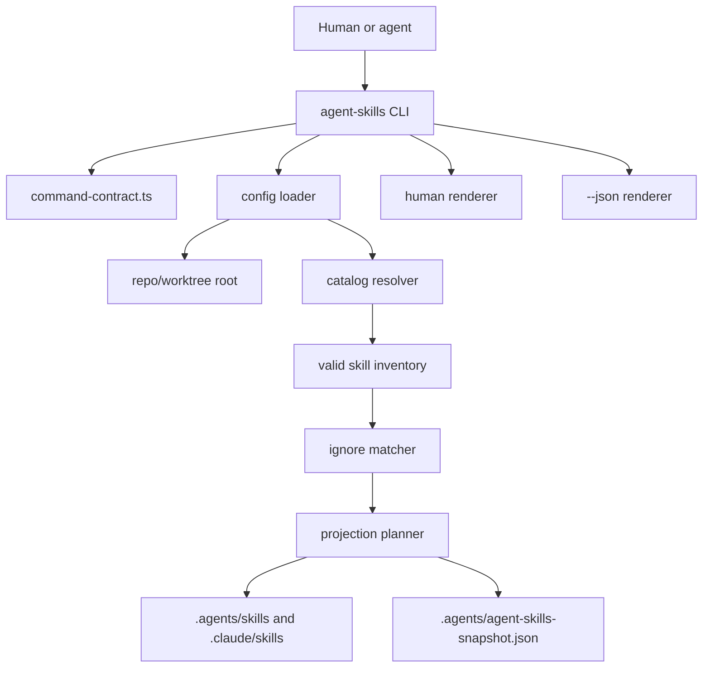

# feat: Add agent-skills local projection CLI

## Summary

Build `agent-skills` as a facade-backed repo-local projection CLI. The command reads `.agent-skills.yml` or the catalog-repo auto-default, projects visible `skills/` entries into local `.agents/skills/` and `.claude/skills/`, keeps snapshot state local to each worktree, and gives humans and agents aligned status and repair output.

---

## Problem Frame

The current install path creates global skill visibility, so worktrees can see skills from the wrong branch. The new CLI moves skill visibility to the current repo or worktree while keeping the mental model compact: global command, local config, local projections, no global skill management.

The origin requirements also pin a low-load workflow. Humans should start with `agent-skills status`; agents and CI should preflight with `agent-skills sync --check --json`; broken projection state should point at one repair action.

---

## Requirements

### Projection And Local State

- R1. Project visible catalog skills into `.agents/skills/` and `.claude/skills/` as symlinks, never copies. Origin: R1-R6, AE1.
- R2. Treat `.agents/skills/`, `.claude/skills/`, and `.agents/agent-skills-snapshot.json` as generated ignored state. Origin: R7, AE9.
- R3. Treat symlinks whose resolved targets are inside the current catalog as managed; treat real directories and foreign symlinks as unmanaged blockers. Origin: R8-R10, AE7.
- R4. Do not read, write, report, migrate, or clean global user skill roots in v1. Origin: R11-R12, AE2.

### Config And Inventory

- R5. Read `.agent-skills.yml` with top-level `catalog`, `ignore`, `projection_roots`, and `imports`; `catalog` is a single path string; when absent in a catalog repo, default to `catalog: ./skills`, `ignore: []`, default projection roots, and no imports. Origin: R13-R21.
- R6. Match ignore entries as direct Skill Catalog Entry id globs, not filesystem paths or frontmatter `name` values. Origin: R15, AE3.
- R7. Store snapshot data as projected Skill Catalog Entry ids, resolved targets, and timestamp only. Origin: R28-R30.
- R8. Preserve default-open behavior: new valid catalog skills become visible unless ignored. Origin: R16-R18.

### CLI Contract And UX

- R9. Implement `sync`, `sync --check`, `status`, `list`, `ignore`, and `unlink` through a facade-backed command contract. Origin: R22-R43, AE1a, AE8.
- R10. Keep human output as the default dashboard and `--json` as the stable agent/script contract. Origin: R24-R26, R31-R32.
- R11. Make `status` answer visible count, ignored count, changes since last sync, projection health, checked roots, and one next action; keep `status --json` informational rather than gate-equivalent. Origin: R31, R44-R53, AE4-AE5.
- R12. Make visibility reasons inspectable from `list --why`, including ignored, invalid, missing, and outside-catalog states. Origin: R37, R61-R62, AE6.
- R13. Keep `ignore suggest` conservative: suggest broad noisy namespaces only and never auto-apply. Origin: R42, R50-R51.
- R14. Keep setup hooks and startup fallback as integration points, not new v1 products. Origin: R69-R70.
- R15. Preserve the v1 no-go list: no allowlist mode, global profiles, wizard, usage ranking, hard cap, provider dashboards, or HTML status report. Origin: R71-R77, AE10.

---

## Key Technical Decisions

- **Runtime package owner:** Put the CLI in `runtime/agent-skills`. This matches `runtime/agent-worktree` for repo-operational tooling and keeps skill authoring source under `skills/` distinct from projection runtime code.
- **Create CLI remains the design gate:** Treat `skills/create-cli/SKILL.md`, `references/cli-guidelines.md`, `references/agent-native-cli-design.md`, and `references/cli-command-facade.md` as required implementation inputs. The lane is facade-backed, so agent-native CLI design happens before facade contract implementation.
- **Facade-backed contract:** Use `@side-quest/cli-command-facade` from the start. The work has explicit agent/script consumers, human output, JSON output, and a command-surface alignment proof requirement.
- **Branch Stations before behavior:** Define the initial package-owned Branch Station Catalog beside the command contract in U1, before runner behavior, so agent-visible outcomes are declared before implementation can drift.
- **Baseline agent coverage:** Keep the initial Branch Station Catalog small and outcome-shaped: `clean`, `needs_sync`, `synced`, `unmanaged_blocker`, `invalid_config`, and `invalid_usage`. `unmanaged_blocker` is a non-clean runtime gate: no writes, exit `1`, and manual inspection next.
- **No partial sync on blockers:** If any unmanaged blocker exists, `sync` fails closed and writes nothing. Projection state should never become half-updated around unsafe local files.
- **Split preflight path:** Keep `agent-skills status` as the human calm inventory and `agent-skills sync --check --json` as the agent and CI gate.
- **Status JSON is informational:** Keep `status --json` for inventory facts and diagnostics; use `sync --check --json` for pass/fail projection gating.
- **Plain modules before abstractions:** Use small modules for config loading, catalog discovery, projection planning, rendering, and CLI dispatch. The pressure gate found no second adapter that earns a registry or plugin-style abstraction.
- **Bun YAML with constrained schema:** Parse `.agent-skills.yml` with Bun's built-in YAML support, then validate only the v1 shape: top-level `catalog` string and `ignore` string list. Reject unsupported config shape with a repairable config error. This avoids both a new dependency and a hand-rolled YAML parser.
- **Single Skill Catalog in v1:** Support exactly one configured Skill Catalog path. Multiple catalogs are deferred because they introduce precedence, duplicate entries, and package-manager expectations.
- **External imports as allowlist:** Support `imports` as an explicit list of CCC-owned Skill Catalog Entry ids symlinked into the configured catalog view. This keeps local catalog visibility default-open while preventing the full CCC catalog from flooding target repos.
- **Skill Catalog Entry identity:** Use the direct child directory id as the stable identity for projection, ignore matching, snapshots, and change detection. Frontmatter `name` is required for validity and display context, but it is not the projection id. Recursive catalog discovery is deferred.
- **Ignore commands own minimal config edits:** `ignore add/remove` may create or update `.agent-skills.yml`, but only for the supported v1 config shape. Unsupported config fails repairably and is left untouched.
- **Filesystem truth over snapshot truth:** Use the resolved catalog and actual symlinks to decide managed state. The snapshot powers change awareness only; it never authorizes cleanup.
- **Generated projection migration:** Remove old tracked `.agents/skills` links from source control and add ignore rules so worktrees regenerate projection state locally.

---

## High-Level Technical Design



The engine computes inventory, visibility, projection health, and next action without mutating by default. `sync` and `unlink` are the write paths; `sync --check` renders the planned sync changes without writing and exits `0` when clean, `1` when sync is needed, and `2` for invalid usage. The CLI renderer selects human text or JSON from the same computed result so the two output modes cannot invent different meanings.

---

## Output Structure

```text
runtime/agent-skills/
  package.json
  tsconfig.json
  src/
    model.ts
    command-contract.ts
    branch-station-catalog.ts
    config.ts
    catalog.ts
    projection.ts
    renderer.ts
    cli.ts
    index.ts
  tests/
    config.test.ts
    catalog.test.ts
    projection.test.ts
    cli-surface.test.ts
    entrypoint.integration.test.ts
```

Root integration also touches `package.json`, `.gitignore`, `scripts/command-entrypoint.integration.test.ts`, and startup docs if the fallback route is added in this slice.

---

## Implementation Units

### U1. Runtime Package And Facade Contract

- **Goal:** Create the `runtime/agent-skills` package, shared model constants, facade-backed command catalog, and initial Branch Station Catalog.
- **Requirements:** R9-R10, R15.
- **Dependencies:** None.
- **Files:** `package.json`, `runtime/agent-skills/package.json`, `runtime/agent-skills/tsconfig.json`, `runtime/agent-skills/src/model.ts`, `runtime/agent-skills/src/command-contract.ts`, `runtime/agent-skills/src/branch-station-catalog.ts`, `runtime/agent-skills/src/index.ts`, `runtime/agent-skills/tests/cli-surface.test.ts`.
- **Approach:** Start from the create-cli facade-backed lane, then mirror the `runtime/agent-worktree` package shape. Define command ids, contract id, schema version, baseline exit codes, command metadata, output modes, side-effect classes, action affordances, and initial Branch Station ids before runner behavior. Keep package-owned result vocabulary beside the command contract.
- **Patterns to follow:** `runtime/agent-worktree/package.json`, `runtime/agent-worktree/src/model.ts`, `runtime/agent-worktree/src/command-contract.ts`, `skills/create-cli/references/cli-command-facade.md`.
- **Initial Branch Stations:** `clean`, `needs_sync`, `synced`, `unmanaged_blocker`, `invalid_config`, `invalid_usage`.
- **Test scenarios:**
  - Covers AE8. Given the command contract is imported, facade construction accepts every command and exposes command discovery metadata.
  - Given the Branch Station Catalog is imported, every initial station names a command-facing outcome and reconciles with command discovery metadata.
  - Given a command has a human default and JSON mode, rendered help advertises the right usage and `--json` support.
  - Given a mutating command is declared, the contract names write side effects and a safe action affordance.
- **Verification:** The package is discoverable through Bun workspaces, type-checks under strict TypeScript, and the facade contract validates at construction.

### U2. Config, Catalog, And Visibility Engine

- **Goal:** Resolve repo root, load `.agent-skills.yml`, derive the catalog default, discover valid skills, and apply ignore globs.
- **Requirements:** R1, R5-R8.
- **Dependencies:** U1.
- **Files:** `runtime/agent-skills/src/config.ts`, `runtime/agent-skills/src/catalog.ts`, `runtime/agent-skills/src/model.ts`, `runtime/agent-skills/tests/config.test.ts`, `runtime/agent-skills/tests/catalog.test.ts`.
- **Approach:** Use Bun's built-in YAML parser, then keep config validation intentionally narrow: `catalog` as one scalar path and `ignore` as a top-level string list. Resolve the catalog path relative to the repo root. Treat valid catalog skills as direct child directories with `SKILL.md` frontmatter containing `name` and `description`. Use the direct Skill Catalog Entry id for projection, ignore matching, snapshots, and change detection.
- **Patterns to follow:** `skills/create-skill/references/skill-design-decision-runbook.md`, `skills/create-skill/scripts/skill-description-audit.ts`, `runtime/agent-worktree/src/discovery.ts`.
- **Test scenarios:**
  - Given no `.agent-skills.yml` and `./skills/` exists, config resolves to the catalog-repo auto-default.
  - Given no config and no `./skills/`, config returns a repairable missing-config error.
  - Given minimal config with `catalog` and `ignore`, the loader resolves the catalog and ignore list.
  - Given unsupported YAML shape, the loader rejects it with a clear config error rather than guessing.
  - Given no config, `ignore add experimental-*` creates minimal v1 config with the default catalog and ignore list.
  - Given unsupported config, `ignore add` and `ignore remove` fail without rewriting the file.
  - Given a folder with no `SKILL.md`, the catalog marks it invalid.
  - Given `experimental-*`, the matcher ignores Skill Catalog Entry `experimental-parser` and does not require `skills/experimental-parser` or the frontmatter `name`.
- **Verification:** Config and catalog tests cover happy path, auto-default, invalid config, invalid skill, and ignore matching.

### U3. Projection Planner, Snapshot, And Filesystem Writes

- **Goal:** Compute and apply projection changes for `.agents/skills/` and `.claude/skills/`, and maintain local snapshot state.
- **Requirements:** R1-R4, R7.
- **Dependencies:** U2.
- **Files:** `runtime/agent-skills/src/projection.ts`, `runtime/agent-skills/src/model.ts`, `runtime/agent-skills/tests/projection.test.ts`, `.gitignore`.
- **Approach:** Split pure projection planning from filesystem application. The planner compares visible skills, projection roots, current symlinks, blockers, and snapshot state. If the plan contains any unmanaged blocker, the write path fails closed before changing projection roots or snapshot state. Otherwise it creates missing roots, updates managed links, removes managed links no longer visible, and writes `.agents/agent-skills-snapshot.json` after successful sync. `sync --check` returns the same plan without touching projection roots or snapshot state.
- **Patterns to follow:** `runtime/agent-worktree/src/store.ts`, `runtime/agent-worktree/tests/store.test.ts`, `install.sh` stale-link handling.
- **Test scenarios:**
  - Covers AE1. Given `skills/fallow/SKILL.md` is visible, sync creates links in both projection roots.
  - Covers AE1a. Given projections are out of date, `sync --check` reports planned changes, leaves the filesystem unchanged, and exits `1`.
  - Given projections are current, `sync --check` exits `0`.
  - Covers AE7. Given a projection link points nowhere, status reports a broken projection and names `sync` as repair.
  - Given a symlink resolves outside the catalog, sync leaves it untouched and reports an unmanaged blocker.
  - Given a real directory exists in a projection root, sync leaves it untouched and reports an unmanaged blocker.
  - Given `sync --check` finds an unmanaged blocker, it exits `1`, writes nothing, and reports station `unmanaged_blocker`.
  - Given `sync` finds one unmanaged blocker and one safe missing link, it writes neither the safe link nor the snapshot.
  - Covers AE9. Given no snapshot exists in a fresh worktree, status reports no last projected state and sync creates a local snapshot.
  - Given a snapshot exists, `list --new` computes newly visible and removed skills from projected Skill Catalog Entry ids.
- **Verification:** Projection tests prove pure planning branches and filesystem integration on temporary repos.

### U4. CLI Runner And Renderers

- **Goal:** Implement command dispatch, human output, JSON output, diagnostics, and all public commands.
- **Requirements:** R9-R14.
- **Dependencies:** U1-U3.
- **Files:** `runtime/agent-skills/src/cli.ts`, `runtime/agent-skills/src/renderer.ts`, `runtime/agent-skills/src/model.ts`, `runtime/agent-skills/tests/cli-surface.test.ts`, `runtime/agent-skills/tests/entrypoint.integration.test.ts`.
- **Approach:** Keep the dispatcher thin. Each command builds or applies one engine result, then passes the same result to the selected renderer. Human output stays compact and scan-friendly. JSON output carries stable package-owned result vocabulary, run correlation, status facts, blockers, changes, and next action.
- **Patterns to follow:** `runtime/agent-worktree/src/cli.ts`, `runtime/agent-worktree/tests/cli-surface.test.ts`, `scripts/command-entrypoint.integration.test.ts`.
- **Test scenarios:**
  - Covers AE4. Given many catalog skills and ignored skills, human `status` fits the calm inventory shape and includes one next action.
  - Given `status --json`, JSON contains the same counts, roots, health, changes, and next action as human output.
  - Covers AE5. Given a skill added after the last snapshot, `list --new` shows it without printing the full inventory.
  - Covers AE6. Given `fallow` is ignored, `list --why fallow` names the matching ignore rule.
  - Given `ignore add` or `ignore remove` succeeds, the command prints the changed rule and next action.
  - Given invalid usage, the CLI exits with usage semantics and points to help.
  - Given `unlink`, only managed projection links are removed.
- **Verification:** CLI tests prove parser acceptance, help, human rendering, JSON rendering, error paths, and write command behavior.

### U5. Command Surface Alignment And Workspace Integration

- **Goal:** Prove command discovery metadata, rendered help, public argv outcomes, JSON output, human output, and runtime semantics cannot drift.
- **Requirements:** R9-R10, R15.
- **Dependencies:** U4.
- **Files:** `scripts/command-entrypoint.integration.test.ts`, `scripts/check-workspace-facade-invariants.ts`, `runtime/agent-skills/src/branch-station-catalog.ts`, `runtime/agent-skills/tests/entrypoint.integration.test.ts`, `runtime/agent-skills/package.json`.
- **Approach:** Extend existing process-boundary proof patterns to include `agent-skills`. Keep package-local integration tests for command semantics, and use root integration only for entrypoint parity and command discovery sentinels. Add workspace facade invariant coverage for the new command contract.
- **Patterns to follow:** `scripts/command-entrypoint.integration.test.ts`, `runtime/agent-worktree/tests/entrypoint.integration.test.ts`, `skills/cli-execution-auditor/src/station-map.ts`.
- **Test scenarios:**
  - Covers AE8. Given the package script, direct source entry, and command discovery path, all expose the same command ids and version/help basics.
  - Given every facade-declared command, rendered help includes the first contract usage line and `sync --check` write-preview usage.
  - Given public argv examples from the contract, accepted commands reach the intended runtime branch and rejected flags fail with usage semantics.
  - Given human and JSON status fixtures, both surfaces report the same next action and projection health.
- **Verification:** Root command-entrypoint integration and workspace facade invariant checks include `agent-skills`.

### U6. Generated-State Migration, Startup Route, And Docs

- **Goal:** Remove old tracked projection links, add ignore rules, and document the setup/startup fallback route without turning setup scripts into v1 scope.
- **Requirements:** R2, R14.
- **Dependencies:** U3-U5.
- **Files:** `.gitignore`, `.agents/skills/*`, `AGENTS.md`, `runtime/agent-skills/docs/brainstorms/2026-06-16-agent-skills-local-projection-requirements.md`, `docs/git/worktree.md`.
- **Approach:** Add ignore entries for generated projection state and snapshot state. Remove tracked `.agents/skills/*` links from source control as part of the migration. Keep `./setup.sh` repo-specific and out of scope; document that setup scripts may call `agent-skills sync --check --json` and route repair to `agent-skills sync`. Add a short startup fallback route only if it stays concise and points to CLI diagnostics.
- **Patterns to follow:** `.gitignore` generated-state comments, `docs/git/worktree.md`, `AGENTS.md` startup routing style.
- **Test scenarios:**
  - Given tracked projection links are removed, a fresh checkout does not contain stale projected skills from another branch.
  - Given `.gitignore` is applied, local projection links and snapshot state are not reported as untracked source.
  - Given startup fallback text is added, `scripts/agent-instructions.sh check` still passes.
- **Verification:** Git status shows source changes only, no generated projection state; startup instruction checks pass when startup text changes.

---

## Scope Boundaries

### Deferred For Later

- User-global publication or stable daily install.
- Team catalog distribution.
- Skill grouping without profiles.
- Skill category metadata in frontmatter.
- Recursive or nested Skill Catalog discovery.
- Usage analytics or ranking.
- Rich UI beyond CLI output.

### Outside V1 Identity

- Package manager behavior.
- Plugin marketplace behavior.
- Version solving.
- Dependency management.
- Global skill ownership.
- Provider-specific dashboards.
- Automatic skill curation that hides skills without user config.
- Creating repo-specific root `./setup.sh` scripts.

---

## Risks And Dependencies

- **Discovery assumption:** The plan depends on Codex discovering repo-local `.agents/skills/` and Claude discovering repo-local `.claude/skills/`. The origin keeps these as assumptions; implementation should not broaden into global fallback if either host behaves differently.
- **Current tracked projection links:** `.agents/skills/*` currently exists as tracked old-model state. Migration needs care so generated state disappears from git without deleting source skills.
- **YAML parser boundary:** A constrained v1 parser is acceptable only because the config shape is intentionally tiny. If users need richer YAML, add a real parser as a separate dependency decision.
- **Output drift risk:** Human and JSON outputs can diverge unless both render from one result model and the alignment proof checks both.

---

## Sources And Research

- Origin requirements: `runtime/agent-skills/docs/brainstorms/2026-06-16-agent-skills-local-projection-requirements.md`.
- Prior pivot: `runtime/agent-skills/docs/brainstorms/2026-05-30-agent-skills-repo-no-plugins-pivot.md`.
- CLI design: `skills/create-cli/SKILL.md`, `skills/create-cli/references/agent-native-cli-design.md`, `skills/create-cli/references/cli-command-facade.md`.
- Facade runtime: `runtime/cli-command-facade/CONTEXT.md`, `runtime/cli-command-facade/AGENTS.md`.
- Existing runtime pattern: `runtime/agent-worktree/`.
- Existing process-boundary proof: `scripts/command-entrypoint.integration.test.ts`.
- Code-style pressure gate: `context/code-style.md`.
- OpenAI Codex skills docs: `https://developers.openai.com/codex/skills`.
- Claude Code skills docs: `https://code.claude.com/docs/en/skills`.
