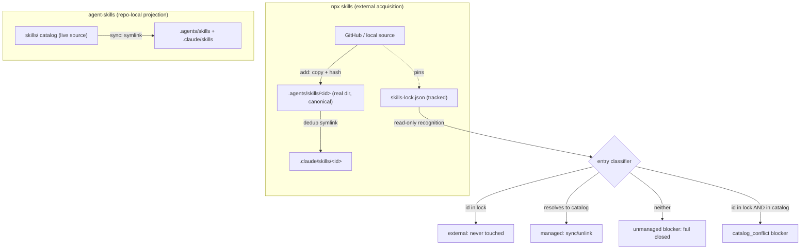

# npx skills and agent-skills division of labor - Plan

## Goal Capsule

- **Objective:** Make the community `skills` CLI (`npx skills`, skills.sh) the owner of external skill acquisition and `runtime/agent-skills` the owner of repo-local live projection, so both tools coexist in the shared `.agents/skills/` root without agent-skills flagging lockfile-managed installs as blockers.
- **Authority hierarchy:** This plan > ADR 0016 lock-boundary rules > agent-skills v1 requirements (`runtime/agent-skills/docs/brainstorms/2026-06-16-agent-skills-local-projection-requirements.md`). Where this plan is silent, the v1 requirements hold.
- **Stop conditions:** Stop if `skills-lock.json` recognition would require *writing* the lock (ADR 0016 forbids a second writer), or if coexistence cannot preserve fail-closed sync for non-lockfile entries.
- **Execution profile:** Standard plan, 5 units, single repo, no external service dependencies. Tests run through `skills/test-runner/src/test-runner.sh`; lint/types through the Biome/tsc MCP runners.
- **Tail ownership:** Implementer runs the Verification Contract and updates the decision records in U5; no post-merge operational steps.

---

## Product Contract

### Summary

`npx skills` (verified against `skills@1.5.14` source and Context7 docs) is a package manager: it installs external skills as hash-pinned copies into `.agents/skills/`, records `source` + `computedHash` in a git-trackable `skills-lock.json`, and dedups agent-specific dirs (`.claude/skills/`) via symlinks pointing at that canonical copy — never at the live source. `runtime/agent-skills` is a projector: it live-symlinks the repo's own `skills/` catalog into the same roots so worktree edits are instantly visible. The tools currently fight: every npx-skills install is an `unmanaged_blocker` that wedges `agent-skills sync`. This plan teaches agent-skills to recognize lockfile-managed entries as a third `external` class, removes the bespoke `imports:` feature that npx skills obsoletes, and records the division of labor.

### Problem Frame

agent-skills v1 classifies anything in a projection root that does not resolve into the catalog as an unmanaged blocker, and `sync` fails closed on blockers (v1 requirements R8-R10, R59-R60). npx skills writes real directories into `.agents/skills/` and canonical-copy symlinks into `.claude/skills/` — both blocker shapes. Installing one external skill therefore permanently breaks `agent-skills sync` in that repo. Separately, agent-skills' `imports:` feature duplicates npx skills' job poorly: it symlinks skills from a hardcoded path relative to a CCC checkout, works only where CCC is cloned, and has no pinning or update story. The never-built Skillporter design (ADRs 0015-0018) already solved lock recognition for this exact provider; this plan reuses that design rather than re-deriving it.

### Requirements

**Coexistence**

- R1. agent-skills classifies entries in projection roots as `external` when their id appears in the repo's `skills-lock.json`, instead of as unmanaged blockers.
- R2. `sync` and `unlink` never create, modify, or remove `external` entries.
- R3. Entries not in the lockfile keep full fail-closed blocker behavior; recognition must not weaken v1 R59-R60.
- R4. A catalog skill id that collides with a lockfile id is a blocker with a distinct conflict reason, not a silent winner; the blocker why-text names both sources and the repair options (rename the catalog skill id, or remove the external install with the skills CLI).
- R5. `skills-lock.json` is read-only input: tolerate both the object shape (`{version, skills: {name: {...}}}`, observed v1.5.14) and the upstream array shape; a malformed lock degrades to "no external entries", never to a crash.
- R6. `status` and `list` surface external entries with counts and a `--why`-style reason naming the lockfile and best-effort source, keeping the visible set legible (v1 R52, R61-R62).
- R12. Lock key names are validated as single path-component tokens (no separators, not `.`/`..`, non-empty) before entering the external set; invalid keys are ignored so a crafted lock entry cannot promote an unintended directory past the blocker model. The reader retains `computedHash` and `source` for diagnostics, and `status` notes external real-dir entries whose lock record carries no hash (tamper-visibility without blocking).
- R13. When `skills-lock.json` exists but yields zero parseable entries, `status` and blocker output name the lock-parse failure so triage points at the lockfile, not at deleting entries.
- R14. A lock id with no disk entry in any projection root surfaces as an informational missing-external count with the restore hint (`bunx skills experimental_install`), never as a blocker or health failure.

**Imports retirement**

- R7. The `imports:` config key, bundled-catalog symlinking, and stale-import cleanup are removed from agent-skills.
- R8. A config containing `imports:` fails with a repairable `invalid_config` error whose message names `bunx skills add` as the replacement.

**Publisher and docs**

- R9. A repeatable check proves this repo works as a `bunx skills add` source (expected catalog ids discoverable from the repo root).
- R10. Startup and worktree docs carry the split: external skills via `npx skills`, repo-local visibility via `agent-skills`; `scripts/agent-instructions.sh check` still passes.
- R11. The division of labor and Skillporter's status are recorded in the repo's decision homes.

### Acceptance Examples

- AE1. **Covers R1-R2, R6.** Given a multi-agent install (`bunx skills@1.5.14 add anthropics/skills -s frontend-design -a claude-code -a codex -y` with `.claude/` pre-existing) produced a lock entry, a real dir at `.agents/skills/frontend-design`, and a symlink at `.claude/skills/frontend-design`, when `agent-skills status` runs, then health is `clean`, both entries are reported as external, and `sync`/`unlink` leave them untouched.
- AE2. **Covers R3.** Given a real dir in a projection root with no lock entry, `sync --check` exits 1 with `unmanaged_blocker` and `sync` writes nothing.
- AE3. **Covers R4.** Given catalog skill `fallow` and a lock entry `fallow`, `sync` fails closed with a `catalog_conflict` blocker naming both sources and the two repair options.
- AE4. **Covers R8.** Given `.agent-skills.yml` containing `imports: [storybook-matrix]`, any command exits 1 with `invalid_config` and the message points to `bunx skills add`.
- AE5. **Covers R5, R13.** Given a lockfile in the upstream array shape, agent-skills reads it; given a corrupt lockfile, agent-skills classifies as if the lock were empty, does not crash, and `status`/blocker output name the lock-parse failure.
- AE6. **Covers R9.** Given the repo root, the publisher check lists the expected skill ids via the pinned provider discovery path without installing anything.
- AE7. **Covers R14.** Given a lock entry whose skill has not been installed in this worktree, `status` stays healthy, reports one missing external, and names `bunx skills experimental_install` as the restore command.

R7, R10, and R11 are verified by U1/U5 test scenarios and the startup-health gate rather than numbered acceptance examples.

### Scope Boundaries

**Deferred to follow-up work**

- Upstream feature request to `vercel-labs/skills` for a `--link` live-symlink mode on local sources (would let npx skills serve dev-loop projection; verified in v1.5.14 that every install path copies before symlinking, and the source-overlap path skips linking entirely).
- Reconciling ADR 0011's global `install.sh` deploy topology with the repo-local projector — separate decision, noted in U5's record as an open thread.
- Content-hash drift detection for external entries. Whether any provider surface (`skills update` or other) verifies `computedHash` against disk post-install is unverified; U5's decision log records this as an open integrity gap rather than assuming the provider covers it.

**Outside this plan's identity**

- Building Skillporter (plan-before-mutation shell). Direct `npx skills` usage replaces it for now; U5 records this.
- Wrapping npx skills inside agent-skills (`agent-skills import ...`). Two tools, two verbs.
- agent-skills managing versions, updates, or removal of external skills — that is package-manager behavior, outside the projector's v1 identity.
- Global (`-g`) skill installs; v1's no-global rule stands.

### Dependencies / Assumptions

- D1. `skills@1.5.14` behavior verified by source read and live probes this session: symlink mode is default but produces canonical copies + agent-dir symlinks (never links to the live source); local-path installs are copies; single-target installs downgrade to copy (`uniqueDirs.size <= 1`); agent-dir symlinks are skipped when the agent dir (e.g. `.claude/`) does not pre-exist.
- D2. `skills-lock.json` lives at the repo root and is git-tracked; installed copies under `.agents/skills/` stay gitignored and are restored per clone/worktree via `bunx skills experimental_install` (node_modules model). `.gitignore` already ignores the projection roots and does not ignore the lock.
- D3. This repo has no production `imports:` config (verified by grep here; consumer repos cannot be checked from this codebase). Any consumer that adopted `imports:` since the 2026-06-30 ship is handled by R8's repairable migration error, which is the designed migration path — the no-deprecation-window decision rests on R8, not on an absence claim.

---

## Planning Contract

### Key Technical Decisions

- **Recognition, not ownership.** agent-skills reads `skills-lock.json` to *classify* entries; it never writes the lock, keeps no ledger, and never mutates external entries. This is Skillporter's lock-boundary rule (ADR 0016) minus the ledger — a ledger is only needed by a tool that mutates installs, which agent-skills does not. (see `docs/adr/0016-ownership-ledger-grain-and-lock-boundary.md`)
- **External is a visibility state, not a blocker reason.** `external` joins `visible`/`ignored`/`invalid` in the domain vocabulary and gets its own status count. Blockers stay blockers; the two-layer result vocabulary (facade envelope vs domain enum) from ADR 0018 is preserved.
- **Same-name collision fails closed.** Catalog id ∩ lock id → blocker with a `catalog_conflict` reason. The Skillporter prototype proved raw `skills add` overwrites foreign same-name skills; agent-skills must not reproduce that hazard from the other direction.
- **Lock adapter is tolerant, isolated, and hardened.** One small module normalizes both lock shapes, treats `source` as best-effort (per ADR 0016's verified finding that `skills list --json` omits it), validates key names as single path-component tokens (a crafted lock entry must not smuggle an arbitrary directory past the blocker model), and retains `computedHash` for diagnostics. Malformed input degrades to empty — but a present-yet-unparseable lock also surfaces a named lock-parse warning, because silent degradation would reinstate the sync wedge with a misleading blocker diagnosis pointing at deletable directories instead of one broken JSON file.
- **Remove `imports:` outright, no deprecation window.** v1 shipped 2026-06-30; this repo has no production config using it and R8's repairable error is the migration path. npx skills is better for acquisition (any source, hash pin, update path) but does not replace the one thing imports did that copies cannot: live cross-repo projection of an edited CCC skill. That dev-loop regresses to a `skills update` re-copy loop until the upstream `--link` request lands; U5's decision log records the regression alongside the other open threads.
- **Pin the provider in scripted gates.** The publisher smoke and the live coexistence smoke invoke `bunx skills@1.5.14` (the version every behavioral claim was verified against); floating to latest would let an upstream release silently change `--list` output or lock shape under a Definition-of-Done gate. Worktree docs note that `experimental_install` is a provider-experimental surface and name the pinned form as the fallback when latest breaks.
- **Command surfaces use `bunx`.** The repo's tool-routing rule prefers `bunx` over `npx`; all command examples, error messages, and docs use `bunx skills ...`. "npx skills" survives only as the community name for the tool in prose.
- **Lock tracked, copies ignored.** `skills-lock.json` is committed; `.agents/skills/` stays gitignored. Fresh worktrees restore external skills with `bunx skills experimental_install` — consistent with the repo's generated-state philosophy and avoids committing third-party copies.
- **Publisher check is a root script, not CI.** The repo has no `.github/workflows`; checks are root `package.json` scripts (pattern: `prove:workspace-portability`). The smoke uses npx skills' local-path discovery (`--list`) so it never mutates.
- **Sequencing: delete before adding.** Removing `imports:` first (U1) shrinks the catalog/projection surface that recognition (U2) threads through.

### High-Level Technical Design

The classifier is the only new decision point; everything downstream (fail-closed apply, status rendering, unlink filtering) already exists and gains one branch.

---

## Implementation Units

### U1. Remove the `imports:` feature

- **Goal:** Delete bundled-catalog imports; make `imports:` a repairable config error pointing at npx skills.
- **Requirements:** R7, R8.
- **Dependencies:** None.
- **Files:** `runtime/agent-skills/src/catalog.ts` (delete `BUNDLED_CATALOG_ROOT`, `bundledCatalogRoot`, `discoverImportedCatalog`, `findStaleImportLinks`), `runtime/agent-skills/src/config.ts` (drop `imports` from `SUPPORTED_KEYS`, types, validation; add the targeted error), `runtime/agent-skills/src/projection.ts` (remove `importLinks`, `staleImportLinks`, `findImportBlockers`, `managedSourceRoots`), `runtime/agent-skills/src/cli.ts` (unwire), `runtime/agent-skills/src/index.ts`, `runtime/agent-skills/tests/config.test.ts`, `runtime/agent-skills/tests/projection.test.ts`, `runtime/agent-skills/tests/entrypoint.integration.test.ts`, `runtime/agent-skills/README.md`.
- **Approach:** Straight deletion plus one behavior: `parseConfigText` special-cases `imports` before the generic unsupported-key error so the message can say `imports is no longer supported; install external skills with: bunx skills add <source> -s <skill>`. Keep the generic unsupported-key path for everything else.
- **Test scenarios:**
  - Covers AE4. Config with `imports: [storybook-matrix]` → `invalid_config`, message contains `bunx skills add`, exit 1 for `status`/`sync`.
  - Config without `imports` parses as before; existing config/projection/entrypoint suites pass with imports fixtures removed.
  - Root `scripts/command-entrypoint.integration.test.ts` still passes (command-id set and contract surface unchanged by the removal).
- **Verification:** Package tests green; `rg -n "imports|bundledCatalog|importLink" runtime/agent-skills/src/` returns nothing but the config error string.

### U2. Lockfile reader and external-entry recognition

- **Goal:** Classify lockfile-managed entries as `external`; keep fail-closed behavior for everything else.
- **Requirements:** R1-R6, R12-R14.
- **Dependencies:** U1.
- **Files:** `runtime/agent-skills/src/skills-lock.ts` (new: tolerant reader), `runtime/agent-skills/src/model.ts` (external state, counts, `catalog_conflict` blocker reason), `runtime/agent-skills/src/projection.ts` (classifier branch), `runtime/agent-skills/src/cli.ts`, `runtime/agent-skills/src/renderer.ts` (status/list rendering), `runtime/agent-skills/tests/skills-lock.test.ts` (new), `runtime/agent-skills/tests/projection.test.ts`, `runtime/agent-skills/tests/entrypoint.integration.test.ts`.
- **Approach:** `readSkillsLock(repoRoot)` returns external-id records (id, best-effort `source`, `computedHash` when present), normalizing object and array shapes per ADR 0016 and validating each key as a single path-component token (reject separators, `.`/`..`, empty — invalid keys are ignored). A present-but-unparseable lock returns empty plus a parse-failure diagnostic that `status` and blocker why-text surface by name. In `readProjectionRoot`, an entry whose id is in the lock set classifies as `external` regardless of shape (real dir, symlink to a canonical copy, dangling) — recognition is by lock evidence, not by disk shape (ownership-by-record, ADR 0016). Externals are excluded from create/remove/broken planning and from `unlinkManagedProjections`. Health ignores externals. Lock ids with no disk entry surface as an informational missing-external count with the `bunx skills experimental_install` hint. Catalog visibility gains the collision check: catalog id in lock set → `catalog_conflict` blocker before any write, its why-text naming both sources and the two repair options. `ProjectionBlocker.reason` widens in place to `"real_entry" | "foreign_symlink" | "catalog_conflict"` — same interface, wider union, so renderers and JSON consumers pick it up without parallel types. Status model gains `external_count`; renderer prints external entries with their lock source when known.
- **Test scenarios:**
  - Covers AE1. Real dir in `.agents/skills` + lock entry → status clean, external count 1 per root, sync no-ops, unlink preserves.
  - Covers AE1. Symlink in `.claude/skills` resolving to the canonical dir, id in lock → external, not `foreign_symlink`.
  - Covers AE2. Real dir with no lock entry → still `unmanaged_blocker`; sync fails closed and writes nothing (regression guard on v1 R59-R60).
  - Covers AE3. Catalog `fallow` + lock `fallow` → blocker reason `catalog_conflict`, sync exit 1, both roots untouched.
  - Covers AE5. Array-shape lock parses; corrupt JSON → empty set, no crash, entries fall back to blocker classification, and `status` output names the lock-parse failure.
  - Covers AE7. Lock entry with no disk entry → health clean, missing-external count 1, restore hint names `bunx skills experimental_install`.
  - Lock key `../escape` or `a/b` → ignored by the reader; a directory named to match never classifies as external via an invalid key.
  - `list --why <external-id>` names `skills-lock.json` (and the source when the lock carries it).
  - No lockfile present → behavior identical to v1 (empty external set).
- **Verification:** Package suite green; live smoke reproduces AE1's symlink topology (single-target installs downgrade to copy and would skip the branch under test): temp repo with `git init`, a minimal `skills/` catalog or `.agent-skills.yml`, `.claude/` pre-created, one `agent-skills sync`; then `bunx skills@1.5.14 add anthropics/skills -s frontend-design -a claude-code -a codex -y`; assert the canonical real dir and the `.claude` symlink both classify external, `agent-skills status` exits 0 with health clean, and `sync --check` exits 0.

### U3. Lock topology and worktree docs

- **Goal:** Pin the tracked-lock/ignored-copies model and give worktrees a restore path.
- **Requirements:** R10 (worktree half), D2.
- **Dependencies:** U2.
- **Files:** `docs/git/worktree.md` (extend the "Repo-local skills" section, lines 50-58), `.gitignore` (comment only, if anything — current entries already correct).
- **Approach:** Add to the worktree section: external skills restore with `bunx skills experimental_install` from the tracked `skills-lock.json` (note the command is provider-experimental and may rename; `bunx skills@1.5.14 experimental_install` is the pinned fallback); `agent-skills status` reports installed externals and counts missing ones with the restore hint; source-of-truth line becomes `skills/` + `.agent-skills.yml` + `skills-lock.json`.
- **Test scenarios:** Test expectation: none — docs-only unit; U2's tests prove the behavior being documented.
- **Verification:** Fresh-worktree walkthrough: `experimental_install` then `agent-skills sync --check --json` exits 0.

### U4. Publisher-hygiene smoke

- **Goal:** Prove this repo works as a `bunx skills add` source.
- **Requirements:** R9.
- **Dependencies:** None (parallel to U1-U3).
- **Files:** `scripts/prove-skills-publisher.ts` (new), `package.json` (root script `prove:skills-publisher`).
- **Approach:** Follow `scripts/prove-workspace-portability.ts`'s shape: shell out to `bunx skills@1.5.14 add <repo-root> --list -y` (pinned to the verified provider version so an upstream `--list` format change cannot silently break a Definition-of-Done gate), parse the listed skill ids, assert a sentinel subset of catalog ids appears (derive expected ids from `skills/*/SKILL.md` at runtime rather than hardcoding). Local-path discovery only; never installs. Network use is limited to bunx fetching the pinned `skills` package.
- **Test scenarios:**
  - Covers AE6. Run against repo root → exit 0, output names matched count.
  - Run against an empty temp dir → exit 1 with a repair hint (proves the assertion bites).
- **Verification:** `bun run prove:skills-publisher` exits 0 locally.

### U5. Startup route and decision records

- **Goal:** Record the division of labor where agents and future readers will find it.
- **Requirements:** R10, R11.
- **Dependencies:** U1-U2 (records describe shipped behavior).
- **Files:** `AGENTS.md` (line 59 area — one added clause; 120-line budget applies), `runtime/agent-skills/README.md` (model section: projector vs package manager, external class, imports removal), `docs/decisions/2026-07-02-npx-skills-division-of-labor.md` (new decision log via the `record-decision` convention), `docs/adr/0015-skillporter-naming-and-location.md` (status note: superseded for now by direct provider use + projector recognition, pointing at the new decision log).
- **Approach:** AGENTS.md is at exactly its enforced 120-line budget — extend the existing skill-visibility line in place; adding a new line fails the startup-health gate. The extended clause carries both the route and the guard: external skills install via `bunx skills add`, checking the id against `agent-skills status` first (raw `skills add` overwrites a same-name skill from a different source — the Skillporter-proven hazard — and agent-skills only detects the collision after the fact). The decision log carries the full rationale: division of labor, lock-read-only boundary, copies-ignored/lock-tracked topology, Skillporter deferral, the accepted pre-install overwrite hazard and its guard, the dev-loop regression from removing `imports:` (pending upstream `--link`), the unverified provider hash-verification gap, and the open ADR 0011 global-topology thread. ADR frontmatter format (`status:` YAML) matches existing ADRs.
- **Test scenarios:** Test expectation: none — docs-only unit.
- **Verification:** `scripts/agent-instructions.sh check` passes; AGENTS.md stays within its 120-line budget.

---

## Verification Contract

| Gate | Command | Applies to |
|---|---|---|
| Package tests | `skills/test-runner/src/test-runner.sh run -- runtime/agent-skills/tests` | U1, U2 |
| Root contract surface | `skills/test-runner/src/test-runner.sh run -- scripts/command-entrypoint.integration.test.ts` | U1, U2 |
| Types | `tsc_check` MCP runner on `runtime/agent-skills` | U1, U2 |
| Lint | `biome_lintCheck` MCP runner on `runtime/agent-skills` | U1, U2 |
| Publisher smoke | `bun run prove:skills-publisher` (pinned `bunx skills@1.5.14`) | U4 |
| Startup health | `scripts/agent-instructions.sh check` (AGENTS.md has zero headroom at 120/120 lines) | U5 |
| Live coexistence smoke | temp repo (git init, minimal catalog/config, `.claude/` pre-created, one `sync`): multi-agent `bunx skills@1.5.14 add ... -a claude-code -a codex -y`, then both external shapes classify, `status` / `sync --check` exit 0 | U2, U3 |

## Definition of Done

- All Verification Contract gates pass.
- AE1-AE7 each have a passing automated test or scripted check (AE1-AE5 and AE7 in the package suite, AE6 via the publisher script).
- `rg -n "imports" runtime/agent-skills/src/` shows only the migration error string.
- Decision log exists and ADR 0015 carries the supersession note.
- No dead code from abandoned approaches remains in the diff.

---

## Sources / Research

- First-hand: `skills@1.5.14` source read (`installSkillForAgent`, `uniqueDirs.size <= 1` copy downgrade, canonical-copy symlink topology) and live probes (local/GitHub × single/multi-agent installs; lockfile shapes).
- Context7 `/vercel-labs/skills` docs: install API, source formats, symlink-vs-copy modes.
- Prior art: `docs/adr/0016-ownership-ledger-grain-and-lock-boundary.md` (lock read-only, dual-shape normalization), `docs/adr/0018-result-vocabulary-two-layers.md`, `docs/plans/2026-06-18-001-feat-skillporter-mvp-plan.md`, `docs/research/2026-06-17-skillport-mvp-architecture.md` (foreign same-name overwrite proof).
- Constraints: `runtime/agent-skills/docs/brainstorms/2026-06-16-agent-skills-local-projection-requirements.md` (R8-R10, R59-R60, scope identity), `runtime/agent-skills/docs/brainstorms/2026-05-30-agent-skills-repo-no-plugins-pivot.md` (no marketplace machinery; hash-pin mitigation), `docs/adr/0011-lean-startup-instructions.md` (AGENTS.md canonical, 120-line budget).
