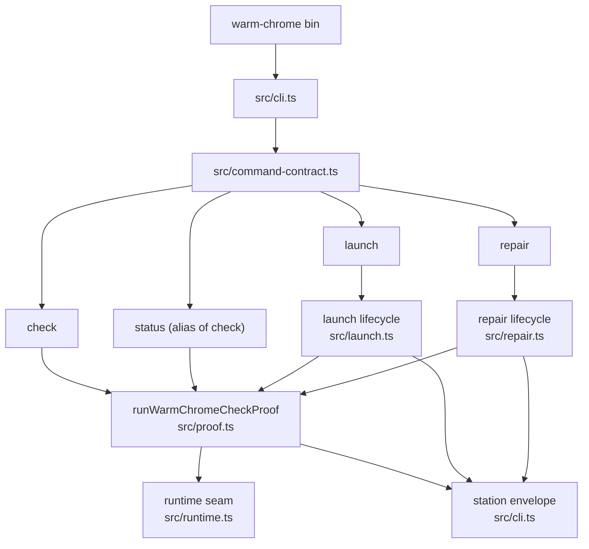
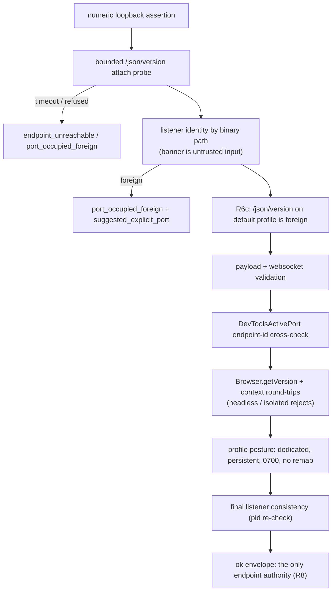

# Warm Chrome Architecture

Package architecture for `@side-quest/warm-chrome`.

## Shape

`warm-chrome` is a facade-backed CLI that owns Warm Chrome browser-entry
proof: verify real headed Google Chrome on a dedicated persistent profile
behind a numeric-loopback CDP endpoint, or fail with a canonical station code,
a machine-readable reason detail, and a repair path — before any browser
adapter acts.

Its interface is:

- `warm-chrome` bin (`src/cli.ts`, source-linked via the package `bin`).
- `src/command-contract.ts` command facade contract built on
  `@side-quest/cli-command-facade`.
- No-arg `warm-chrome` and `warm-chrome help [command]` render help without
  browser work.
- JSON result envelopes carrying `contract_id` `warm-chrome.browser-entry`
  and `schema_version` for agents; plain output for humans (`status`).
- Package-owned exit code `20` (browser-entry failure, never adapter
  fallback) beside the facade baseline `0`/`1`/`2`.
- No generated local state from `check`/`status`; `launch` may start local
  Chrome and `repair` may mutate dedicated-profile proof state.

The Module Map below is the single per-module owner list. `AGENTS.md` and
`README.md` point here instead of repeating it; `tests/docs-drift.test.ts`
keeps the map complete in both directions.

## Maintainer Surfaces

- `AGENTS.md`: maintainer route, source owners, change recipes, doc drift
  gate, debug path, safety invariants, and verification.
- `README.md`: human front door, command posture, authority, safety rules,
  and develop commands.
- `CONTEXT.md`: package language for stations, proof, endpoint authority,
  mutation, and maintenance workflows.
- `TASKS.md`: active project-manager dashboard.
- `TASKS.archive.md`: closed task detail and long review rationale.
- `tests/docs-drift.test.ts`: Module Map drift gate plus maintainer doc-set
  presence check.

## CLI Entry Flow

## Command Surface

| Command | Posture | Owner |
| --- | --- | --- |
| `check` | Read-only proof chain; JSON default; every failure is a canonical station | `src/proof.ts`, `src/cli.ts` |
| `status` | Presentation alias of `check`; plain default; no stations of its own | `src/command-contract.ts`, `src/cli.ts` |
| `launch` | Spawns real Chrome only when nothing listens; fail-closed classification; race policy | `src/launch.ts`, `src/cli.ts` |
| `repair` | Profile-state repair (dir, chmod 0o700, DevToolsActivePort hygiene), then re-prove; refusal, never termination | `src/repair.ts`, `src/cli.ts` |

Exit codes are contract-owned: `0` verified, `1` runtime failure, `2` invalid
usage, `20` browser entry required (`no_adapter_fallback` rides every exit-20
envelope).

Input fallbacks: `WARM_CHROME_CDP_PORT`, `WARM_CHROME_PROFILE_DIR`,
`WARM_CHROME_RUN_ID`, and launch-only `CHROME_BIN`. Global diagnostic flags:
`--run-id`, `--quiet`, `--verbose`, `--debug`.

## Module Map

- `package.json`: bin, exports, `test` and `typecheck` scripts, workspace
  facade contract.
- `src/model.ts`: contract id, schema version, command ids, exit code `20`,
  runtime-action ids, the `no_adapter_fallback` constraint id, and the closed
  check reason-detail union.
- `src/command-contract.ts`: facade contract entries per command, flags,
  exit-code meanings, result contract, action affordances, preview notes,
  Command Discovery Tree projection.
- `src/branch-station-catalog.ts`: the sixteen-station Branch Station Catalog
  (station = canonical code = primary action = mutation pin), the re-emit map
  for proof failures reached via `launch`/`repair`, and the drift gate.
- `src/branch-station-evidence.ts`: evidence manifest — station tests attach
  envelope evidence; missing or contradicting evidence is a drift finding.
- `src/runtime.ts`: the injectable runtime seam (env, listener probe, profile
  stat, spawn handle, SingletonLock probe), `WarmChromeRuntimeError`, process
  command parsing, and the websocket/listener redaction helpers.
- `src/proof.ts`: the single check proof chain — loopback assertion, bounded
  attach probe, listener identity, default-profile foreignness (R6c),
  payload validation, endpoint-id cross-check, CDP round-trips (headless and
  isolated-context rejects), profile posture, final listener consistency,
  and the suggested-explicit-port scan.
- `src/launch.ts`: launch lifecycle — pre-spawn short-circuit, competing
  9222-instance guard, fail-closed classification, SingletonLock pre-bind
  refusal, bounded readiness poll, and the own-child race policy.
- `src/repair.ts`: repair lifecycle — foreign-listener refusal (R11), profile
  dir creation, ownership-gated chmod, diagnosed DevToolsActivePort hygiene
  with the never-follow-symlink guard, and the mutation pin.
- `src/cli.ts`: argv parsing, dispatch, diagnostics configuration and the
  R13 redaction chokepoints, station envelope emission, error normalization,
  and runtime-action guidance.
- `src/index.ts`: re-exports the package seam.
- `tests/`: one suite per lifecycle (`check-stations`, `launch-stations`,
  `repair-stations`), `catalog.test.ts` drift gate, `cli-surface.test.ts`
  contract alignment, `redaction.test.ts` R13 proofs,
  `entrypoint.integration.test.ts` process-boundary stations, and
  `docs-drift.test.ts` module-map drift.

## Proof Flow

Station stance:

- One station = one canonical error code = one primary action; fine-grained
  cause lives in the closed `data.reason` union, never in the code.
- Proof-failure stations live under `check`; `launch` and `repair` re-emit
  them by reference. The one exception is `launch.spawned_unverified`: a
  post-spawn proof failure has mutated the workspace where a read-only check
  failure has not, which the re-emit rule cannot express.
- The ok envelope is the only endpoint authority; guidance carries the actual
  verified endpoint, never the `9222` convention.
- `skills/browser-use/src/preflight-warm-chrome.ts` is now a thin delegator to
  this package's `main()`; the switchover is closed and the parity harness that
  measured old-vs-new station/exit/envelope parity has been retired.
