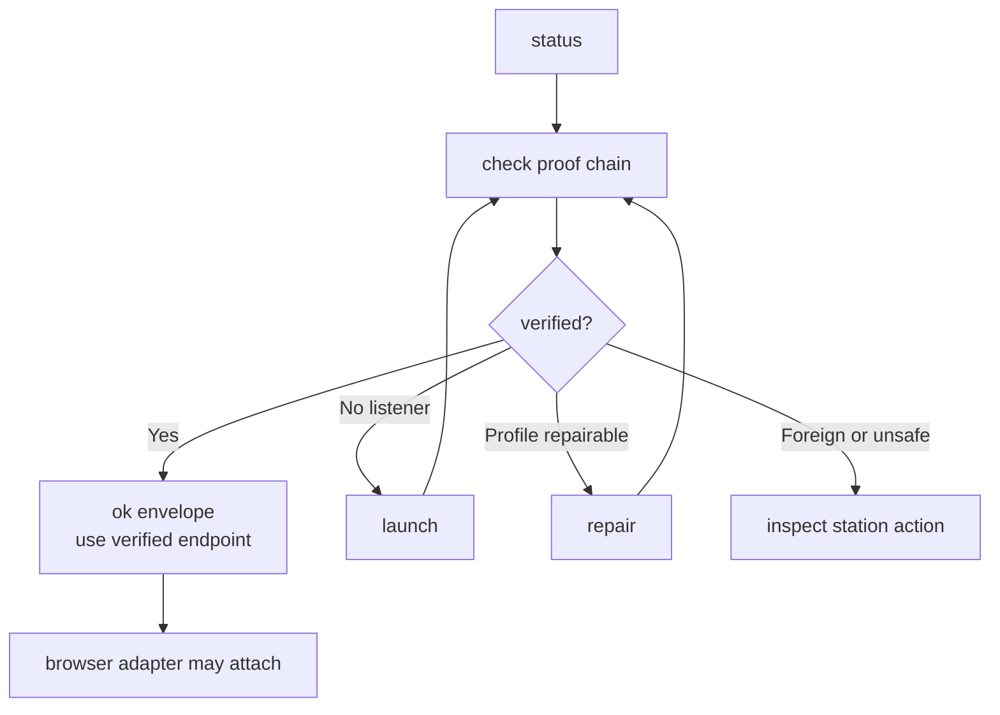

# warm-chrome

`warm-chrome` proves browser-entry readiness before any browser adapter acts.
It verifies a real headed Google Chrome on a dedicated persistent profile,
numeric-loopback CDP, browser-level websocket, listener/profile/port
consistency, and endpoint authority.

Failure is a canonical station with a repair path. Command envelopes are
evidence, not browser-control permission.

## What It Does

- Proves the current Warm Chrome endpoint through `check`.
- Renders human posture through `status`.
- Starts Chrome through `launch` only after no-spawn guards pass.
- Repairs dedicated-profile proof state through `repair`.
- Emits facade-backed JSON envelopes for agents.
- Keeps station ids, reason unions, flags, and result contracts in code.

## Start Here

Run the source-linked package bin when linked:

```bash
warm-chrome status
warm-chrome check --json
```

Run the direct source runner in repo-local environments:

```bash
bun run runtime/warm-chrome/src/cli.ts status
bun run runtime/warm-chrome/src/cli.ts check --json
```

Inspect help:

```bash
bun run runtime/warm-chrome/src/cli.ts --help
bun run runtime/warm-chrome/src/cli.ts launch --help
```

Read shared language before interpreting station terms:

- [CONTEXT.md](./CONTEXT.md)

For package maintenance, see [AGENTS.md](./AGENTS.md). For architecture and
module ownership, see [ARCHITECTURE.md](./ARCHITECTURE.md).

## Loop Shape



The ok envelope is the only endpoint authority. Consumers take its verified
endpoint and browser-level websocket URL verbatim; they do not derive either
from the `9222` convention.

## CLI Commands

| Command | Output | Posture | Mutation |
| --- | --- | --- | --- |
| `check` | JSON default, plain available | Agent proof chain | read-only |
| `status` | plain default, JSON available | Human alias of `check` | read-only |
| `launch` | JSON/plain | Spawn plus verify | may write browser state |
| `repair` | JSON/plain | Profile proof repair plus verify | may write profile proof state |

No-arg `warm-chrome` shows help. `warm-chrome help [command]` renders the same
help as `--help`.

```bash
# Agent proof
bun run runtime/warm-chrome/src/cli.ts check --json

# Human posture
bun run runtime/warm-chrome/src/cli.ts status

# Lifecycle
bun run runtime/warm-chrome/src/cli.ts launch --json
bun run runtime/warm-chrome/src/cli.ts repair --json

# Discovery
bun run runtime/warm-chrome/src/cli.ts help check
bun run runtime/warm-chrome/src/cli.ts help repair
```

Browser-entry failures exit `20` and carry the `no_adapter_fallback`
continuation constraint. Baseline exits stay facade-owned: `0` verified, `1`
runtime failure, `2` invalid usage.

## Inputs

- `--port`: CDP port. Mutually exclusive with `--endpoint`.
- `--endpoint`: numeric loopback endpoint, `http://127.0.0.1:<port>`.
- `--profile`: dedicated profile. `check` and `status` verify it. `launch`
  may create or chmod it. `repair` may create, chmod, or rewrite proof state
  inside it.
- `--chrome`: `launch` only; accepted binary path is
  `/Applications/Google Chrome.app/Contents/MacOS/Google Chrome`.
- Global diagnostics: `--run-id`, `--quiet`, `--verbose`, `--debug`.

Environment fallbacks: `WARM_CHROME_CDP_PORT`, `WARM_CHROME_PROFILE_DIR`,
`WARM_CHROME_RUN_ID`, and `CHROME_BIN` (`launch` only).

Flags win over environment. `--endpoint` accepts only numeric loopback
`http://127.0.0.1:<port>`.

## Files

Per-module owners live in [ARCHITECTURE.md](./ARCHITECTURE.md) Module Map.
Package docs: [AGENTS.md](./AGENTS.md) maintenance routing,
[CONTEXT.md](./CONTEXT.md) vocabulary, [TASKS.md](./TASKS.md) active work,
and [TASKS.archive.md](./TASKS.archive.md) closed task detail.

Browser entry authority is `runtime/browser-connect`, which consumes this
package in-process; the legacy browser-use delegator is deleted (migration
cleanup U5/KTD6).

## Authority

- Charter:
  `docs/decisions/2026-07-03-warm-chrome-runtime-package-definition.md`
- Runtime contract:
  `docs/adr/0009-browser-use-fixed-cdp-convention-and-runtime-proof.md`
- Plan:
  `docs/plans/2026-07-03-001-feat-warm-chrome-runtime-package-plan.md`
- Research:
  `skills/browser-use/docs/research/2026-07-03-warm-chrome-cdp-gotchas-and-port-policy.md`
- In-process consumer: `runtime/browser-connect`

## Safety Rules

- Treat `check` and `status` as read-only proof.
- Trust only the ok envelope for endpoint authority.
- Route on station action, not on `data.reason`.
- Do not switch adapters after exit `20`.
- Do not terminate a listener unless proof verified it as Warm Chrome.
- Keep foreign-listener diagnostics to pid and process basename.
- Preview lifecycle posture with `check` before `launch` or `repair`.
- Keep browser-use preflight authoritative until parity switchover closes.

## Develop

Run package tests:

```bash
skills/test-runner/src/test-runner.sh run -- runtime/warm-chrome/tests/
```

Run typecheck:

```bash
bun --filter @side-quest/warm-chrome typecheck
```

After command or station changes, prove discovery metadata, rendered help,
parser behavior, runtime semantics, station evidence, and parity output.
