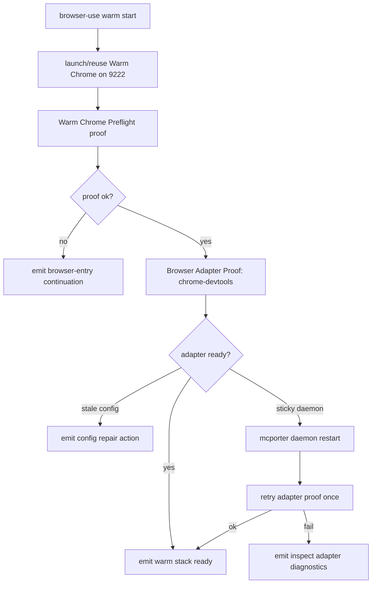

# feat: Add browser-use warm start front door

## Summary

Add `browser-use warm start` as the agent-facing Warm Chrome front door. The command orchestrates Warm Chrome launch/reuse, Warm Chrome proof, Chrome DevTools Adapter Proof, bounded config recovery, and one sticky-daemon retry behind one facade-backed CLI surface.

The default Warm Chrome endpoint remains loopback CDP on `9222` with the dedicated profile `~/.agent-warm-profile`. The issue's `9223` detail is incident evidence only: use it in stale-port tests, not as the new default.

---

## Problem Frame

Issue #211 reports a real failed setup loop: an agent entered `browser-use`, checked the wrong port path, found useful state elsewhere, edited `mcporter` config mid-run, and still needed a daemon restart before `chrome-devtools` was usable. The lower-level commands were mostly correct, but the workflow forced the agent to know too much choreography.

The fix is a runtime-owned front door. Agents should ask for the warm browser stack to be ready and receive one parseable result with the next safe action. They should not manually infer when to launch Chrome, when adapter config is stale, when a daemon restart is worth trying, or when cold-browser fallback is forbidden.

---

## Requirements

### Warm Chrome Entry

- R1. Add `browser-use warm start` as a public facade-backed command.
- R2. Keep `9222` as the default Warm Chrome CDP port.
- R3. Keep `~/.agent-warm-profile` as the default dedicated persistent profile.
- R4. Launch or reuse real Google Chrome only through the existing Warm Chrome proof path.
- R5. Reject Chrome for Testing, throwaway profiles, everyday default profiles, AppleScript, `osascript`, Playwright launch, and cold-browser fallback.
- R6. Preserve existing `preflight-warm-chrome` commands and contracts.

### Adapter Readiness

- R7. Prove `chrome-devtools` through Browser Adapter Proof after Warm Chrome proof succeeds.
- R8. Treat selected `mcporter` config stale/mismatch as adapter-config recovery, not Warm Chrome failure.
- R9. Do not mutate selected `mcporter` config in default `warm start` mode.
- R10. Offer a bounded repair path for stale selected `mcporter` config through an explicit flag or companion command.
- R11. Restart `mcporter daemon` only after adapter proof reaches the sticky-daemon class with config already matching the verified endpoint.
- R12. Retry adapter proof at most once after daemon restart.

### Agent Contract

- R13. Emit parseable JSON with readiness status, endpoint, browser pid, adapter readiness, page count, repair actions, and `continuation.next_action_id`.
- R14. Keep diagnostics on stderr and primary machine output on stdout.
- R15. Expose command discovery metadata, help, flags, exit codes, action ids, side effects, and result contract in `command-contract.ts`.
- R16. Prove discovery metadata, rendered help, parser acceptance, and runtime semantics cannot drift.
- R17. Update `browser-use/SKILL.md` so the first browser-entry action is `browser-use warm start`.

---

## Scope Boundaries

### In Scope

- `browser-use warm start` command contract, parser, help, and runtime orchestration.
- One safe daemon restart retry for the sticky-daemon class.
- Bounded selected-`mcporter` config repair through explicit `--repair-adapter-config` mode.
- Tests for the issue failure path and contract drift.
- Skill and reference docs after runtime behavior exists.

### Deferred to Follow-Up Work

- Changing the Warm Chrome default port away from `9222`.
- Native Chrome DevTools MCP transport without `mcporter`.
- Multi-adapter warm startup beyond `chrome-devtools`.
- Unattended destructive browser actions.
- Durable browser-domain-memory workflow promotion.

### Out of Scope

- Cold browser fallback.
- Killing arbitrary Chrome processes.
- Editing native Claude/Codex MCP config as the default repair path.
- Storing secrets, cookies, auth-bearing URLs, or raw page URLs in diagnostics.

---

## High-Level Technical Design

The front door composes existing proof owners. It does not replace Warm Chrome Preflight or Browser Adapter Proof. It converts their recovery outputs into one current-run continuation so agents stop guessing.

---

## Key Technical Decisions

- KTD1. **Default stays 9222:** ADR `docs/adr/0009-browser-use-fixed-cdp-convention-and-runtime-proof.md` and shipped code own the fixed Warm Chrome convention. The `9223` incident becomes a stale-port fixture.
- KTD2. **Facade-backed lane:** `browser-use-scripts` already uses `@side-quest/cli-command-facade`; the new command follows the existing facade-backed contract path.
- KTD3. **Orchestrate, do not duplicate proofs:** `warm start` calls reusable Warm Chrome and Adapter Proof owners or extracts owner functions from them. It does not build weaker listener/config checks.
- KTD4. **No default config mutation:** Default `warm start` can launch/reuse Chrome and restart a sticky daemon, but selected `mcporter` config writes require explicit `--repair-adapter-config`.
- KTD5. **Selected config identity is pinned:** Adapter Proof must report the selected `mcporter` chrome-devtools binding identity. Warm start carries that identity into repair mode and aborts the write if the selected binding differs before mutation.
- KTD6. **Daemon restart is narrow:** Restart only when proof has shown selected config targets the verified endpoint, dependency/config inspection succeeded, Adapter Proof reaches the named sticky-daemon class, and no timeout, unparsable output, missing dependency, or mismatched-config condition is present.
- KTD7. **Plain module first:** Add a small warm-start orchestration module because the dispatcher would otherwise absorb cross-command branching. Do not introduce a registry or strategy layer; there is one adapter in scope.
- KTD8. **Branch Station proof earns its keep:** The new command has multiple recovery branches. Add station coverage so discovery/help/runtime outcomes cannot drift as branches grow.

---

## Implementation Units

### U1. Warm Start CLI Contract

- **Goal:** Add the public `browser-use warm start` surface and contract vocabulary.
- **Requirements:** R1, R2, R3, R13, R14, R15, R16
- **Dependencies:** None
- **Files:**
  - `skills/browser-use/src/command-contract.ts`
  - `skills/browser-use/src/browser-use-parser.ts`
  - `skills/browser-use/src/browser-use-parser.test.ts`
  - `skills/browser-use/src/browser-use.test.ts`
  - `skills/browser-use/src/build-dist.ts`
  - `skills/browser-use/package.json`
- **Approach:** Add a `warm` family with `start`. Declare default behavior as `9222`/`~/.agent-warm-profile` in code-owned contract data and help. Name `--repair-adapter-config` as the explicit write mode for stale selected-`mcporter` config repair. Add action ids for warm-stack-ready, launch-warm-chrome, repair-adapter-config, restart-mcporter-daemon, inspect-adapter-diagnostics, and change-warm-start-input.
- **Patterns to follow:** Existing `targets` / `operate` family parser, `browserUseContracts`, and command discovery tests.
- **Test scenarios:**
  - `browser-use --help` lists `warm`, `targets`, and `operate`.
  - `browser-use warm --help` lists `start`.
  - `browser-use warm start --help` shows `9222` as the default port and does not mention `9223` as a default.
  - Parser accepts `warm start --json`, `--plain`, `--port`, `--endpoint`, `--profile`, `--adapter chrome-devtools`, and `--repair-adapter-config`.
  - Parser rejects foreign `targets` and `operate` flags on `warm start`.
  - Command discovery exposes the warm-start result contract and action affordances.
  - Reserved facade diagnostic flags are not redeclared.
- **Verification:** Contract parsing, help rendering, parser tests, and discovery projection agree on every public flag.

### U2. Warm Start Orchestration Engine

- **Goal:** Implement the no-mutation happy path: launch/reuse Warm Chrome, prove Warm Chrome, prove `chrome-devtools`, and emit one readiness envelope.
- **Requirements:** R2, R3, R4, R5, R6, R7, R13, R14
- **Dependencies:** U1
- **Files:**
  - `skills/browser-use/src/browser-use-warm.ts`
  - `skills/browser-use/src/browser-use.ts`
  - `skills/browser-use/src/browser-use-runtime.ts`
  - `skills/browser-use/src/preflight-warm-chrome.ts`
  - `skills/browser-use/src/preflight-browser-adapter.ts`
  - `skills/browser-use/src/browser-use-warm.test.ts`
  - `skills/browser-use/src/preflight-warm-chrome.test.ts`
  - `skills/browser-use/src/preflight-browser-adapter.test.ts`
- **Approach:** Extract reusable owner functions only where needed so `warm start` can call the same proof logic as the lower-level CLIs. Keep the CLI dispatcher thin. Build a warm-start result from proof outputs, not from direct listener/config scraping.
- **Patterns to follow:** `runBrowserUseCli`, `createDefaultBrowserUseRuntime`, `runTargetsList`, `runOperate`, and existing proof envelopes.
- **Test scenarios:**
  - Clean launch on `9222` with `~/.agent-warm-profile` emits ready status, endpoint `http://127.0.0.1:9222`, browser pid, adapter ready, page count, and warm-stack continuation.
  - Existing healthy Warm Chrome on `9222` is reused without spawning a second browser.
  - Normal Chrome or a non-CDP listener occupying `9222` fails with browser-entry recovery and no cold-browser fallback.
  - Explicit `--port 9223` is honored for the current run but does not change the default or help default.
  - Unsafe browser/profile cases preserve existing Warm Chrome preflight failures.
  - Lower-level `preflight-warm-chrome` and `preflight-browser-adapter` command behavior remains unchanged.
- **Verification:** The issue path cannot lead an agent to treat `9223` as the default; Warm Chrome proof remains the endpoint authority.

### U3. Adapter Config Recovery and Sticky Daemon Retry

- **Goal:** Handle stale selected `mcporter` config and sticky daemon state without manual choreography.
- **Requirements:** R8, R9, R10, R11, R12, R13, R14
- **Dependencies:** U2
- **Files:**
  - `skills/browser-use/src/browser-use-warm.ts`
  - `skills/browser-use/src/preflight-browser-adapter.ts`
  - `skills/browser-use/src/mcporter-transport.ts`
  - `skills/browser-use/src/browser-use-warm.test.ts`
  - `skills/browser-use/src/preflight-browser-adapter.test.ts`
  - `skills/browser-use/src/browser-use-transport.test.ts`
- **Approach:** Map Adapter Proof errors into warm-start continuations. For stale or mismatched selected `mcporter` config, return `repair-adapter-config` by default. In `--repair-adapter-config` mode, update only the selected `mcporter` chrome-devtools binding to the verified endpoint, then rerun Adapter Proof. Carry the selected binding identity from proof into repair mode and abort if the selected binding changes before write. For sticky daemon behavior, restart only after Adapter Proof reaches a sticky-daemon classification: selected config matches the verified endpoint, dependency/config inspection succeeds, the adapter page proof fails with the named daemon-stale signal, and no timeout, unparsable output, missing dependency, or mismatched-config condition is present. Run `mcporter daemon restart` through the shared command-vector transport, then retry Adapter Proof once.
- **Patterns to follow:** `runMcporter`, `mcporterDependencyHintText`, Adapter Proof config diagnostics, and operation transport failure mapping.
- **Test scenarios:**
  - Selected `mcporter` config pointing at `9223` returns `repair-adapter-config` by default.
  - `--repair-adapter-config` updates selected `mcporter` config to `http://127.0.0.1:9222` and reruns proof.
  - Repair mode aborts if the selected `mcporter` chrome-devtools binding identity differs between proof and write.
  - Native stale config remains warning-only when selected `mcporter` config is healthy.
  - Sticky daemon after matching config and the named daemon-stale signal triggers exactly one daemon restart and one retry.
  - Timeout, unparsable output, missing dependency, and mismatched-config failures do not trigger daemon restart.
  - Adapter proof failure after retry emits inspect diagnostics and does not loop.
  - Missing `mcporter` emits dependency recovery, not Warm Chrome repair.
  - Invalid `BROWSER_USE_MCPORTER_COMMAND_JSON` remains an input/configuration failure.
  - Daemon restart uses argv vectors only; no shell string or package-runner fallback.
- **Verification:** `warm start` distinguishes stale config, missing dependency, sticky daemon, and adapter output failure with separate continuations.

### U4. Facade Branch Coverage and Process Proof

- **Goal:** Prove the new command cannot drift across contract metadata, help, parser acceptance, and runtime behavior.
- **Requirements:** R15, R16
- **Dependencies:** U1, U2, U3
- **Files:**
  - `skills/browser-use/src/browser-use-warm-station-catalog.ts`
  - `skills/browser-use/src/browser-use-warm-station-catalog.test.ts`
  - `skills/browser-use/src/browser-use-warm.integration.test.ts`
  - `skills/browser-use/src/browser-use.test.ts`
  - `skills/browser-use/src/browser-use-warm.test.ts`
- **Approach:** Add a package-owned Branch Station catalog for warm-start outcomes. Cover the catalog with synthetic validation and process-boundary scenarios. Use shared facade testing helpers where available; keep domain fixtures test-local.
- **Patterns to follow:** `skills/create-cli/references/cli-command-facade.md`, existing `browser-use` command contract tests, and any package-local facade testing helpers.
- **Test scenarios:**
  - Catalog validates against live command discovery.
  - Scenario map keys match station ids exactly.
  - Process test covers happy path, stale config, sticky daemon restart success, sticky daemon retry failure, missing dependency, invalid input, and non-Warm listener on `9222`.
  - JSON stdout validates result contract metadata.
  - Diagnostics stay on stderr.
  - Every station is covered or explicitly skipped with rationale.
- **Verification:** Unit tests, station catalog tests, and integration tests agree on exit codes, envelope status, contract id, and next action ids.

### U5. Skill and Reference Update

- **Goal:** Make the skill entry screen route agents through `browser-use warm start`.
- **Requirements:** R17
- **Dependencies:** U1, U2, U3, U4
- **Files:**
  - `skills/browser-use/SKILL.md`
  - `skills/browser-use/references/warm-chrome.md`
  - `skills/browser-use/references/browser-adapter-chrome-devtools.md`
  - `skills/browser-use/docs/PRODUCT-BASELINE.md`
  - `skills/browser-use/TEST_MATRIX.md`
- **Approach:** After runtime behavior exists, update prose to name `browser-use warm start` as the first action. Keep exact flags, schema, action ids, and output semantics owned by code/help/tests. Before editing `SKILL.md`, read `skills/create-skill/references/skill-design-decision-runbook.md`.
- **Patterns to follow:** Existing skill owner-path style and behavior-regression checks for skill docs.
- **Test scenarios:**
  - Skill docs point first browser-entry work to `browser-use warm start`.
  - Docs preserve no cold-browser fallback and no adapter fallback constraints.
  - Docs do not copy the full JSON schema.
  - Owner-path checks pass after `SKILL.md` changes.
  - `9222` appears as the default; `9223` appears only as stale-port incident/test context.
- **Verification:** Skill prose, command help, and contract tests agree on ownership and next safe action.

---

## Acceptance Examples

- AE1. Given no Warm Chrome is running and port `9222` is free, when an agent runs `browser-use warm start --json`, then real Google Chrome launches on `9222`, Adapter Proof passes, and stdout emits ready status with `continuation.next_action_id` for using the warm stack.
- AE2. Given healthy Warm Chrome already runs on `9222`, when `warm start` runs, then it reuses that process and does not spawn a second browser.
- AE3. Given a non-Warm listener occupies `9222`, when `warm start` runs, then it fails closed with browser-entry recovery and does not use a cold browser.
- AE4. Given selected `mcporter` config points at `9223`, when `warm start --json` runs in default mode, then it returns a stale-config repair action and does not silently make `9223` the default.
- AE5. Given selected `mcporter` config already matches `9222` and Adapter Proof reaches the sticky-daemon class, when `warm start --json` runs, then it restarts `mcporter daemon`, retries Adapter Proof once, and succeeds or emits inspect diagnostics.
- AE6. Given an agent reads `browser-use/SKILL.md`, when they start browser work, then the first mechanical action is `browser-use warm start`, not a hand-assembled sequence of lower-level proofs.

---

## Risks and Dependencies

- **External config mutation:** Repairing `mcporter` config can surprise operators. Default mode returns a repair action; `--repair-adapter-config` must be explicit, bounded to selected `mcporter` chrome-devtools config, and guarded by selected-binding identity.
- **Daemon restart side effects:** Restarting `mcporter daemon` may affect other active MCP sessions. Limit restart to the sticky-daemon class, exclude broad adapter failures, and retry once.
- **Facade test debt:** Existing `browser-use` tests prove many facade properties without a full station catalog. This command adds station coverage for warm-start branches so the new surface does not deepen that gap.
- **Port confusion:** The issue body mentions `9223`, but repo truth says `9222`. Tests must lock `9222` as default and use `9223` only for stale-config cases.

---

## Sources and Research

- GitHub issue #211: `Add browser-use warm start front door`.
- ADR: `docs/adr/0009-browser-use-fixed-cdp-convention-and-runtime-proof.md`.
- Warm Chrome runtime: `skills/browser-use/src/preflight-warm-chrome.ts`.
- Adapter Proof runtime: `skills/browser-use/src/preflight-browser-adapter.ts`.
- Shared transport: `skills/browser-use/src/mcporter-transport.ts`.
- CLI contract owner: `skills/browser-use/src/command-contract.ts`.
- Existing browser-use CLI: `skills/browser-use/src/browser-use.ts`.
- Skill entry: `skills/browser-use/SKILL.md`.
- CLI design owner: `skills/create-cli/SKILL.md`.
- Facade-backed CLI guidance: `skills/create-cli/references/cli-command-facade.md`.
