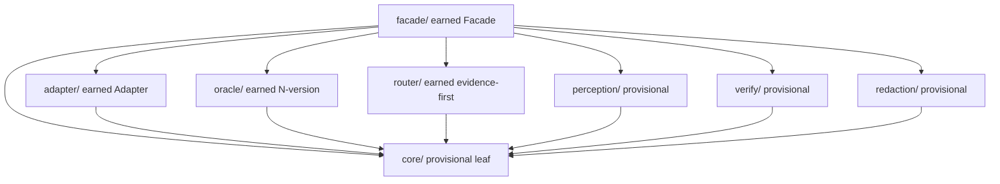

# Browser-use seam map

This `src/` tree uses seam directories as architecture lookup handles. These directories
do not create CLI front doors. The existing flat modules stay authoritative until the
Plan 2 migration moves behavior into the seams.

## Seams

| Seam | Status | Pattern | Deletion test |
|---|---|---|---|
| `facade/` | earned | Facade, action surface only | Remove it -> caller must name engines and handle five vocabularies. |
| `adapter/` | earned | Adapter | Remove it -> facade reaches only chrome-devtools and N collapses to one. |
| `oracle/` | earned | N-version programming | Remove it -> lose the disagreement signal that is the product moat. |
| `router/` | earned | evidence-first selection | Remove it -> engines route on unproven manifests and false capability claims. |
| `perception/` | provisional | none | Remove it -> observation kinds smear across callers before proof. |
| `verify/` | provisional | none | Remove it -> post-state proof leaks into operation callers. |
| `redaction/` | provisional | none | Remove it -> privacy release rules become optional caller discipline. |
| `core/` | provisional | none | Remove it -> shared leaf symbols climb back into higher seams and cycles return. |

## Direction

`core/` is the keystone leaf. It imports no browser-use seam. Middle seams import only
`core/`. `facade/` can import middle seams and `core/`.

## Placement rule

- Put caller-facing orchestration in `facade/`.
- Put engine vocabulary and dispatch mapping in `adapter/`.
- Put mechanical N-engine comparison in `oracle/`.
- Put evidence-gated route selection in `router/`.
- Put observation-mode substrate in `perception/`.
- Put post-state proof in `verify/`.
- Put privacy boundary mechanics in `redaction/`.
- Put shared leaf symbols in `core/`.
