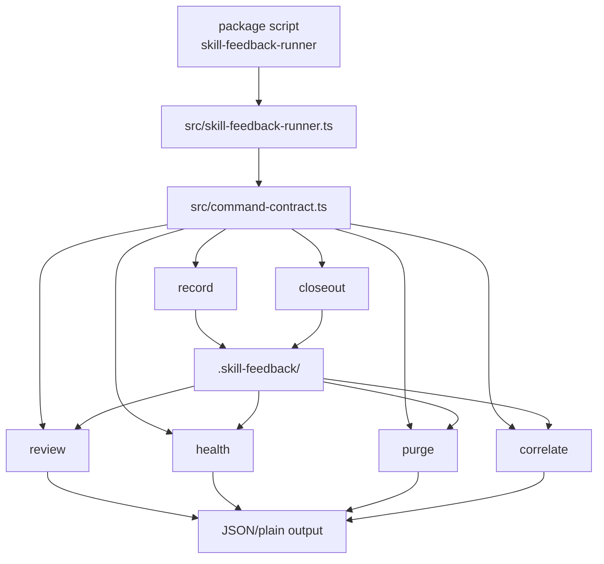
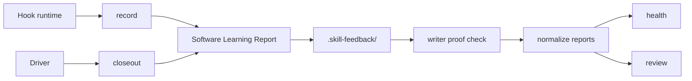
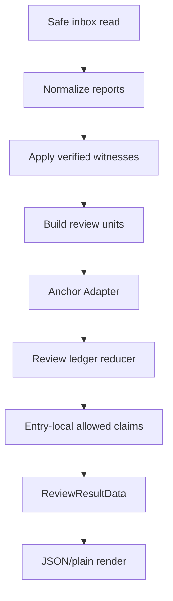
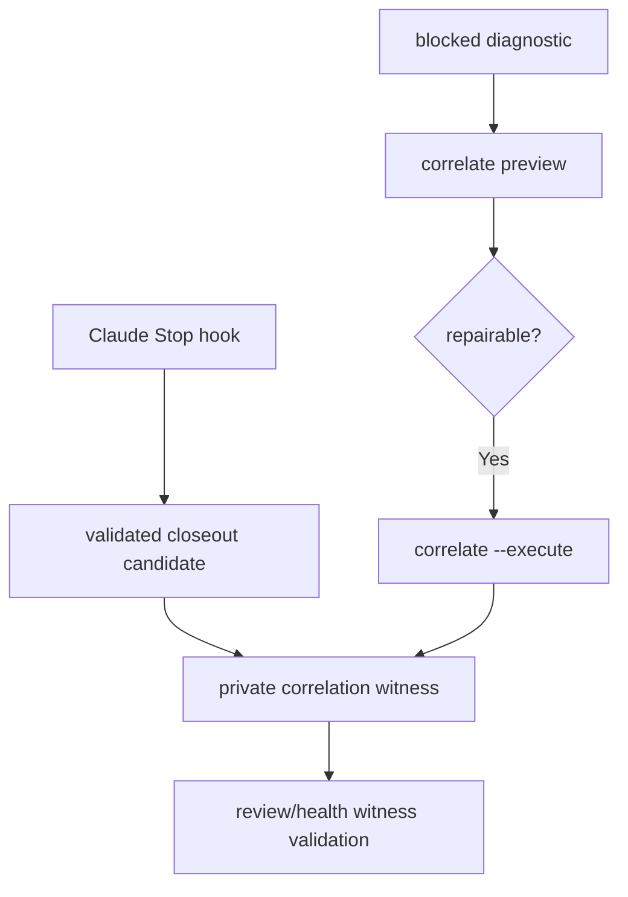
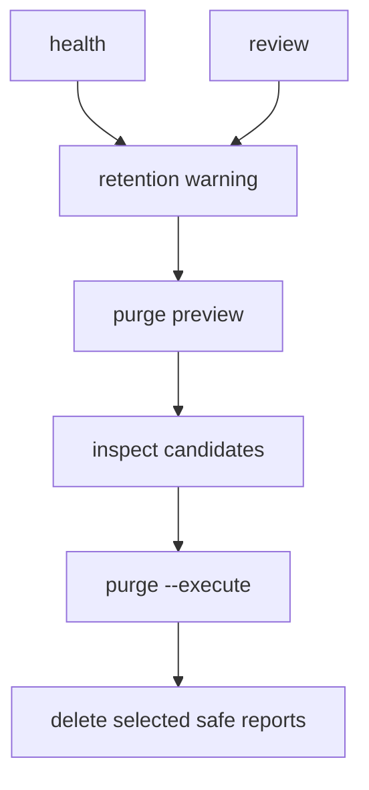

# Skill Feedback Architecture

Package architecture for `skill-feedback-scripts`.

## Shape

`skill-feedback` is a CLI interface over repo-local Software Learning Reports.
It writes private evidence under `.skill-feedback/`, then exposes health,
review, correlation, and retention commands for agents and humans.

Its interface is:

- `skill-feedback-runner` package script.
- `src/command-contract.ts` command facade contract.
- JSON result envelopes for all commands.
- Plain output for `review`, `health`, and `correlate`.
- Private repo-local inbox files under `.skill-feedback/`.

Implementation modules behind that interface are:

- command contracts and result types in `src/command-contract.ts`,
- CLI dispatch, filesystem safety, and command engines in
  `src/skill-feedback-runner.ts`,
- review ledger reduction in `src/review-ledger-reducer.ts`,
- owner path anchoring in `src/ledger-anchor-adapter.ts`,
- harness adapter seams in `src/capture-adapters.ts`,
- redaction in `src/redaction.ts`,
- branch station coverage in `src/branch-station-catalog.ts`.

## CLI Entry Flow

- `package.json`: exposes `skill-feedback-runner`, `test`, and `typecheck`.
- `src/command-contract.ts`: command metadata, parser rules, schemas, result
  contracts, help/discovery contract, proof/witness contracts.
- `src/skill-feedback-runner.ts`: CLI entry, read-target resolution, safe inbox
  reads, safe writes, renderers, and command handlers.

The command facade contract is the external seam. Tests cover discovery
metadata, help rendering, parser acceptance, runtime semantics, and branch
station evidence.

## Command Surface

| Command | Posture | Owner |
| --- | --- | --- |
| `record` | Writes hook-owned Software Learning Report; fail-closed on gitignore | `src/skill-feedback-runner.ts`, `src/command-contract.ts` |
| `closeout` | Writes driver closeout from stdin; no argv receipt | `src/skill-feedback-runner.ts`, `references/closeout-receipt.md` |
| `review` | Read-only claim-safe report card | `src/skill-feedback-runner.ts`, `src/review-ledger-reducer.ts` |
| `health` | Read-only inbox, readiness, warning, next-action summary | `src/skill-feedback-runner.ts`, `src/command-contract.ts` |
| `purge` | Preview by default; `--execute` deletes selected safe reports | `src/skill-feedback-runner.ts` |
| `correlate` | Preview by default; `--execute` writes private witnesses | `src/skill-feedback-runner.ts`, `src/command-contract.ts` |

## Module Map

- `src/command-contract.ts`: contract ids, schema versions, command metadata,
  parsed types, result envelopes, report normalization, writer proof, correlation
  witness creation and verification.
- `src/skill-feedback-runner.ts`: runtime abstraction, gitignore gate, inbox
  preparation, record and closeout writes, health/review/correlate/purge
  engines, safe JSON scans, plain rendering, CLI parsing.
- `src/review-ledger-reducer.ts`: review unit grouping, trusted run handling,
  ledger entries, evidence tiers, resolution state, entry-local allowed claims.
- `src/ledger-anchor-adapter.ts`: repo-contained owner path canonicalization,
  strong anchor facts, weak anchor reasons.
- `src/capture-adapters.ts`: `CaptureAdapter` seam plus Claude OTel and Codex
  JSON normalization for receipt-shaped input.
- `src/redaction.ts`: redaction for agent-authored report and report-card text.
- `src/report-helpers.ts`: evidence-gap helpers and stable report ids.
- `src/branch-station-catalog.ts`: package-owned station map for public command
  branch coverage.
- `src/branch-station-evidence.ts`: station evidence projection and missing
  station helpers.

## Report And Trust Flow

Report trust stance:

- Agent-authored text is evidence-only.
- Writer proof verifies selected writer-owned fields only.
- Trusted skill identity requires engine-owned evidence.
- Trusted run proof requires runtime-owned or correlation-owned provenance.
- `corroborated` requires runtime-owned hook capture plus correlation-owned
  driver closeout in the same trusted review unit.

## Review Ledger Flow

The reducer owns claim derivation. Renderers repeat facts; they do not infer
trust or readiness.

## Correlation Flow

Correlation witnesses live under `.skill-feedback/.correlation/`. Diagnostics
carry reason ids only. Public report ids, run ids, proof fields, trust fields,
and closeout receipt fields cannot create a witness.

## Inbox Retention Flow

Purge skips `.trust/` and `.correlation/`. Correlation witness and diagnostic
retention needs a separate contract before deletion support.

## Locality

The package stays deep when callers use the CLI and read owner docs:

- Contracts, schemas, flags, and enums live in code.
- `CONTEXT.md` owns vocabulary.
- References explain reading rules, not copied schemas.
- `.skill-feedback/` stores private evidence, not source truth.
- `TASKS.md` tracks active work; archive stores completed trust.
