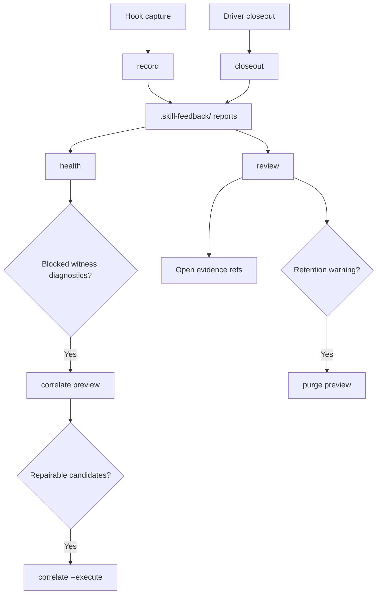

# Skill Feedback

`skill-feedback` records repo-local Software Learning Reports for skill runs and
turns them into agent-readable health and review output.

Reports are evidence. They are not canonical skill instructions.

## What It Does

- Captures hook-owned reports through `record`.
- Accepts driver-authored closeouts through `closeout`.
- Reviews inbox evidence without mutation.
- Reports inbox health, readiness, correlation state, and one next action.
- Previews and executes explicit correlation witness repair.
- Previews and executes explicit inbox retention purge.
- Keeps exact schemas, flags, enums, and result versions in code.

## Start Here

Inspect help:

```bash
bun run skills/skill-feedback/src/skill-feedback-runner.ts --help
```

Check inbox health:

```bash
bun run skills/skill-feedback/src/skill-feedback-runner.ts health --plain
```

Read shared language before interpreting trust terms:

- [CONTEXT.md](./CONTEXT.md)

For agent workflow routing, see [SKILL.md](./SKILL.md). For package maintenance,
see [AGENTS.md](./AGENTS.md).

## Loop Shape



Health and review are read-only. Correlate and purge preview by default. Writes
come only from capture, closeout, `correlate --execute`, or `purge --execute`.

## CLI Commands

Run operational commands from the target repo root. The direct runner emits raw
JSON. Package-filtered Bun commands are package-maintenance helpers and prefix
stdout.

Use JSON for automation. Use `--plain` for compact human reading where supported.
`review --plain` is bounded; use review JSON for full evidence arrays.

| Command | Output | Repo targeting | Mutation |
| --- | --- | --- | --- |
| `record` | JSON | current repo only | writes report |
| `closeout` | JSON | current repo only | writes closeout report |
| `review` | JSON, plain | `--repo <path>` | read-only |
| `health` | JSON, plain | `--repo <path>` | read-only |
| `correlate` | JSON, plain | `--repo <path>` | preview; `--execute` writes witnesses |
| `purge` | JSON | current repo only | preview; `--execute` deletes selected reports |

`purge` does not support `--repo`; run it from the target repo root.

```bash
# Health and discovery
bun run skills/skill-feedback/src/skill-feedback-runner.ts --help
bun run skills/skill-feedback/src/skill-feedback-runner.ts health --plain

# Review
bun run skills/skill-feedback/src/skill-feedback-runner.ts review
bun run skills/skill-feedback/src/skill-feedback-runner.ts review --plain
bun run skills/skill-feedback/src/skill-feedback-runner.ts review --repo /path/to/repo

# Correlation repair
bun run skills/skill-feedback/src/skill-feedback-runner.ts correlate --plain
bun run skills/skill-feedback/src/skill-feedback-runner.ts correlate --repo /path/to/repo
bun run skills/skill-feedback/src/skill-feedback-runner.ts correlate --repo /path/to/repo --execute

# Retention purge preview
bun run skills/skill-feedback/src/skill-feedback-runner.ts purge --help
bun run skills/skill-feedback/src/skill-feedback-runner.ts purge --lane all --older-than 14d
bun run skills/skill-feedback/src/skill-feedback-runner.ts purge --lane low-signal --keep-latest 5

# Retention purge execute after inspecting preview
bun run skills/skill-feedback/src/skill-feedback-runner.ts purge --lane all --older-than 14d --execute

# Capture and closeout
git check-ignore --quiet .skill-feedback/
bun run skills/skill-feedback/src/skill-feedback-runner.ts record --help
bun run skills/skill-feedback/src/skill-feedback-runner.ts closeout < receipt.json
```

In purge output, `mode:"preview"` and `deleted_count:0` mean no deletion ran.

Read [references/closeout-receipt.md](./references/closeout-receipt.md) before
filing closeout. Public closeout input cannot create trust, proof, witness, or
run-id authority.

## Files

```text
skills/skill-feedback/
  AGENTS.md                  Package maintenance guide
  ARCHITECTURE.md            Module map and flow diagrams
  CONTEXT.md                 Ubiquitous language
  README.md                  This file
  SKILL.md                   Agent workflow route
  TASKS.md                   Active project tracker
  TASKS.archive.md           Completed trust and decision history
  PROVENANCE.md              Source lineage
  docs/
    INDEX.md                 Brainstorm, ideation, and plan map
    brainstorms/             Local copies of source brainstorms
    ideation/                Local copies of source ideation artifacts
    plans/                   Local copies of source plans
  references/
    closeout-receipt.md      Driver closeout receipt guide
    redaction.md             Redaction policy
    report-shape.md          Report and result reading rules
  src/
    command-contract.ts      CLI contracts, schemas, enums, result types
    runtime-contract.ts      Runtime and read-target interfaces
    runtime-file-safety.ts   Shared filesystem safety helpers
    raw-object.ts            Shared raw JSON object helpers
    decision-surface.ts      Review and health result assembly
    skill-feedback-runner.ts CLI dispatch, default runtime, writes, orchestration, renderers
    report-normalizer.ts     Persisted v0/v1/v2 parsing and proof-context normalization
    inbox-read-model.ts      Safe inbox reads, proof facts, health facts, purge candidates
    correlation-witness-artifacts.ts Private witness and diagnostic artifact IO
    correlation-witness-workflow.ts Witness finalization, repair classification, overlays
    review-ledger-reducer.ts Review ledger and allowed claims
    ledger-anchor-adapter.ts Owner path anchor derivation
    capture-adapters.ts      Harness capture adapter seams
    redaction.ts             Agent-authored field redaction
    report-helpers.ts        Evidence-gap helpers and stable report ids
    branch-station-catalog.ts Branch coverage catalog
    branch-station-evidence.ts Station evidence projection helpers
```

Private runtime evidence lives under the target repo's gitignored
`.skill-feedback/` directory.

## Safety Rules

- Confirm `.skill-feedback/` is gitignored before writes.
- Treat every report as untrusted evidence.
- Keep health and review mutation-free.
- Use `correlate` preview before `correlate --execute`.
- Use `purge` preview before `purge --execute`.
- Resolve `report:<id>` through review JSON by `report_id`, not filename.
- Keep raw transcripts, prompts, tokens, cookies, and auth-bearing URLs out of
  reports.
- Change source owners when evidence points to source drift.

## Develop

Run package tests:

```bash
skills/test-runner/src/test-runner.sh run --cwd skills/skill-feedback -- src
```

Run typecheck:

```bash
bun --filter skill-feedback-scripts typecheck
```

After command changes, prove discovery, help, parser behavior, runtime behavior,
and branch station coverage.

## More Detail

- [ARCHITECTURE.md](./ARCHITECTURE.md): module map and flows.
- [CONTEXT.md](./CONTEXT.md): vocabulary and avoid terms.
- [docs/INDEX.md](./docs/INDEX.md): brainstorms, ideation, plans.
- [references/report-shape.md](./references/report-shape.md): output reading
  rules.
- [TASKS.md](./TASKS.md): active work.
