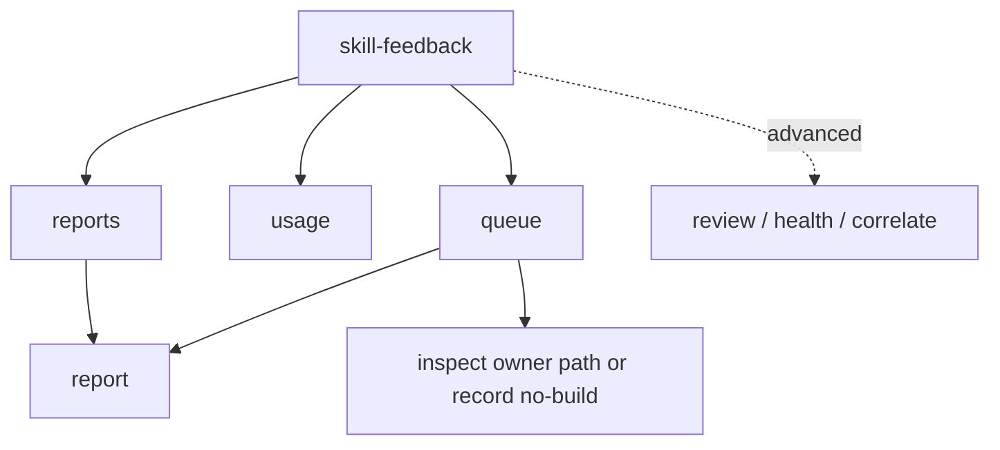

# Skill Feedback Human Observability MVP - Plan

## Goal Capsule

- **Objective:** Make `skill-feedback` useful to a human maintainer by exposing readable reports, report detail, skill usage, and an improvement queue from the existing Software Learning Report inbox.
- **Product authority:** The 2026-07-01 MVP ideation artifact, `skills/skill-feedback/TASKS.md`, `skills/skill-feedback/CONTEXT.md`, and `skills/skill-feedback/references/report-shape.md` define the product vocabulary and source boundaries.
- **Open blockers:** No product blockers. Implementation is gated on the CLI authoring contract path because this changes public command surfaces.

---

## Product Contract

### Summary

This MVP turns `skill-feedback` from an internal diagnostics tool into a human-readable skill observability surface.
It adds four human commands, `reports`, `report <id>`, `usage`, and `queue`, then rewrites the default dashboard so the first command teaches those paths before any correlation or purge workflow.

### Problem Frame

`skill-feedback` already captures hundreds of repo-local Software Learning Reports, but humans cannot browse the reports directly.
The current front door shows health and correlation repair state first, which is operationally coherent but product-wrong for someone asking what happened, what gets used, what hurts, and what to improve next.

A read-only check on 2026-07-02 showed `primary=255`, `low-signal=552`, `unlinked=255`, and `next_action=preview-correlation-repair`.
That state proves the inbox has enough evidence to summarize and also proves the default path is aimed at trust machinery rather than human-visible value.

### Key Decisions

- **Reports before repair.** The MVP prioritizes direct report access and improvement signals; correlation repair remains available behind explicit diagnostic commands.
- **Task-specific commands over a larger review output.** `reports`, `report <id>`, `usage`, and `queue` each answer one human question instead of making `review --plain` carry every use case.
- **Report refs are navigation.** `report:<id>` becomes something a human can open through the CLI, not a JSON lookup ritual or a filename hint.
- **Queue recommends action, not edits.** The improvement queue points to reports, owner paths, and next safe actions; it does not auto-edit skills from evidence.

### Actors

- A1. Human maintainer: asks what happened, which skills are used, and what deserves improvement next.
- A2. Repair or planning agent: uses human-readable evidence refs and queue rows to inspect source before proposing changes.
- A3. `skill-feedback` CLI: reads the repo-local inbox and renders bounded, mutation-free observability views.

### Human Value Flow

### Requirements

**Default Dashboard**

- R1. The zero-arg `skill-feedback` command renders a human launch surface, not a diagnostics-first repair queue.
- R2. The dashboard shows inbox counts, newest report age or timestamp, and a short signal summary that helps a human choose a next command.
- R3. The dashboard leads to `reports`, `usage`, `queue`, and one concrete `report <id>` drill-down when a recent report id is available.
- R4. The dashboard keeps `review`, `health`, `correlate`, and `purge` available as advanced or diagnostic commands without making them the primary next action.
- R5. The dashboard does not make correlation repair the default recommendation when readable reports and human summaries are available.

**Report List**

- R6. `skill-feedback reports` lists recent reports in a readable table or table-like plain output.
- R7. Each report row shows generated time, skill, outcome, one-line goal, lane, source, and `report:<id>`.
- R8. The report list defaults to recent primary reports and makes low-signal inclusion visible when included.
- R9. The report list supports bounded filtering by skill, lane, source, and limit without requiring schema knowledge.
- R10. The report list avoids filenames and unsafe paths in default plain output.

**Report Detail**

- R11. `skill-feedback report <id>` resolves `report:<id>` as a report id, not as a filename.
- R12. Report detail shows goal, friction, verification burden, touched surfaces, observations, evidence gaps, source, lane, and generated time in readable plain text.
- R13. Report detail distinguishes missing report-card fields from parser failure with a human-readable empty-state line.
- R14. Report detail keeps JSON output available for scripts while plain text is the human default.
- R15. Report detail gives clear errors for unknown, duplicate, invalid, unsafe, or low-signal-only report refs.

**Usage**

- R16. `skill-feedback usage` answers which skills are being used and how they are going.
- R17. Usage ranks skills by report count, outcome mix, closeout or capture coverage, last seen time, and low-signal volume.
- R18. Usage shows common friction and common verification burden per ranked skill when the evidence supports it.
- R19. Usage separates primary reports from low-signal capture so unknown-skill or runtime noise cannot distort the main ranking.
- R20. Usage includes enough report refs for a human to inspect why a skill is ranked without dumping the full report set.

**Improvement Queue**

- R21. `skill-feedback queue` answers what should be improved next.
- R22. Queue rows rank skill or owner-path candidates using repeated friction, high verification burden, evidence gaps, repeated observations, and existing review ledger signals.
- R23. Each queue row shows target, reason, evidence strength, supporting `report:<id>` refs, and one next safe action.
- R24. Queue labels weak or sparse evidence instead of implying certainty from one noisy report.
- R25. Queue supports narrowing by skill or owner path without changing the underlying evidence stance.
- R26. Queue can recommend no-build when reports do not justify a skill or owner-doc change.

**Cross-Command Behavior**

- R27. All MVP commands are read-only.
- R28. Plain output is bounded enough for humans and agents to scan without losing a path to full JSON where JSON exists.
- R29. Commands preserve the existing evidence stance: reports are untrusted evidence until source owners confirm them.
- R30. Commands use `report:<id>` refs consistently across list, detail, usage, queue, and review output.
- R31. Commands expose lane and source context wherever a human might otherwise over-trust low-signal or unlinked reports.
- R32. New command help describes the human question each command answers before mentioning internal diagnostics.

### Key Flows

- F1. Dashboard launch
  - **Trigger:** A human runs `skill-feedback` with no args.
  - **Actors:** A1, A3
  - **Steps:** The dashboard shows counts, recent evidence, and human commands. The human chooses report browsing, usage, or queue.
  - **Outcome:** The first screen points to useful report value, not correlation repair.

- F2. Report browsing
  - **Trigger:** A human runs `skill-feedback reports`.
  - **Actors:** A1, A3
  - **Steps:** The command lists bounded recent reports with `report:<id>` refs. The human opens one ref with `skill-feedback report <id>`.
  - **Outcome:** The human can inspect actual report evidence without `jq`, filenames, or schema knowledge.

- F3. Usage review
  - **Trigger:** A human asks which skills are being used.
  - **Actors:** A1, A3
  - **Steps:** `usage` ranks skills and shows count, outcome mix, last seen, lane context, and common friction.
  - **Outcome:** The human sees the skill portfolio and can inspect supporting report refs.

- F4. Improvement queue
  - **Trigger:** A human asks what to improve next.
  - **Actors:** A1, A2, A3
  - **Steps:** `queue` ranks candidates with reasons and refs. The human or agent opens reports and inspects owner paths before editing or recording no-build.
  - **Outcome:** Evidence becomes a prioritized review path without auto-mutating skill source.

### Acceptance Examples

- AE1. Given the inbox has primary and low-signal reports, when a human runs `skill-feedback`, then the dashboard shows report-oriented commands before any correlation repair action.
- AE2. Given the current inbox has unlinked primary reports, when the dashboard renders, then correlation status is available but does not replace `reports`, `usage`, or `queue` as the main path.
- AE3. Given recent primary reports exist, when `reports` runs, then each visible row includes a generated time, skill, outcome, one-line goal, lane, source, and `report:<id>`.
- AE4. Given a visible `report:<id>`, when `report <id>` runs, then the output shows goal, friction, verification burden, touched surfaces, observations, and evidence gaps without exposing the report filename.
- AE5. Given a report lacks a recorded friction note, when `report <id>` renders, then the output says the field was not recorded instead of failing or inventing a value.
- AE6. Given low-signal reports dominate the inbox, when `usage` ranks skills, then primary report counts and low-signal counts are separate.
- AE7. Given multiple reports name the same owner path with repeated friction, when `queue` runs, then that owner path appears with supporting report refs and one next safe action.
- AE8. Given one noisy report names an owner path, when `queue` runs, then the row is weakly labeled or omitted unless other evidence justifies promotion.
- AE9. Given a user wants full machine-readable evidence, when a command supports JSON, then plain output points to JSON without making JSON required for the human path.
- AE10. Given a command is read-only, when it runs against the inbox, then it does not create correlation witnesses, purge reports, or write report files.

### Success Criteria

- A fresh human can run `skill-feedback` and find reports, usage, and queue views from the first screen.
- A human can open at least one actual report by `report:<id>` without reading JSON or filenames.
- A maintainer can answer which skills are used most, which are noisy, and which have recent friction.
- A repair agent can start from a queue row, inspect report refs, inspect owner paths, and avoid editing when evidence is weak.
- Internal trust, correlation, and retention work no longer dominate the default human path.

### Scope Boundaries

#### Deferred For Later

- Correlation witness repair UX beyond keeping diagnostics available behind explicit commands.
- Purge plain-output parity and retention workflow polish.
- Rich web UI, weekly digest, charts, or external publication.
- Auto-editing skills, docs, or prompts from report evidence.
- Codex Trusted skill identity resolution.

#### Outside This MVP's Identity

- A larger `review --plain` that mixes every dashboard, report, usage, queue, health, and correlation concern.
- Treating raw report prose as source truth.
- Hiding low-signal, unlinked, invalid, or evidence-only state to make summaries look cleaner.
- Using report filenames, private proof fields, or correlation artifacts as the human navigation model.

### Dependencies / Assumptions

- Existing normalized report data contains enough goal, friction, verification burden, touched surface, observation, outcome, source, lane, and timestamp fields to power the MVP.
- Missing fields render as missing evidence, not errors.
- `report:<id>` resolution uses safe inbox data and review-unit report ids before any raw file scan.
- Exact flag names, output caps, and parser contract details are implementation planning decisions under the CLI authoring path.

### Sources

- `docs/ideation/2026-07-01-skill-feedback-mvp-ideation.html`
- `skills/skill-feedback/TASKS.md`
- `skills/skill-feedback/CONTEXT.md`
- `skills/skill-feedback/ARCHITECTURE.md`
- `skills/skill-feedback/references/report-shape.md`
- Live read-only command output from `bun run skills/skill-feedback/src/skill-feedback-runner.ts`, `health --plain`, and `review --plain` on 2026-07-02.
